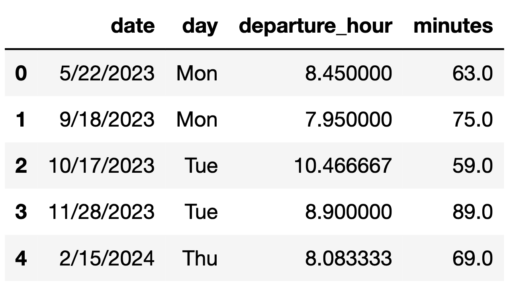
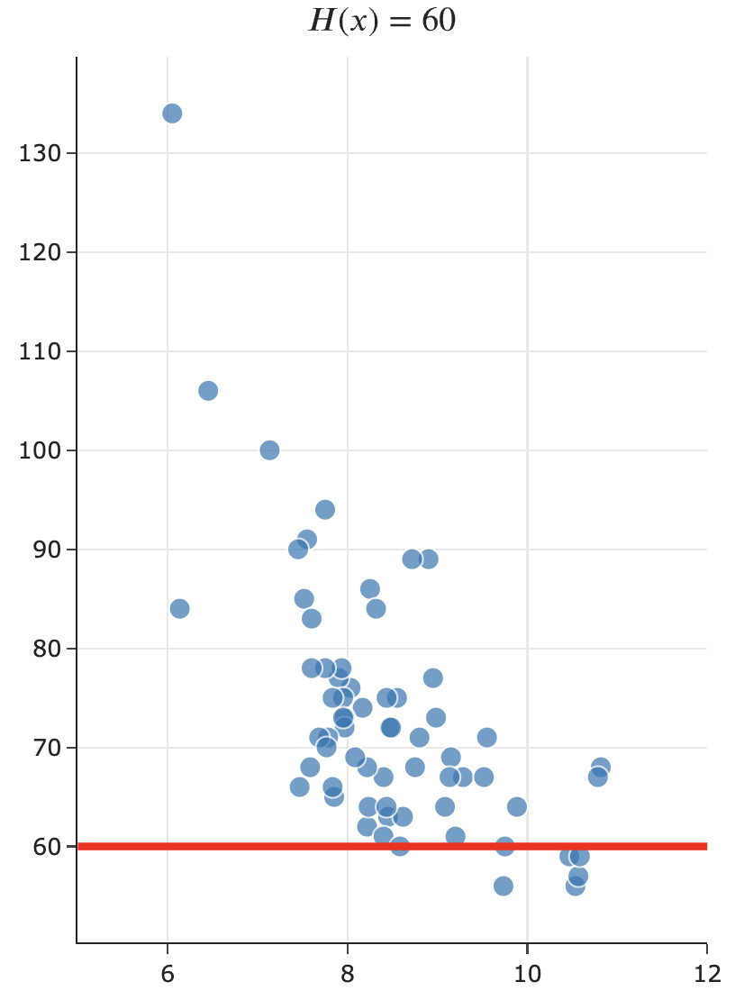
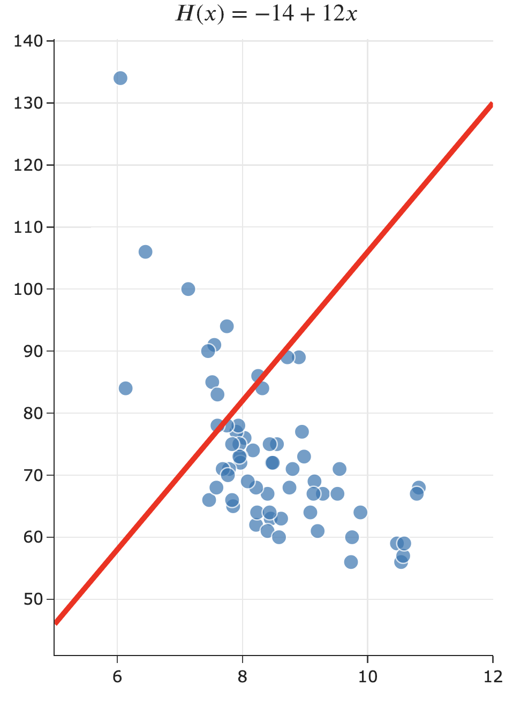
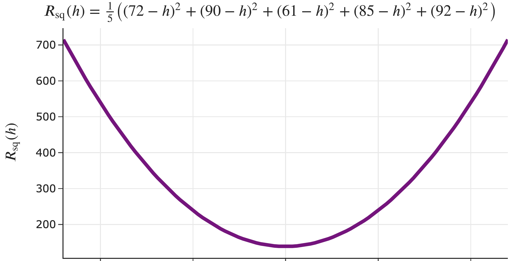

<!-- These set styles for the entire document. -->

   

##### Lecture 1

# Introduction to Modeling

#### DSC 40A, Summer 2024

---

### Agenda

- Introductions.
- What is DSC 40A about?
- Logistics.
- Modeling.
- The constant model.

---

     

## Introductions

---

### Instructor: Nishant Kheterpal

<!--  -->

- Originally from Ann Arbor, MI, 〽️.
- Undergrad: EECS at Berkeley.
- Grad school: MS, PhD-in-progress in Robotics at Michigan.
- Teaching this summer in the Halıcıoğlu Data Science Institute at UC San Diego.
  - Previously taught DSC 10 during the first summer session.
- Helped teach other classes at Michigan and Berkeley.
- Outside interests: traveling, cooking, baking, working on bicycles.

  

---

 

    

        
        &nbsp;&nbsp;
    

    

        
        &nbsp;&nbsp;
    

    

        
    

 

    
My summer so far.

---

### Course staff

We have 3 tutors, all of whom are excited to help you in discussion and office hours!

 

    
 
        Jack Determan 
        Zoe Ludena 
        Owen Miller
    

     

Read more about us at [dsc40a.com/staff](https://dsc40a.com/staff).

---

### Throughout lecture, ask questions!

- You're always free to ask questions during lecture, and I'll try and stop for them frequently. But still, you may not feel like asking your question out loud.
- You can **type your questions anonymously** at the following link and I'll try and answer them.

<h2>

**[q.dsc40a.com](https://docs.google.com/forms/d/e/1FAIpQLSfEaSAGovXZCk_51_CVI587CcGW1GZH1w4Y50dKDzoLEX3D4w/viewform)**

</h2>

- You'll also use this form to answer questions that I ask you during lecture.
- If the direct link doesn't work, use the **🤔 Lecture Questions** link in the top right corner of [dsc40a.com](https://dsc40a.com).

---

### Question 🤔

**Answer at [q.dsc40a.com](https://docs.google.com/forms/d/e/1FAIpQLSfEaSAGovXZCk_51_CVI587CcGW1GZH1w4Y50dKDzoLEX3D4w/viewform)**

 

Select the **FALSE** statement below.

A: I've been making sourdough bread for four years.
B: I've been to Japan four times.
C: I skipped first grade.
D: I've tried out for Jeopardy four times.
E: I am less than 28 years old.

---

     

## What is DSC 40A about?

---

     

<big>**Theoretical Foundations** of Data Science I</big>

---

### What have you _heard_ about DSC 40A?

Here are some responses from the Welcome Survey in the spring quarter.

 

<small markdown="1">

_I've heard the class seeks to uncover a lot of the key concepts of the math behind machine learning, while utilizing a lot of linear algebra. I've heard that the class can be difficult and proof-heavy._

_I heard it is conceptual, and therefore, a pretty hard class (to understand conceptually). I also heard it has a lot to do with linear algebra._

_That it’s the most awful class in the DSC major, pretty much just pure math/all proofs._

_It's a pretty hard class but rewarding in the end._

</small>

---

     

<big>**Why** do we need to study theoretical foundations?</big>

---

 Machine learning is about **automatically learning patterns from data**.

 
<small>Humans are good at understanding handwriting – but how do we get computers to understand handwriting?</small>

---

### Course overview

**Part 1: Learning from Data (Weeks 1, 2, and 3)**

- Summary statistics and loss functions; empirical risk minimization.
- Linear regression (including multiple variables); linear algebra.
- Clustering.

**Part 2: Probability (Weeks 4 and 5)**

- Set theory and combinatorics; probability fundamentals.
- Conditional probability and independence.
- The Naïve Bayes classifier.

---

### Learning objectives

After this class, you'll...

- understand the basic principles underlying almost every machine learning and data science method.
- be better prepared for the math in upper division: vector calculus, linear algebra, and probability.

---

### What do DSC 80 students have to say about DSC 40A?

Here are some responses from the End-of-Quarter Survey last quarter in DSC 80.

 

<small markdown="1">

_study hardy, pay attention in DSC 40A and start work early :)_

_40A and Math 18 is super important for this class. Don't wait till the last minute too!_

_I think DSC40[A] was the most important prerequisite for this class._

</small>

---

     

## Logistics

---

### Getting started

- The course website, [**dsc40a.com**](https://dsc40a.com), contains all content. **Read the syllabus carefully!**
  - Click around; you'll find other helpful resources.
- Other sites you'll need to use:
  - **[Gradescope](https://www.gradescope.com/courses/814891/)** is where you'll submit all assignments. You'll be automatically added within 24 hours of enrolling.
  - **[Ed](https://edstem.org/us/courses/61623/discussion/)** is where all announcements will be made. If you're not enrolled, there's a join link in the syllabus.
  - We aren't using Canvas.
- Make sure to fill out the [**Welcome Survey**](https://forms.gle/qA5xnzXiNZc55nii6) ASAP.

---

### Lectures

- Lecture is here, WLH 2208, Monday-Thursday 12:30-1:50p.
- Lecture slides will be posted on the course website before class, and annotated slides will be posted after class.
- Lecture will be podcasted.
- **The value of lecture is interaction and discussion, so even though attendance isn't required, it's highly, highly recommended.**

---

### Discussions

- Dicsussion weekly on Wednesdays, directly after lecture here in WLH 2208, 2-3:50p.
- Discussion will primarily be used for **groupwork** – that is, working on problems in small groups of size 2-4.
  - If you email me, you may work in a self-organized group outside of a discussion section for full credit, but no matter what, **you cannot work alone**.
- Groupwork worksheets are due to Gradescope on **Mondays at 11:59p**.
  - Only one group member needs to submit, and should add the rest of the group to the submission.
- **The value of attending is getting support from tutors and working in a group**.

---

### Grading

- **Homeworks (40%)**: Due to Gradescope **Tuesdays and Fridays at 11:59p**, due dates vary.
  - Graded for correctness. Lowest score is dropped.
- **Groupworks (10%)**: Due to Gradescope on **Mondays at 11:59p**.
  - Graded for effort. Lowest score is dropped.
- **Midterm Exam (20%)**: Thursday, August 22nd, in class.
- **Final Exam (30%)**: Friday, September 6th, 11:30a-2:30p in WLH 2208. See the [syllabus](https://dsc40a.com/syllabus/#redemption-policy) for the redemption policy.

Let us know about exam conflicts on the [Welcome Survey](https://forms.gle/qA5xnzXiNZc55nii6).

---

### Support

We know this is a challenging class, and we're here to help:

- **Office hours**: In-person in HDSI 155 and virtual on [Zoom](https://ucsd.zoom.us/j/91954238673). Plan to attend at least twice a week for homework help.
- **Ed**: Use it! We're here to help you. Post conceptual questions publicly – just don't post answers to homework questions.

A bunch of new-ish things to improve the student experience:

- [practice.dsc40a.com](https://practice.dsc40a.com) to give you access to practice exam problems, categorized by topic.
- Walkthrough videos to show you our thought process when answering questions.
- More time reviewing linear algebra.

---

     

## Modeling

---

You might be starting to look for off-campus apartments, none of which are affordable.

---

...

<!-- <small markdown="1"> -->

You decide to live with your parents in Orange County and commute. You keep track of how long it takes you to get to school each day.

<footer>

This is a real dataset, collected by [Joseph Hearn](https://www.linkedin.com/pulse/tracking-my-commutes-machine-learning-sandbox-joseph-a-hearn-phd/)! However, he lived in the Seattle area, not San Diego.

</footer>

<!-- </small> -->

---

---

<!--  -->

---

---

     

<big markdown="1">

**Goal**: Predict your commute time. That is, predict how long it'll take to get to school.

</big>

  

How can we do this?

What will we need to assume?

---

     

<big>A **model** is a set of assumptions about how data were generated.</big>

---

### Possible models

    
 

    

    
 
    

---

### Notation

    
 

    

    

<small>

$x$: "input", "independent variable", or "feature"

 

$y$: "response", "dependent variable", or "target"

 

**We use $x$ to predict $y$.**

 

The $i$th observation is denoted $(x_i, y_i)$.</small>

---

### Hypothesis functions and parameters

A hypothesis function, $H$, takes in an $x$ as input and returns a predicted $y$.
<b>Parameters</b> define the relationship between the input and output of a hypothesis function.

The constant model, $H(x) = {\color{purple} h}$, has one parameter: ${\color{purple} h}$.

    &nbsp;
    
    &nbsp;&nbsp;

    
    &nbsp;&nbsp;

    

---

### Hypothesis functions and parameters

A hypothesis function, $H$, takes in an $x$ as input and returns a predicted $y$.
<b>Parameters</b> define the relationship between the input and output of a hypothesis function.

The simple linear regression model, $H(x) = {\color{purple}w_0} + {\color{purple}w_1}x$, has two parameters: $\color{purple} w_0$ and $\color{purple} w_1$.

    

        &nbsp;
        
        &nbsp;&nbsp;
    

    

        
        &nbsp;&nbsp;
    

---

     

## The constant model

---

### The constant model

 

    
 
        
    

     
    
 
        
    

---

### A concrete example

Let's suppose we have just a smaller dataset of just five historical commute times in minutes.

$$\begin{align*} y_1 &= 72 \\ y_2 &=  90 \\ y_3 &= 61 \\ y_4 &= 85 \\ y_5 &= 92\end{align*}$$

Given this data, can you come up with a prediction for your future commute time? How?

---

### Some common approaches

- The **mean**:

$$\frac{1}{5} \left( 72 + 90 + 61 + 85 + 92\right) = \boxed{80}$$

- The **median**:

$$61 \:\:\:\:\:\: 72 \:\:\:\:\:\: \boxed{85} \:\:\:\:\:\: 90 \:\:\:\:\:\: 92$$

- Both of these are familiar **summary statistics** – they summarize a collection of numbers with a single number.

- But which one is better? Is there a "best" prediction we can make?

---

### The cost of making predictions

A **loss function** quantifies how bad a prediction is for a single data point.

- If our prediction is **close** to the actual value, we should have **low** loss.
- If our prediction is **far** from the actual value, we should have **high** loss.

A good starting point is error, which is the difference between **actual** and **predicted** values.

$$e_i = {\color{blue}y_i} - {\color{orange}H(x_i)}$$

Suppose my commute **actually** takes 80 minutes.

- If I predict 75 minutes:
- If I predict 72 minutes:
- If I predict 100 minutes:

---

### Squared loss

One loss function is squared loss, $L_{\text{sq}}$, which computes $({\color{blue}\text{actual}} - {\color{orange}\text{predicted}})^2$.

$$L_{\text{sq}}({\color{blue}y_i}, {\color{orange}H(x_i)}) = ({\color{blue}y_i} - {\color{orange}H(x_i)})^2$$

  

Note that for the constant model, $H(x_i) = h$, so we can simplify this to:

$$L_{\text{sq}}({\color{blue}y_i}, {\color{orange}h}) = ({\color{blue}y_i} - {\color{orange}h})^2$$

   

Squared loss is not the only loss function that exists! Soon, we'll learn about absolute loss.

---

### A concrete example, revisited

Consider again our smaller dataset of just five historical commute times in minutes. Suppose we predict the median, $h = 85$. What is the squared loss of $85$ for each data point?

$\begin{align*} y_1 &= 72 \\ y_2 &=  90 \\ y_3 &= 61 \\ y_4 &= 85 \\ y_5 &= 92\end{align*}$

---

### Averaging squared losses

We'd like a single number that describes the quality of our predictions across our entire dataset. One way to compute this is as the **average of the squared losses**.

- For the median, $h = {\color{purple}{85}}$:

$$\frac{1}{5} \left( (72 - {\color{purple}{85}})^2 + (90 - {\color{purple}{85}})^2 + (61 - {\color{purple}{85}})^2 + (85 - {\color{purple}{85}})^2 + (92 - {\color{purple}{85}})^2 \right) = \boxed{163.8}$$

- For the mean, $h = {\color{purple}{80}}$:

$$\frac{1}{5} \left( (72 - {\color{purple}{80}})^2 + (90 - {\color{purple}{80}})^2 + (61 - {\color{purple}{80}})^2 + (85 - {\color{purple}{80}})^2 + (92 - {\color{purple}{80}})^2 \right) = \boxed{138.8}$$

 

Which prediction is better? Could there be an even better prediction?

---

### Mean squared error

- Another term for <b><u>average</u> squared loss</b> is <b><u>mean</u> squared error (MSE)</b>.

- The mean squared error on our smaller dataset for any prediction $h$ is of the form:

$$R_\text{sq}(h) = \frac{1}{5} \left( (72 - h)^2 + (90 - h)^2 + (61 - h)^2 + (85 - h)^2 + (92 - h)^2 \right)$$

<small>

$R$ stands for "**r**isk", as in "empirical **r**isk." We'll see this term again soon.

</small>

- For example, if we predict $h = {\color{purple}{100}}$, then:

$$\begin{align*} R_\text{sq}({\color{purple}{100}}) &=  \frac{1}{5} \left( (72 - {\color{purple}{100}})^2 + (90 - {\color{purple}{100}})^2 + (61 - {\color{purple}{100}})^2 + (85 - {\color{purple}{100}})^2 + (92 - {\color{purple}{100}})^2 \right) \\ &= \boxed{538.8} \end{align*}$$

- **We can pick any $h$ as a prediction, but the smaller $R_\text{sq}(h)$ is, the better $h$ is!**

---

### Visualizing mean squared error

&nbsp;&nbsp;&nbsp;&nbsp;&nbsp;&nbsp;&nbsp;&nbsp;&nbsp;&nbsp;&nbsp;&nbsp;&nbsp;&nbsp;<small> Which $h$ corresponds to the vertex of $R_\text{sq}(h)$?</small>

---

### Mean squared error, in general

- Suppose we collect $n$ commute times, $y_1, y_2, ..., y_n$.
- The mean squared error of the prediction $h$ is:

   

- Or, using **summation notation**:

---

### The best prediction

$$R_\text{sq}(h) = \frac{1}{n} \sum_{i = 1}^n (y_i - h)^2$$

- We want the **best** prediction, $h^*$.

- The smaller $R_\text{sq}(h)$ is, the better $h$ is.

- **Goal**: Find the $h$ that minimizes $R_\text{sq}(h)$.
  <small>The resulting $h$ will be called $h^*$.</small>

- **How do we find $h^*$?**

---

### Summary, next time

- We started with the abstract problem:

  > Given historical commute times, predict your future commute time.

- We've turned it into a formal optimization problem:

  > Find the prediction $h^*$ that has the smallest mean squared error $R_\text{sq}(h)$ on the data.

- Implicitly, we introduced a three-step modeling process that we'll keep revisiting:

  - i. Choose a model.
  - ii. Choose a loss function.
  - iii. Minimize average loss, $R$.

- **Next time**: We'll solve this optimization problem by hand.
