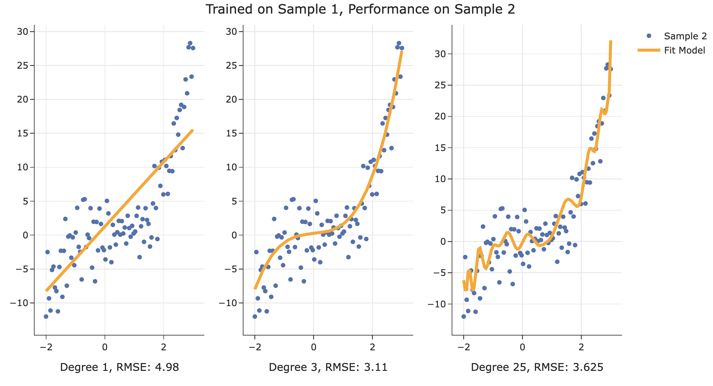

style scoped>section {background: linear-gradient(90deg, hsla(290, 25%, 76%, 1) 0%, hsla(284, 80%, 10%, 1) 100%);}</style>

     

## Measuring the quality of a classifier

---

---

### Classification problems

- In a classification problem, we make predictions based on data (called **training data**) for which we know the value of the **categorical** response variable.

- Example classification problems:
  - Deciding whether a patient has kidney disease.
  - Identifying handwritten digits.
  - Determining whether an avocado is ripe.
  - Predicting whether credit card activity is fraudulent.
  - Predicting whether you'll be late to school or not.

---

### Assessing the quality of a classifier

- Naïve Bayes is one classification algorithm, or **classifier**, but there are many others.

- How do we measure how _good_ the predictions made by a classifier are?

- **Reflect back**: When working with regression models, how did we measure the quality of our predictions? Can we adopt a similar strategy?

---

### Unseen data

- A natural way to measure the quality of our classifications is to see how often we predict the correct category.

- We want to make good predictions on **unseen data**, so we'll measure how often we classify examples correctly for a new set of **test data**.

- This avoids **overfitting**.

---

### Accuracy

- Classification **accuracy** is the proportion of examples in the test set that are correctly classified. It is measured on a 0 to 1 scale:

$$\text{accuracy} = \frac{\text{\# correctly classified examples in test set}}{\text{size of test set}}$$

- We can think of accuracy as an estimate for the probability of making a correct classification on an unseen example:

$$\begin{align*} &\text{Parameter: } \mathbb{P}(\text{successful classification}) \\ &\text{Estimate:} \:\:\:\: \text{accuracy} = \frac{\text{\# correctly classified examples in test set}}{\text{size of test set}} \end{align*}$$

---

### Imbalanced classes

Alagille syndrome is a rare genetic condition that affects 1 in 40,000 people. We want to classify people as having this condition (**unhealthy**) or not having this condition (**healthy**).

 

Consider a classifier that classifies everyone as **healthy**.

1. What is the accuracy of this classifier?

2. Does accuracy tell the full story?

---

### High accuracy is not enough!

- We want to avoid overdiagnosis: telling someone they have the condition when they don't.
- We also want to avoid underdiagnosis: telling someone they're healthy when they're not.
- It's easy to avoid either one of these. It's hard to avoid both of these simultaneously, yet a good classifier should do exactly that.

---

### Different types of errors

 

| | Actually **healthy** | Actually **unhealthy** |
| --- | --- | --- |
| Classified as **healthy** <small>"negative" classification</small> | 
12
  | 
4
  | 
| Classified as **unhealthy** <small>"positive" classification</small> | 
9
  | 
15
  |

---

### Summary

- In classification, our goal is to predict a discrete category, called a **class**, given some features.

- The Naïve Bayes classifier uses Bayes' Theorem:

$$\mathbb{P}((\text{class|features}) = \frac{\mathbb{P}((\text{class}) \cdot \mathbb{P}((\text{features|class})}{\mathbb{P}((\text{features})}$$

- And works by estimating the numerator of $\mathbb{P}((\text{class|features})$ for all possible classes.

- It also uses a simplifying assumption, that features are conditionally independent given a class:

$$\mathbb{P}((\text{features|class}) = \mathbb{P}((\text{feature}_1 | \text{class}) \cdot \mathbb{P}((\text{feature}_2 | \text{class}) \cdot ...$$

---