<!-- These set styles for the entire document. -->

   

##### Lecture 1

# Introduction to Modeling

#### DSC 40A, Summer 2026

---

### Agenda

- Introductions.
- What is DSC 40A about?
- Logistics.
- Modeling.
- The constant model.
- 10 minute break.
- Part 2.

---

     

## Introductions

---

### Instructor: Jordan Schwartz

<!--  -->

- Originally from Redwood City, CA.
- Undergrad: CS and Cognitive Science at Berkeley.
- Grad school: MS-in-progress in Computer and Info Science at UPenn.
- Teaching this summer in the Halıcıoğlu Data Science Institute at UC San Diego.
- Helped teach other classes at Berkeley and UPenn (intro CS, computer security, Python).
- Outside interests: cooking, hiking, social dancing (particularly Lindy Hop).

  

---

    &nbsp;
    
    &nbsp;&nbsp;

    
    &nbsp;&nbsp;

    

<!--  

    

        
        &nbsp;&nbsp;
    

    

        
        &nbsp;&nbsp;
    

    

        
    

 -->

 

    
My summer so far.

---

### Course staff

We have 1 TA, who is excited to help you in discussion and office hours!

 

    
 
        Eric Ness
    

 

    

        
        &nbsp;&nbsp;
    

     

Read more about us at [https://dsc-courses.github.io/DSC40A-SU26/staff/](https://dsc-courses.github.io/DSC40A-SU26/staff/).

---

### Throughout lecture, ask questions! - 

- You're always free to ask questions during lecture by using the raise hand feature, and I'll try and stop for them frequently. But still, you may not feel like asking your question out loud.
- You can **type your questions anonymously or non-anonymously** in the zoom chat OR Q&A and either I or Eric will get to it ASAP.

---

### Question 🤔

**Answer in the zoom chat**

 

Select the **FALSE** statement below.

A: I've fostered 2 cats for a cat cafe.

B: I have a pin collection of over 350 pins.

C: I skipped first grade.

D: I've been a vegetarian for over 11 years.

E: I know a form of english country dance.

---

     

## What is DSC 40A about?

---

     

<big>**Theoretical Foundations** of Data Science I</big>

---

### What have you _heard_ about DSC 40A?

Here are some responses from the Welcome Survey in the past quarters.

 

<small markdown="1">

_I've heard the class seeks to uncover a lot of the key concepts of the math behind machine learning, while utilizing a lot of linear algebra. I've heard that the class can be difficult and proof-heavy._

_I heard it is conceptual, and therefore, a pretty hard class (to understand conceptually). I also heard it has a lot to do with linear algebra._

_That it’s the most awful class in the DSC major, pretty much just pure math/all proofs._

_It's a pretty hard class but rewarding in the end._

</small>

---

     

<big>**Why** do we need to study theoretical foundations?</big>

---

 Machine learning is about **automatically learning patterns from data**.

 
<small>Humans are good at understanding handwriting – but how do we get computers to understand handwriting?</small>

---

### Course overview

**Part 1: Learning from Data (Weeks 1, 2, and 3)**

- Summary statistics and loss functions; empirical risk minimization.
- Linear regression (including multiple variables); linear algebra.
- Clustering.

**Part 2: Probability (Weeks 4 and 5)**

- Set theory and combinatorics; probability fundamentals.
- Conditional probability and independence.
- The Naïve Bayes classifier.

---

### Learning objectives

After this class, you'll...

- understand the basic principles underlying almost every machine learning and data science method.
- be better prepared for the math in upper division: vector calculus, linear algebra, and probability.

---

### What do DSC 80 students have to say about DSC 40A?

Here are some responses from the End-of-Quarter Survey in a past quarter in DSC 80.

 

<small markdown="1">

_study hardy, pay attention in DSC 40A and start work early :)_

_40A and Math 18 is super important for this class. Don't wait till the last minute too!_

_I think DSC40[A] was the most important prerequisite for this class._

</small>

---

     

## Logistics

---

### Getting started

- The course website, [**https://dsc-courses.github.io/DSC40A-SU26/**](https://dsc-courses.github.io/DSC40A-SU26/), contains all content. **Read the syllabus carefully!**
  - Click around; you'll find other helpful resources.
- Other sites you'll need to use:
  - **[Gradescope](https://www.gradescope.com/)** is where you'll submit all assignments. You'll be automatically added within 24 hours of enrolling.
  - **[TBD]()** is where all announcements will be made. If you're not enrolled, there's a join link in the syllabus.
  - We aren't using Canvas.
- Make sure to fill out the [**Welcome Survey**]() ASAP.

---

### Lectures

- Lecture is here, on zoom, Monday and Wednesday 11:00-1:50p.
- Lecture slides will be posted on the course website before class, and annotated slides will be posted after class.
- Lecture will be podcasted.
- **The value of lecture is interaction and discussion, so even though attendance isn't required, it's highly, highly recommended.**

---

### Discussions

- Discussion weekly on Wednesdays, directly after lecture.
- Discussion will primarily be used for **groupwork** – that is, working on problems in small groups of size 3-4.
  - No matter what, **you cannot work alone**.
  - The first discussion will be synchronous this week on **Wednesday, July 1st, 2-4pm** on zoom and will be a good opportunity to meet other students.
  - There will also be a TBD thread to look for partners.
- Groupwork worksheets are due to Gradescope on **Thursdays at 11:59pm**.
  - Only one group member needs to submit, and should add the rest of the group to the submission.

---

### Discussions contd. 

- In order to get credit for groupworks 2-4, there will be no synchronous discussion section. 
    - Instead each group is required to sign up for a 5 minute check off meeting sometime that week with the TA. 
    - The link to do so can be found on TBD. 
    - You must sign up at least (tentatively) 12 hours in advance of the meeting. 
    - There will be **no makeup meetings** outside of the time allotted by the TA. There will be more appointment slots than groups, so every group should be able to sign up for a time that works for them if they sign up early enough.

---

### Grading

- **TBD Participation (2%)**: Due by the start of the final exam, 11:30AM on Friday, 7/31
- **Groupworks (8%)**: Due to Gradescope on **Thursdays at 11:59p**.
  - Graded for effort in check off meetings.
- **Homeworks (40%)**: Due to Gradescope (usually) **Tuesdays and Fridays at 11:59pm**, due dates vary.
  - Graded for correctness. Lowest score is dropped.
- **Midterm Exam (20%)**: Wednesday, July 15th, in class, remote.
- **Final Exam (30%)**: Friday, July 31st, 11:30a-2:30p, remote. See the [syllabus](https://dsc-courses.github.io/DSC40A-SU26/syllabus/#redemption-policy) for the redemption policy.

Let us know about exam conflicts on the [Welcome Survey]().

---

### Support

We know this is a challenging class, and we're here to help:

- **Office hours** - There will be two types of office hours offered this summer:
  1. _Community office hours_: Once a week, 2:00pm on Mondays right after lecture, there will be a 30 minute open zoom session for anyone to join! This is the equivalent of Jordan sitting in her office with the door open.
  2. _Individual or group office hours_: Google calendar appointments. You may schedule as many of these as you feel necessary, up to 3 a week, throughout the week with either member of staff. These will be 10-15 minute appointments that you, and whoever else you’d like, join.
- **TBD**: Use it! We're here to help you. Post conceptual questions publicly – just don't post answers to homework questions.

---

### More Support and resources

A bunch of new-ish things to improve the student experience:

- [practice.dsc40a.com](https://practice.dsc40a.com) to give you access to practice exam problems, categorized by topic.
- Walkthrough videos to show you our thought process when answering questions.
- More time reviewing linear algebra.

---

     

## Modeling

---

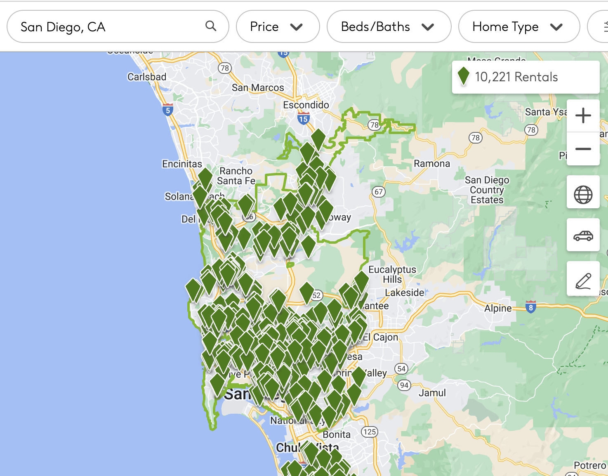

You might be starting to look for off-campus apartments, none of which are affordable.

---

...

<small markdown="1">

You decide to live with your parents in Orange County and commute. You keep track of how long it takes you to get to school each day.

<!-- <footer>  -->

This is a real dataset, collected by [Joseph Hearn](https://www.linkedin.com/pulse/tracking-my-commutes-machine-learning-sandbox-joseph-a-hearn-phd/)! However, he lived in the Seattle area, not San Diego.

<!-- </footer> -->

</small>

---

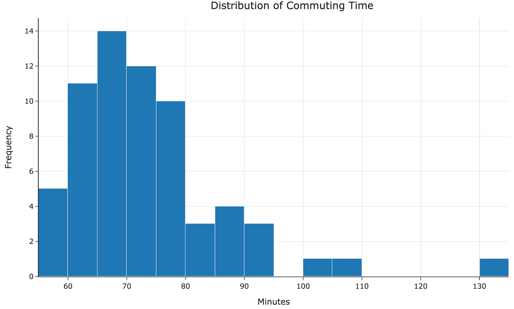

---

<!--  -->

---

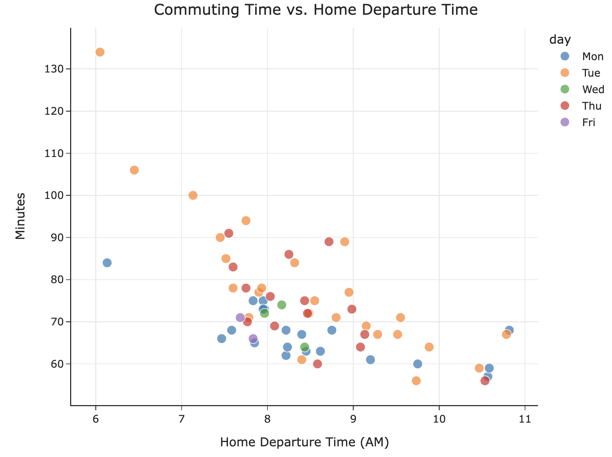

---

     

<big markdown="1">

**Goal**: Predict your commute time. That is, predict how long it'll take to get to school.

</big>

  

How can we do this?

What will we need to assume?

---

     

<big>A **model** is a set of assumptions about how data were generated.</big>

---

### Possible models

    
 

    

    
 
    

---

### Notation

    &nbsp;
    
    &nbsp;&nbsp;

<!-- 

    
 

    

    
 -->

<small>

$x$: "input", "independent variable", or "feature"

 

$y$: "response", "dependent variable", or "target"

 

**We use $x$ to predict $y$.**

 

The $i$th observation is denoted $(x_i, y_i)$.</small>

---

### Hypothesis functions and parameters

A hypothesis function, $H$, takes in an $x$ as input and returns a predicted $y$.
<b>Parameters</b> define the relationship between the input and output of a hypothesis function.

The constant model, $H(x) = {\color{purple} h}$, has one parameter: ${\color{purple} h}$.

    &nbsp;
    
    &nbsp;&nbsp;

    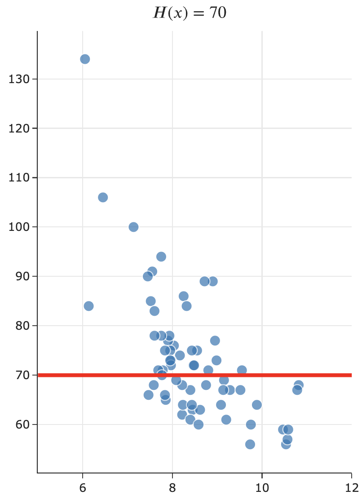
    &nbsp;&nbsp;

    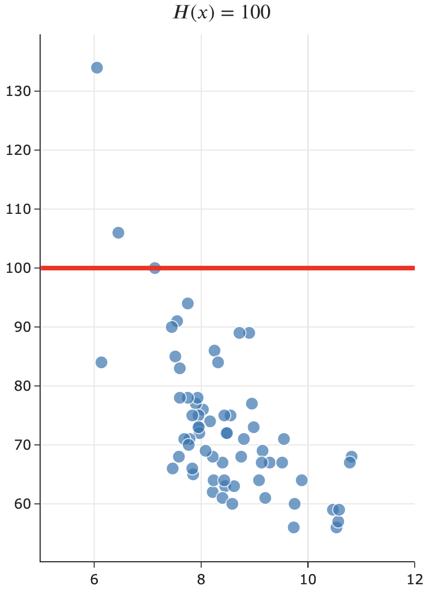

---

### Hypothesis functions and parameters

A hypothesis function, $H$, takes in an $x$ as input and returns a predicted $y$.
<b>Parameters</b> define the relationship between the input and output of a hypothesis function.

The simple linear regression model, $H(x) = {\color{purple}w_0} + {\color{purple}w_1}x$, has two parameters: $\color{purple} w_0$ and $\color{purple} w_1$.

    

        &nbsp;
        
        &nbsp;&nbsp;
    

    

        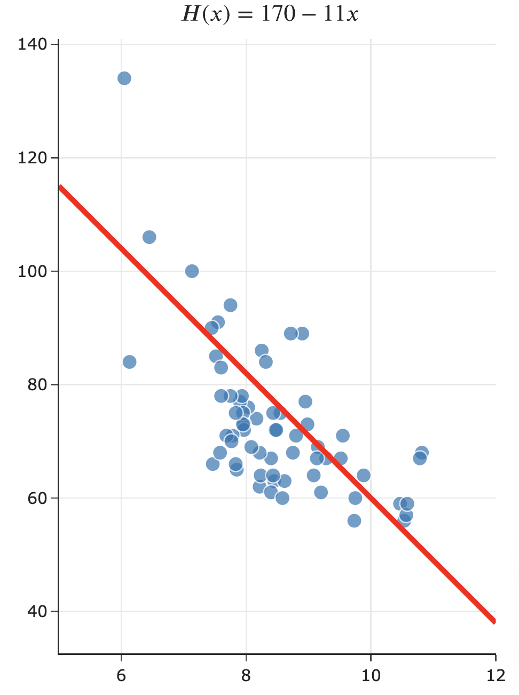
        &nbsp;&nbsp;
    

---

     

## The constant model

---

### The constant model

 

   &nbsp;
   
   &nbsp;&nbsp;

   &nbsp;
   
   &nbsp;&nbsp;

<!-- 

    
 
        
    

     
    
 
        
    

 -->

---

### A concrete example

Let's suppose we have just a smaller dataset of just five historical commute times in minutes.

$$\begin{align*} y_1 &= 72 \\ y_2 &=  90 \\ y_3 &= 61 \\ y_4 &= 85 \\ y_5 &= 92\end{align*}$$

Given this data, can you come up with a prediction for your future commute time? How?

---

### Some common approaches

- The **mean**:

$$\frac{1}{5} \left( 72 + 90 + 61 + 85 + 92\right) = \boxed{80}$$

- The **median**:

$$61 \:\:\:\:\:\: 72 \:\:\:\:\:\: \boxed{85} \:\:\:\:\:\: 90 \:\:\:\:\:\: 92$$

- Both of these are familiar **summary statistics** – they summarize a collection of numbers with a single number.

- But which one is better? Is there a "best" prediction we can make?

---

### The cost of making predictions

A **loss function** quantifies how bad a prediction is for a single data point.

- If our prediction is **close** to the actual value, we should have **low** loss.
- If our prediction is **far** from the actual value, we should have **high** loss.

A good starting point is error, which is the difference between **actual** and **predicted** values.

$$e_i = {\color{blue}y_i} - {\color{orange}H(x_i)}$$

Suppose my commute **actually** takes 80 minutes.

- If I predict 75 minutes:
- If I predict 72 minutes:
- If I predict 100 minutes:

---

### Squared loss

One loss function is squared loss, $L_{\text{sq}}$, which computes $({\color{blue}\text{actual}} - {\color{orange}\text{predicted}})^2$.

$$L_{\text{sq}}({\color{blue}y_i}, {\color{orange}H(x_i)}) = ({\color{blue}y_i} - {\color{orange}H(x_i)})^2$$

  

Note that for the constant model, $H(x_i) = h$, so we can simplify this to:

$$L_{\text{sq}}({\color{blue}y_i}, {\color{orange}h}) = ({\color{blue}y_i} - {\color{orange}h})^2$$

   

Squared loss is not the only loss function that exists! Soon, we'll learn about absolute loss.

---

### A concrete example, revisited

Consider again our smaller dataset of just five historical commute times in minutes. Suppose we predict the median, $h = 85$. What is the squared loss of $85$ for each data point?

$\begin{align*} y_1 &= 72 \\ y_2 &=  90 \\ y_3 &= 61 \\ y_4 &= 85 \\ y_5 &= 92\end{align*}$

---

### Averaging squared losses

We'd like a single number that describes the quality of our predictions across our entire dataset. One way to compute this is as the **average of the squared losses**.

- For the median, $h = {\color{purple}{85}}$:

$$\frac{1}{5} \left( (72 - {\color{purple}{85}})^2 + (90 - {\color{purple}{85}})^2 + (61 - {\color{purple}{85}})^2 + (85 - {\color{purple}{85}})^2 + (92 - {\color{purple}{85}})^2 \right) = \boxed{163.8}$$

- For the mean, $h = {\color{purple}{80}}$:

$$\frac{1}{5} \left( (72 - {\color{purple}{80}})^2 + (90 - {\color{purple}{80}})^2 + (61 - {\color{purple}{80}})^2 + (85 - {\color{purple}{80}})^2 + (92 - {\color{purple}{80}})^2 \right) = \boxed{138.8}$$

 

Which prediction is better? Could there be an even better prediction?

---

### Mean squared error

- Another term for <b><u>average</u> squared loss</b> is <b><u>mean</u> squared error (MSE)</b>.

- The mean squared error on our smaller dataset for any prediction $h$ is of the form:

$$R_\text{sq}(h) = \frac{1}{5} \left( (72 - h)^2 + (90 - h)^2 + (61 - h)^2 + (85 - h)^2 + (92 - h)^2 \right)$$

<small>

$R$ stands for "**r**isk", as in "empirical **r**isk." We'll see this term again soon.

</small>

- For example, if we predict $h = {\color{purple}{100}}$, then:

$$\begin{align*} R_\text{sq}({\color{purple}{100}}) &=  \frac{1}{5} \left( (72 - {\color{purple}{100}})^2 + (90 - {\color{purple}{100}})^2 + (61 - {\color{purple}{100}})^2 + (85 - {\color{purple}{100}})^2 + (92 - {\color{purple}{100}})^2 \right) \\ &= \boxed{538.8} \end{align*}$$

- **We can pick any $h$ as a prediction, but the smaller $R_\text{sq}(h)$ is, the better $h$ is!**

---

### Visualizing mean squared error

&nbsp;&nbsp;&nbsp;&nbsp;&nbsp;&nbsp;&nbsp;&nbsp;&nbsp;&nbsp;&nbsp;&nbsp;&nbsp;&nbsp;<small> Which $h$ corresponds to the vertex of $R_\text{sq}(h)$?</small>

---

### Mean squared error, in general

- Suppose we collect $n$ commute times, $y_1, y_2, ..., y_n$.
- The mean squared error of the prediction $h$ is:

   

- Or, using **summation notation**:

---

### The best prediction

$$R_\text{sq}(h) = \frac{1}{n} \sum_{i = 1}^n (y_i - h)^2$$

- We want the **best** prediction, $h^*$.

- The smaller $R_\text{sq}(h)$ is, the better $h$ is.

- **Goal**: Find the $h$ that minimizes $R_\text{sq}(h)$.
  <small>The resulting $h$ will be called $h^*$.</small>

- **How do we find $h^*$?**

---

### Summary, after the break!

- We started with the abstract problem:

  > Given historical commute times, predict your future commute time.

- We've turned it into a formal optimization problem:

  > Find the prediction $h^*$ that has the smallest mean squared error $R_\text{sq}(h)$ on the data.

- Implicitly, we introduced a three-step modeling process that we'll keep revisiting:

  - i. Choose a model.
  - ii. Choose a loss function.
  - iii. Minimize average loss, $R$.

- **Next**: We'll solve this optimization problem by hand.

---

# 10 minute break

---

##### Part 2 of Lecture 1

# Empirical Risk Minimization

#### DSC 40A, Summer 2026

---

### Agenda

- Recap: Mean squared error.
- Minimizing mean squared error.
- Another loss function.
- Minimizing mean absolute error.
<!-- - A practice exam problem (time permitting). -->

---

     

## Recap: Mean squared error

---

### Overview

    &nbsp;
    
    &nbsp;&nbsp;

<!-- 

    
 

    
 -->

 

- We started by introducing the idea of a hypothesis function, $H(x)$.
- We looked at two possible models:
  - The constant model, $H(x) = h$.
  - The simple linear regression model, $H(x) = w_0 + w_1x$.
- We decided to find the **best constant prediction** to use for predicting commute times, in minutes.

---

### Mean squared error

- Let's suppose we have just a smaller dataset of just five historical commute times in minutes.

$$y_1 = 72 \:\:\:\:\:\:\:\:\:\: y_2 = 90 \:\:\:\:\:\:\:\:\:\: y_3 = 61 \:\:\:\:\:\:\:\:\:\: y_4 = 85 \:\:\:\:\:\:\:\:\:\: y_5 = 92$$

- The **mean squared error** of the constant prediction $h$ is:

$$R_\text{sq}(h) = \frac{1}{5} \left( (72 - h)^2 + (90 - h)^2 + (61 - h)^2 + (85 - h)^2 + (92 - h)^2 \right)$$

- For example, if we predict $h = {\color{purple}{100}}$, then:

$$\begin{align*} R_\text{sq}({\color{purple}{100}}) &=  \frac{1}{5} \left( (72 - {\color{purple}{100}})^2 + (90 - {\color{purple}{100}})^2 + (61 - {\color{purple}{100}})^2 + (85 - {\color{purple}{100}})^2 + (92 - {\color{purple}{100}})^2 \right) \\ &= \boxed{538.8} \end{align*}$$

- **We can pick any $h$ as a prediction, but the smaller $R_\text{sq}(h)$ is, the better $h$ is!**

---

### Visualizing mean squared error

&nbsp;&nbsp;&nbsp;&nbsp;&nbsp;&nbsp;&nbsp;&nbsp;&nbsp;&nbsp;&nbsp;&nbsp;&nbsp;&nbsp;<small> Which $h$ corresponds to the vertex of $R_\text{sq}(h)$?</small>

---

### The best prediction

- Suppose we collect $n$ commute times, $y_1, y_2, ..., y_n$.
- The mean squared error of the prediction $h$ is:

$$R_\text{sq}(h) = \frac{1}{n} \sum_{i = 1}^n (y_i - h)^2$$

- We want the **best** prediction, $h^*$.

- The smaller $R_\text{sq}(h)$ is, the better $h$ is.

- **Goal**: Find the $h$ that minimizes $R_\text{sq}(h)$.
<small>The resulting $h$ will be called $h^*$.</small>

- **How do we find $h^*$?**

---

     

## Minimizing mean squared error

---

### Minimizing using calculus

We'd like to minimize:

$$R_\text{sq}(h) = \frac{1}{n} \sum_{i = 1}^n (y_i - h)^2$$

In order to minimize $R_\text{sq}(h)$, we:
1. take its derivative with respect to $h$,
2. set it equal to 0,
3. solve for the resulting $h^*$, and
4. perform a second derivative test to ensure we found a minimum.

---

### Step 0: The derivative of $(y_i-h)^2$

- Remember from calculus that:
  - if $c(x) = a(x) + b(x)$, then 
  - $\frac{d}{dx} c(x) = \frac{d}{dx} a(x) + \frac{d}{dx} b(x)$.

- This is relevant because $R_\text{sq}(h) = \frac{1}{n} \sum_{i = 1}^n (y_i - h)^2$ involves the sum of $n$ individual terms, each of which involve $h$.

- So, to take the derivative of $R_\text{sq}(h)$, we'll first need to find the derivative of $(y_i-h)^2$. 

 

$\frac{d}{dh} (y_i-h)^2 = \:$

---

### Question 🤔 
**Answer at in the chat**

$$R_\text{sq}(h) = \frac{1}{n} \sum_{i = 1}^n (y_i - h)^2$$

Which of the following is $\frac{d}{dh}R_\text{sq}(h)$?

- A. 0
- B. $\sum_{i = 1}^n y_i$
- C. $\frac{1}{n} \sum_{i = 1}^n (y_i - h)$
- D. $\frac{2}{n} \sum_{i = 1}^n (y_i - h)$
- E. $-\frac{2}{n} \sum_{i = 1}^n (y_i - h)$ 
---

### Step 1: The derivative of $R_\text{sq}(h)$

$$\frac{d}{dh}R_\text{sq}(h) = \frac{d}{dh} \left( \frac{1}{n} \sum_{i = 1}^n (y_i - h)^2 \right) $$

---

### Steps 2 and 3: Set to 0 and solve for the minimizer, $h^*$

---

### Step 4: Second derivative test

    &nbsp;
    
    &nbsp;&nbsp;

<!-- 

    
 

    

    
  -->

We already saw that $R_\text{sq}(h)$ is **convex**, i.e. that it opens upwards, so the $h^*$ we found must be a minimum, not a maximum.

---

### The mean minimizes mean squared error!

- The problem we set out to solve was, find the $h^*$ that minimizes:

$$R_\text{sq}(h) = \frac{1}{n} \sum_{i = 1}^n (y_i - h)^2$$

- The answer is:

$$h^* = \text{Mean}(y_1, y_2, ..., y_n)$$

- The **best constant prediction**, in terms of mean squared error, is always the **mean**.
- We call $h^*$ our **optimal model parameter**, for when we use:
  - the constant model, $H(x) = h$, and
  - the squared loss function, $L_\text{sq}(y_i, h) = (y_i - h)^2$.

---

### Aside: Notation

Another way of writing

$$h^* \text{ is the value of $h$ that minimizes } \frac{1}{n} \sum_{i = 1}^n (y_i - h)^2$$

is

 

$$h^* = \underset{h}{\text{argmin}} \: \left( \frac{1}{n} \sum_{i = 1}^n (y_i - h)^2 \right)$$

 

$h^*$ is the solution to an **optimization problem**.

---

### The modeling recipe

We've implicitly introduced a three-step process for finding optimal model parameters (like $h^*$) that we can use for making predictions:

1. Choose a model.

 

2. Choose a loss function.

 

3. Minimize average loss to find optimal model parameters.

---

### Question 🤔 
**Answer in the chat or Q&A**

   

<big><b>What questions do you have?</b></big>

---

     

## Another loss function

---

### Another loss function

- Last lecture, we started by computing the **error** for each of our predictions, but ran into the issue that some errors were positive and some were negative.

$$e_i = {\color{blue}y_i} - {\color{orange}H(x_i)}$$

- The solution was to **square** the errors, so that all are non-negative. The resulting loss function is called **squared loss**.

$$L_{\text{sq}}({\color{blue}y_i}, {\color{orange}H(x_i)}) = ({\color{blue}y_i} - {\color{orange}H(x_i)})^2$$

- Another loss function, which also measures how far $H(x_i)$ is from $y_i$, is **absolute loss**.

$$L_{\text{abs}}({\color{blue}y_i}, {\color{orange}H(x_i)}) = |{\color{blue}y_i} - {\color{orange}H(x_i)} |$$

---

### Squared loss vs. absolute loss

For the constant model, $H(x_i) = h$, so we can simplify our loss functions as follows:
<!-- - Squared loss: $L_{\text{sq}}({\color{blue}y_i}, {\color{orange}h}) = ({\color{blue}y_i} - {\color{orange}h})^2$.
- Absolute loss: $L_{\text{abs}}({\color{blue}y_i}, {\color{orange}h}) = |{\color{blue}y_i} - {\color{orange}h}|$. -->
- Squared loss: $L_{\text{sq}}({\color{blue}y_i}, {\color{orange}h}) = ({\color{blue}y_i} - {\color{orange}h})^2$.
- Absolute loss: $L_{\text{abs}}({\color{blue}y_i}, {\color{orange}h}) = |{\color{blue}y_i} - {\color{orange}h} |$.

Consider, again, our example dataset of five commute times and the prediction $\color{orange}h = 80$.

$$y_1 = 72 \:\:\:\:\:\:\:\:\:\: y_2 = 90 \:\:\:\:\:\:\:\:\:\: y_3 = 61 \:\:\:\:\:\:\:\:\:\: y_4 = 85 \:\:\:\:\:\:\:\:\:\: y_5 = 92$$

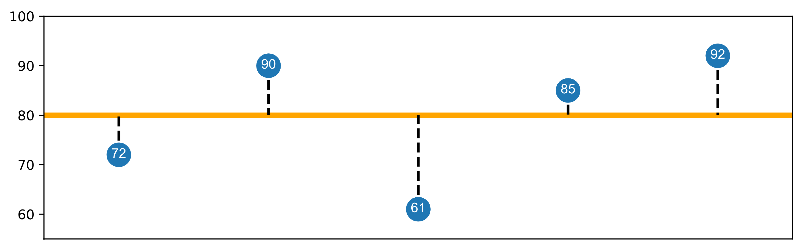

---

### Squared loss vs. absolute loss

- When we use squared loss, $h^*$ is the point at which the average squared loss is minimized.

- When we use absolute loss, $h^*$ is the point at which the average absolute loss is minimized.

 

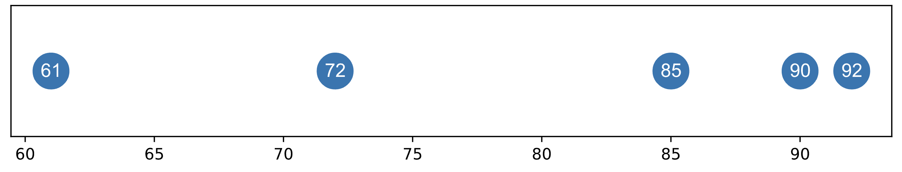

---

### Mean absolute error

- Suppose we collect $n$ commute times, $y_1, y_2, ..., y_n$.
- The **<u>average</u> absolute loss**, or **<u>mean</u> absolute error (MAE)**, of the prediction $h$ is: 

$$R_\text{abs}(h) = \frac{1}{n} \sum_{i = 1}^n |y_i - h|$$

- We'd like to find the best prediction, $h^*$.

- Previously, we used calculus to find the optimal model parameter $h^*$ that minimized $R_\text{sq}$ – that is, when using squared loss.

- Can we use calculus to minimize $R_\text{abs}(h)$, too?

---

     

## Minimizing mean absolute error

---

### Minimizing using calculus, again

We'd like to minimize:

$$R_\text{abs}(h) = \frac{1}{n} \sum_{i = 1}^n |y_i - h|$$

In order to minimize $R_\text{abs}(h)$, we:
1. take its derivative with respect to $h$,
2. set it equal to 0,
3. solve for the resulting $h^*$, and
4. perform a second derivative test to ensure we found a minimum.

---

### Step 0: The derivative of $|y_i-h|$

    &nbsp;
    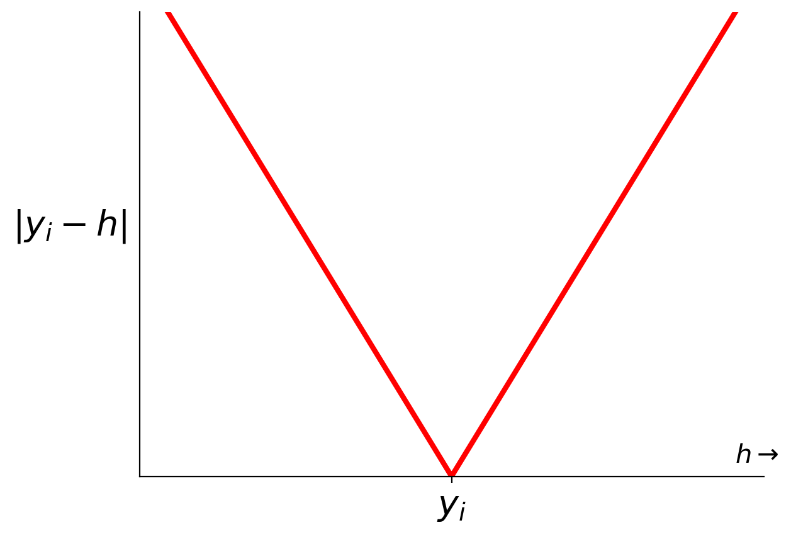
    &nbsp;&nbsp;

<!-- 

    
 
 

    
 -->

 

Remember that $|x|$ is a **piecewise linear** function of $x$:

$|x| = \begin{cases} x & x > 0 \\ 0 &x=0 \\ -x &x < 0 \end{cases}$

So, $| y_i - h|$ is also a piecewise linear function of $h$:

<!-- $$|y_i - h | = \begin{cases} y_i - h &y_i > h\\ 0 &y_i = h \\ h-y_i &y_i < h \end{cases}$$ -->

$|y_i - h | = \begin{cases} y_i - h &h < y_i\\ 0 &y_i = h \\ h-y_i &h > y_i \end{cases}$

---

### Step 0: The "derivative" of $|y_i-h|$

    &nbsp;
    
    &nbsp;&nbsp;

<!-- 

    
 
 

    
 -->

 

 
 

$|y_i - h | = \begin{cases} y_i - h &h < y_i\\ 0 &y_i = h \\ h-y_i &h > y_i \end{cases}$

 
 

 
 

What is $\frac{d}{dh} |y_i - h|$?

---

### Step 1: The "derivative" of $R_\text{abs}(h)$

$$\frac{d}{dh}R_\text{abs}(h) = \frac{d}{dh} \left( \frac{1}{n} \sum_{i = 1}^n |y_i - h| \right) $$

---

### Steps 2 and 3: Set to 0 and solve for the minimizer, $h^*$

---

### The median minimizes mean absolute error!

- The new problem we set out to solve was, find the $h^*$ that minimizes:

$$R_\text{abs}(h) = \frac{1}{n} \sum_{i = 1}^n |y_i - h|$$

- The answer is:

$$h^* = \text{Median}(y_1, y_2, ..., y_n)$$

- This is because the median has an equal number of data points to the left of it and to the right of it.

- To make a bit more sense of this result, let's graph $R_\text{abs}(h)$.

---

### Visualizing mean absolute error

   &nbsp;
   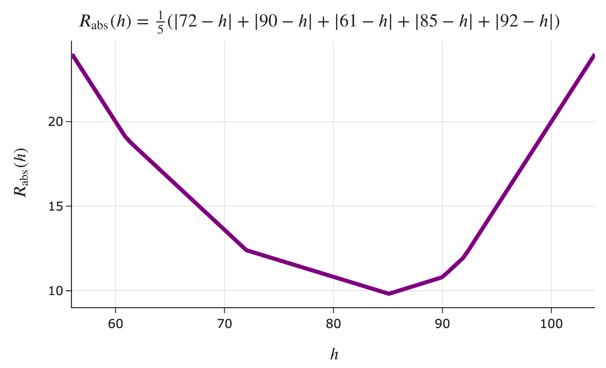
   &nbsp;&nbsp;

<!-- 

    
 
 

    
 -->

 

Consider, again, our example dataset of five commute times.

$72, 90, 61, 85, 92$

Where are the "bends" in the graph of $R_\text{abs}(h)$ – that is, where does its slope change?

---

### Visualizing mean absolute error, with an even number of points

   &nbsp;
   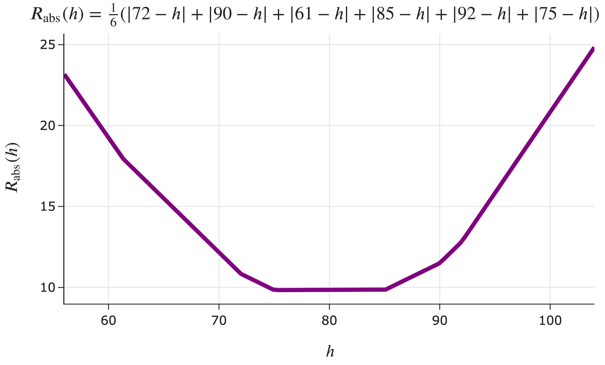
   &nbsp;&nbsp;

<!-- 

    
 
 

    
 -->
    

 

 

What if we add a sixth data point?

$72, 90, 61, 85, 92, 75$

Is there a unique $h^*$?

---

### The median minimizes mean absolute error!

- The new problem we set out to solve was, find the $h^*$ that minimizes:

$$R_\text{abs}(h) = \frac{1}{n} \sum_{i = 1}^n |y_i - h|$$

- The answer is:

$$h^* = \text{Median}(y_1, y_2, ..., y_n)$$

- The **best constant prediction**, in terms of mean absolute error, is always the **median**.
  - When $n$ is odd, this answer is unique.
  - When $n$ is even, any number between the middle two data points (when sorted) also minimizes mean absolute error.
  - When $n$ is even, define the median to be the mean of the middle two data points.

---

### The modeling recipe, again

We've now made two full passes through our "modeling recipe."

1. Choose a model.

 

2. Choose a loss function.

 

3. Minimize average loss to find optimal model parameters.

---

### Empirical risk minimization

- The formal name for the process of minimizing average loss is **empirical risk minimization**.

- Another name for "average loss" is **empirical risk**.

- When we use the squared loss function, $L_\text{sq}(y_i, h) = (y_i - h)^2$, the corresponding empirical risk is mean squared error:

$$R_\text{sq}(h) = \frac{1}{n} \sum_{i = 1}^n (y_i - h)^2$$

- When we use the absolute loss function, $L_\text{abs}(y_i, h) = |y_i - h|$, the corresponding empirical risk is mean absolute error:

$$R_\text{abs}(h) = \frac{1}{n} \sum_{i = 1}^n |y_i - h|$$

---

### Empirical risk minimization, in general

**Key idea**: If $L(y_i, h)$ is **any** loss function, the corresponding empirical risk is:

$$R(h) = \frac{1}{n} \sum_{i = 1}^n L(y_i, h)$$

---

### Question 🤔 
**Answer in chat or in Q&A**

   

<big><b>What questions do you have?</b></big>

---

### Summary, next time

- $h^* = \text{Mean}(y_1, y_2, ..., y_n)$ minimizes mean squared error, $R_\text{sq}(h) = \frac{1}{n} \sum_{i = 1}^n (y_i - h)^2$.

- $h^* = \text{Median}(y_1, y_2, ..., y_n)$ minimizes mean absolute error, $R_\text{abs}(h) = \frac{1}{n} \sum_{i = 1}^n |y_i - h|$.

- $R_\text{sq}(h)$ and $R_\text{abs}(h)$ are examples of **empirical risk** – that is, average loss.

- **Next time**: What's the relationship between the mean and median? What is the significance of $R_\text{sq}(h^*)$ and $R_\text{abs}(h^*)$?

<!-- ---

     

## A practice exam problem

---

### An exam problem? Already?

- Homework 1 is going to be released soon.
- In it, you'll be asked to _show_ or _prove_ that various facts hold true – but you may have never done this before!
- To help you practice, we'll walk through an old exam problem together.

---

Define the extreme mean ($\text{EM}$) of a dataset to be the average of its largest and smallest values. Let $f(x) = -3x + 4$.

Show that for any dataset $x_1 \leq x_2 \leq ... \leq x_n$,

$$\text{EM}(f(x_1), f(x_2), ..., f(x_n)) = f(\text{EM}(x_1, x_2, ..., x_n))$$

---
 -->
