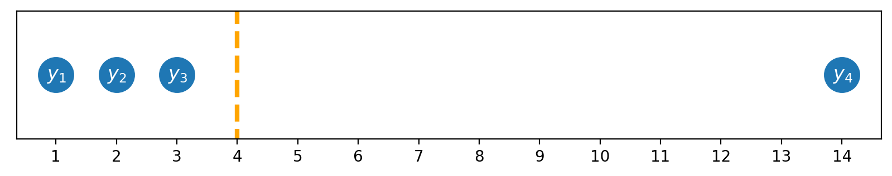
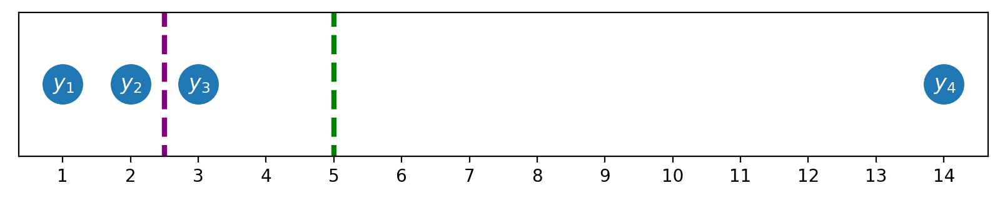
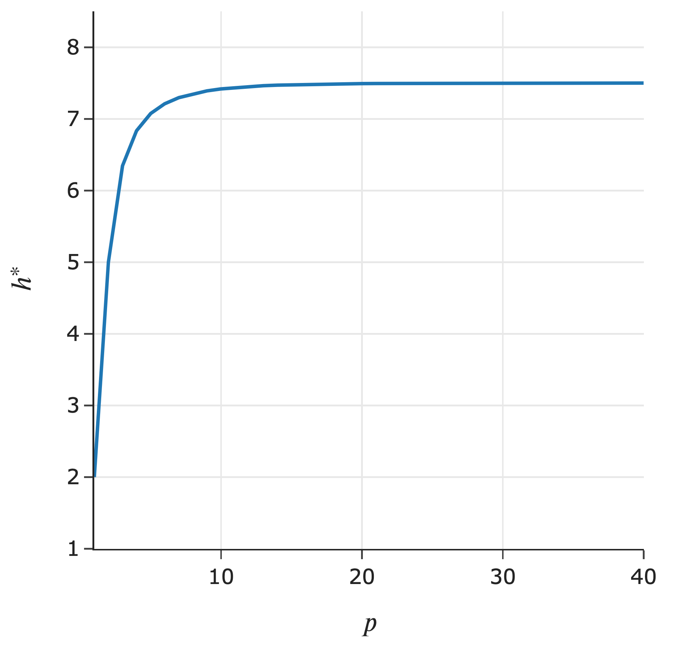
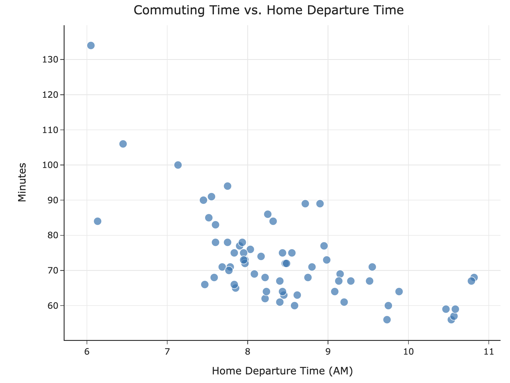
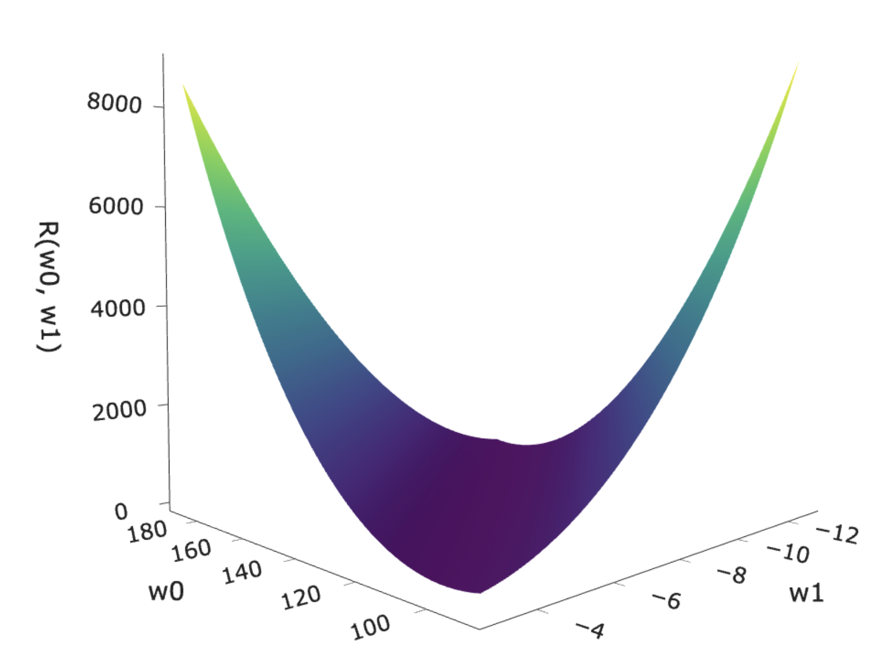

<!-- These set styles for the entire document. -->

   

##### Lecture 2

# Comparing Loss Functions and Simple Linear Regression

#### DSC 40A, Summer 2026

---

   

##### Lecture 2 part 1

# Comparing Loss Functions 

---

### Announcements

- Homework 1 is due to Gradescope on **Monday, July 6th**.
- Discussion is today, directly after lecture at 2pm here.
  - Remember that, in general, groupwork worksheets are released on Wednesday and due Thursday.
  - Starting next week you will need to sign up for a check off meeting with your group.
- Look at the office hours schedule [here](https://dsc-courses.github.io/DSC40A-SU26/syllabus/#office-hours) and plan to start regularly attending!
- Remember to take a look at the supplementary readings linked on the course website.
- Please participate in lecture through hand raising, chat, and/or Q&A.

---

### Agenda for part 1

- Recap: Empirical risk minimization.
- Choosing a loss function.
  - The role of outliers.
- Center and spread.
- Towards linear regression.
- Break!

---

### Follow-Ups and Questions from Lecture 1

- Are there guidelines to bad loss functions?
  - Kinda: if it fails to provide useful information or guides you towards predictions that don't align with the real-world goals. 
    - Non-differentiable $\rightarrow$ we will explore why in more depth later on, but for now if the loss function isn't differentiable then there's no way to tell whether that point is a minimum.
    - Unbounded or exploding slope $\rightarrow$ we will be looking into this today!
- Any other lingering questions from last time?

---

### Question 🤔
**Answer in chat or Q&A**

   

<big><b>Remember, you can always ask questions.</b></big>

---

     

## Recap: Empirical risk minimization

---

### Goal

We had one goal in Lecture 1: given a dataset of values from the past, **find the best constant prediction** to make.

 

$$y_1 = 72 \:\:\:\:\:\:\:\:\:\: y_2 = 90 \:\:\:\:\:\:\:\:\:\: y_3 = 61 \:\:\:\:\:\:\:\:\:\: y_4 = 85 \:\:\:\:\:\:\:\:\:\: y_5 = 92$$

 

**Key idea**: Different definitions of "best" give us different "best predictions."

---

### The modeling recipe

In Lecture 1, we made two full passes through our "modeling recipe."

1. Choose a model.

 

2. Choose a loss function.

 

3. Minimize average loss to find optimal model parameters.

---

### Empirical risk minimization

- The formal name for the process of minimizing average loss is **empirical risk minimization**.

- Another name for "average loss" is **empirical risk**.

- When we use the squared loss function, $L_\text{sq}(y_i, h) = (y_i - h)^2$, the corresponding empirical risk is mean squared error:

$$R_\text{sq}(h) = \frac{1}{n} \sum_{i = 1}^n (y_i - h)^2$$

- When we use the absolute loss function, $L_\text{abs}(y_i, h) = |y_i - h|$, the corresponding empirical risk is mean absolute error:

$$R_\text{abs}(h) = \frac{1}{n} \sum_{i = 1}^n |y_i - h|$$

---

### Empirical risk minimization, in general

**Key idea**: If $L(y_i, h)$ is **any** loss function, the corresponding empirical risk is:

$$R(h) = \frac{1}{n} \sum_{i = 1}^n L(y_i, h)$$

 
 
 
 
 
 
 
 

---

### Question 🤔
**Answer in chat or Q&A**

   

<big><b>Remember, you can always ask questions.</b></big>

---

### Question 🤔
**Answer in chat (not Q&A)**

$$R_\text{sq}(h) = \frac{1}{n} \sum_{i = 1}^n (y_i - h)^2$$

$$R_\text{abs}(h) = \frac{1}{n} \sum_{i = 1}^n |y_i - h|$$

Is the following statement true, for any dataset $y_1, y_2, ..., y_n$ and prediction $h$?

$$\left( R_\text{abs}(h) \right)^2 = R_\text{sq}(h)$$

- A. It's true for any $h$ and any dataset.
- B. It's can sometimes be true, but not in general.
- C. It's never true.

---

     

## Choosing a loss function

---

### Now what?

- We know that, for the constant model $H(x) = h$, the **mean** minimizes mean **squared** error.
- We also know that, for the constant model $H(x) = h$, the **median** minimizes mean **absolute** error.
- **How does our choice of loss function impact the resulting optimal prediction?**

---

### Comparing the mean and median

- Consider our example dataset of 5 commute times.

$$y_1 = 72 \:\:\:\:\:\:\:\:\:\: y_2 = 90 \:\:\:\:\:\:\:\:\:\: y_3 = 61 \:\:\:\:\:\:\:\:\:\: y_4 = 85 \:\:\:\:\:\:\:\:\:\: y_5 = 92$$

- As of now, the **median is 85** and the **mean is 80**.
- What if we add 200 to the largest commute time, $92$?

$$y_1 = 72 \:\:\:\:\:\:\:\:\:\: y_2 = 90 \:\:\:\:\:\:\:\:\:\: y_3 = 61 \:\:\:\:\:\:\:\:\:\: y_4 = 85 \:\:\:\:\:\:\:\:\:\: y_5 = 292$$

- Now, the median is &nbsp;&nbsp;&nbsp;&nbsp;&nbsp;&nbsp;&nbsp;&nbsp;&nbsp;&nbsp;&nbsp;&nbsp;&nbsp;&nbsp;&nbsp;&nbsp;&nbsp;&nbsp;&nbsp;&nbsp;&nbsp;&nbsp;&nbsp;&nbsp;&nbsp;&nbsp;&nbsp;&nbsp;&nbsp;&nbsp;&nbsp;&nbsp; but the mean is &nbsp;&nbsp;&nbsp;&nbsp;&nbsp;&nbsp;&nbsp;&nbsp;&nbsp;&nbsp;&nbsp;&nbsp;&nbsp;&nbsp;&nbsp;&nbsp;&nbsp;&nbsp;&nbsp;&nbsp;&nbsp;&nbsp;&nbsp;!

- **Key idea**: The mean is quite **sensitive** to outliers.

---

### Outliers

Below, $|y_4 - h|$ is 10 times as big as $|y_3 - h|$, but $(y_4 - h)^2$ is 100 times $(y_3 - h)^2$.

The result is that the <b>mean</b> is "pulled" in the direction of outliers, relative to the <b>median</b>.

As a result, we say the <b>median</b> is **robust** to outliers. But the <b>mean</b> was easier to solve for.

---

---

### Example: Income inequality

---

### Balance points

Both the <b>mean</b> and <b>median</b> are "balance points" in the distribution.

- The <b>mean</b> is the point where $\sum_{i = 1}^n (y_i - h) = 0$.
  - This appears in Homework 1!

 

- The <b>median</b> is the point where $\# \: (y_i < h) = \# \: (y_i > h)$.

--- 

### Why stop at squared loss?

| Empirical Risk, $R(h)$ | Derivative of Empirical Risk, $\frac{d}{dh}R(h)$ | Minimizer |
| --- | --- | --- |
| $\frac{1}{n} \sum_{i = 1}^n \|y_i - h\|$ | $\frac{1}{n} \big( \sum_{y_i < h} 1 - \sum_{y_i > h}1  \big)$| median |
| $\frac{1}{n} \sum_{i = 1}^n (y_i - h)^2$ | $\frac{-2}{n}\sum_{i = 1}^n (y_i - h)$ | mean |
| $\frac{1}{n} \sum_{i = 1}^n \|y_i - h\|^3$ |    | ??? |
| $\frac{1}{n} \sum_{i = 1}^n (y_i - h)^4$ |    | ??? |
| $\frac{1}{n} \sum_{i = 1}^n (y_i - h)^{100}$ |    | ??? |
| ... | ... | ... |

---

### Generalized $L_p$ loss

For any $p \geq 1$, define the $L_p$ loss as follows:

$$L_p(y_i, h) = |y_i - h|^p$$

The corresponding empirical risk is:

$$R_p(h) = \frac{1}{n} \sum_{i = 1}^n |y_i - h|^p$$

- When $p = 1$, $h^* = \text{Median}(y_1, y_2, ..., y_n)$.
- When $p = 2$, $h^* = \text{Mean}(y_1, y_2, ..., y_n)$.
- What about when $p = 3$?
- What about when $p \rightarrow \infty$?

---

### What value does $h^*$ approach, as $p \rightarrow \infty$?

<!-- 
 -->

        <!-- &nbsp; -->
        
        &nbsp;&nbsp;

Consider the dataset $1, 2, 3, 14$:

On the left:
- The $x$-axis is $p$.
- The $y$-axis is $h^*$, the optimal constant prediction for $L_p$ loss:

$h^* = \underset{h}{\text{argmin}} \frac{1}{n} \sum_{i = 1}^n |y_i-h|^p$

---

### The _midrange_ minimizes average $L_\infty$ loss!

On the previous slide, we saw that as $p \rightarrow \infty$, the minimizer of mean $L_p$ loss approached **the midpoint of the minimum and maximum values in the dataset**, or the <b>midrange</b>.

- As $p \rightarrow \infty$, $R_p(h) = \frac{1}{n} \sum_{i = 1}^n |y_i - h|^p$ minimizes **the "worst case" distance from any data point".** (Read more [here](https://mathworld.wolfram.com/L-Infinity-Norm.html)).
- If your measure of "good" is "not far from any one data point", then the midrange is the best prediction.

I need some space so i am typing stufff yippeeee

I need some more space

if you are reading this hi, my html and css are jank

---

### Another example: 0-1 loss

Consider, for example, the **0-1 loss**:

$$L_{0,1}(y_i, h) = \begin{cases} 0 & y_i = h \\ 1 & y_i \neq h \end{cases}$$

The corresponding empirical risk is:

$$R_{0,1}(h) = \frac{1}{n} \sum_{i = 1}^n L_{0, 1}(y_i, h)$$

---

### Question 🤔
**Answer in chat** (not Q&A)

$$R_{0,1}(h) = \frac{1}{n} \sum_{i = 1}^n \begin{cases} 0 & y_i = h \\ 1 & y_i \neq h \end{cases}$$

Suppose $y_1, y_2, ..., y_n$ are all unique. What is $R_{0, 1}(y_1)$?

- A. 0.
- B. $\frac{1}{n}$.
- C. $\frac{n-1}{n}$.
- D. 1.

---

### Minimizing empirical risk for 0-1 loss

$$R_{0,1}(h) = \frac{1}{n} \sum_{i = 1}^n \begin{cases} 0 & y_i = h \\ 1 & y_i \neq h \end{cases}$$

---

### Summary: Choosing a loss function

**Key idea**: Different loss functions lead to different best predictions, $h^*$!

| Loss | Minimizer | Always Unique? | Robust to Outliers? | Differentiable? |
| --- | --- | --- | --- | --- |
| $L_\text{sq}$ | mean | yes ✅ | no ❌ | yes ✅ |
| $L_\text{abs}$ | median | no ❌ | yes ✅ | no ❌ |
| $L_\infty$ | midrange | yes ✅ | no ❌ | no ❌ |
| $L_\text{0,1}$ | mode | no ❌ | yes ✅ | no ❌ |

 

The optimal predictions, $h^*$, are all **summary statistics** that measure the **center** of the dataset in different ways.

---

     

## Center and spread

---

### What does it mean?

- The general form of empirical risk, for any loss function $L(y_i, h)$, is:

$$R(h) = \frac{1}{n} \sum_{i = 1}^n L(y_i, h)$$

- As we just saw, the input $h^*$ that minimizes $R(h)$ is some measure of the **center** of the dataset.
  - Examples include the mean ($L_\text{sq}$), median ($L_\text{abs}$), and mode ($L_\text{0,1}$).

- The minimum output, $R(h^*)$, represents some measure of the **spread**, or variation, in the dataset.

---

### Squared loss

- The empirical risk for squared loss, i.e. mean squared error, is:

$$R_\text{sq}(h) = \frac{1}{n} \sum_{i = 1}^n (y_i - h)^2$$

- $R_\text{sq}(h)$ is minimized when $h^* = \text{Mean}(y_1, y_2, ..., y_n)$.
- Therefore, the minimum value of $R_\text{sq}(h)$ is:

$$\begin{align*} R_\text{sq}(h^*) &= R_\text{sq}\left( \text{Mean}(y_1, y_2, ..., y_n) \right) \\  &= \frac{1}{n} \sum_{i = 1}^n \left( y_i -  \text{Mean}(y_1, y_2, ..., y_n) \right)^2  \end{align*}$$

---

### Variance

- The minimum value of $R_\text{sq}(h)$ is the mean squared deviation from the mean, more commonly known as the **variance**.

$$\text{Variance}(y_1, y_2, ..., y_n) =\frac{1}{n} \sum_{i = 1}^n \left( y_i -  \text{Mean}(y_1, y_2, ..., y_n) \right)^2$$

- It measures the squared distance of each data point from the mean, on average.

- Its square root is called the **standard deviation**.

---

---

### Absolute loss

- The empirical risk for absolute loss, i.e. mean absolute error, is:

$$R_\text{abs}(h) = \frac{1}{n} \sum_{i = 1}^n |y_i - h|$$

- $R_\text{abs}(h)$ is minimized when $h^* = \text{Median}(y_1, y_2, ..., y_n)$.

- Therefore, the minimum value of $R_\text{abs}(h)$ is:

$$\begin{align*} R_\text{abs}(h^*) &= \frac{1}{n} \sum_{i = 1}^n |y_i - h| \\ &= R_\text{abs}(h) = \frac{1}{n} \sum_{i = 1}^n |y_i - \text{Median}(y_1, y_2, ..., y_n)| \end{align*}$$

---

### Mean absolute deviation from the median

- The minimum value of $R_\text{abs}(h)$ is the **mean absolute deviation from the median**.

$$\text{MAD from the median}(y_1, y_2, ..., y_n) =  \frac{1}{n} \sum_{i = 1}^n |y_i - \text{Median}(y_1, y_2, ..., y_n)|$$

- It measures how far each data point is from the median, on average.

- **Example**: What's the MAD from the median in the dataset $2, 3, 3, 4, 5$?

---

### Mean absolute deviation from the median

---

### 0-1 loss

- The empirical risk for the 0-1 loss is:

$$R_{0,1}(h) = \frac{1}{n} \sum_{i = 1}^n \begin{cases} 0 & y_i = h \\ 1 & y_i \neq h \end{cases}$$

- This is the proportion (between 0 and 1) of data points not equal to $h$.

- $R_{0,1}(h)$ is minimized when $h^* = \text{Mode}(y_1, y_2, ..., y_n)$.

- Therefore, $R_{0,1}(h^*)$ is the proportion of data points not equal to the mode.

- **Example**: What's the proportion of values not equal to the mode in the dataset $2, 3, 3, 4, 5$?

---

### Summary of center and spread

- Different loss functions $L(y_i, h)$ lead to different empirical risk functions $R(h)$, which are minimized at various measures of **center**.

- The minimum values of empirical risk, $R(h^*)$, are various measures of **spread**.

- There are many different ways to measure both center and spread; these are sometimes called **descriptive statistics**.

---

     

## What's next?

---

### Towards simple linear regression

   
   &nbsp;&nbsp;

- In Lecture 1, we introduced the idea of a hypothesis function, $H(x)$.
- We've focused on finding the best **constant model**, $H(x) = h$.
- Now that we understand the modeling recipe, we can apply it to find the best **simple linear regression model**, $H(x) = w_0 + w_1 x$.
- This will allow us to make predictions that aren't all the same for every data point.

---

### The modeling recipe

1. Choose a model.

  

2. Choose a loss function.

  

3. Minimize average loss to find optimal model parameters.

---

# Break

---

   

##### Lecture 2 part 2

# Simple Linear Regression

#### DSC 40A, Summer 2026

---

### Part 2 Agenda

- Recap: Center and spread.
- Simple linear regression.
- Minimizing mean squared error for the simple linear model.

---

### Question 🤔
**Answer in chat; ask in Q&A**

   

<big><b>Remember, you can always ask questions!</b></big>

---

     

## Recap: Center and spread

---

### The relationship between $h^*$ and $R(h^*)$

- Recall, for a general loss function $L$ and the constant model $H(x) = h$, empirical risk is of the form:

$$R(h) = \frac{1}{n} \sum_{i = 1}^n L(y_i, h)$$

- $h^*$, the value of $h$ that minimizes empirical risk, represents the **center** of the dataset in some way.
- $R(h^*)$, the smallest possible value of empirical risk, represents the **spread** of the dataset in some way.
- The specific center and spread depend on the choice of loss function.

---

### Examples

When using **squared loss**:

- $h^* = \text{Mean}(y_1, y_2, ..., y_n)$.
- $R_{sq}(H^*)=Variance(y_1,y_2,...,y_n)$.

When using **absolute loss**:

- $h^* = \text{Median}(y_1, y_2, ..., y_n)$.
- $R_{abs}(h^*)=$ MAD from the median.

---

     

## Simple linear regression

---

### Recap: Hypothesis functions and parameters

A hypothesis function, $H$, takes in an $x$ as input and returns a predicted $y$.
<b>Parameters</b> define the relationship between the input and output of a hypothesis function.

The simple linear regression model, $H(x) = {\color{purple}w_0} + {\color{purple}w_1}x$, has two parameters: $\color{purple} w_0$ and $\color{purple} w_1$.

    

        &nbsp;
        
    

    

        
    

---

### The modeling recipe

1. Choose a model.

  

2. Choose a loss function.

  

3. Minimize average loss to find optimal model parameters.

---

### Minimizing mean squared error for the simple linear model

- We'll choose squared loss, since it's the easiest to minimize.
- Our goal, then, is to find the linear hypothesis function $H^*(x)$ that minimizes empirical risk:

$$R_{\text{sq}} (H) = \frac{1}{n} \sum_{i = 1}^n \left( y_i - H(x_i) \right)^2$$

- Since linear hypothesis functions are of the form $H(x) = w_0 + w_1x$, we can re-write $R_\text{sq}$ as a function of $w_0$ and $w_1$:

$$\boxed{R_\text{sq}(w_0, w_1) = \frac{1}{n} \sum_{i = 1}^n \left( y_i - (w_0 + w_1 x_i) \right)^2}$$

- **How do we find the parameters $w_0^*$ and $w_1^*$ that minimize $R_\text{sq}(w_0, w_1)$?**

---

### Loss surface

For the constant model, the graph of $R_\text{sq}(h)$ looked like a parabola.

 

What does the graph of $R_\text{sq}(w_0, w_1)$ look like for the simple linear regression model?

---

     

## Minimizing mean squared error for the simple linear model

---

### Minimizing multivariate functions

- Our goal is to find the parameters $w_0^*$ and $w_1^*$ that minimize mean squared error:

$$R_\text{sq}(w_0, w_1) = \frac{1}{n} \sum_{i = 1}^n \left( y_i - (w_0 + w_1 x_i) \right)^2$$

- $R_\text{sq}$ is a function of two variables: $w_0$ and $w_1$.
- To minimize a function of multiple variables:
  - Take partial derivatives with respect to each variable.
  - Set all partial derivatives to 0.
  - Solve the resulting system of equations.
  - Ensure that you've found a minimum, rather than a maximum or saddle point (using the [second derivative test](https://math.stackexchange.com/questions/2058469/how-can-we-minimize-a-function-of-two-variables) for multivariate functions).

---

### Example

Find the point $(x, y, z)$ at which the following function is minimized.

$$f(x, y) = x^2 - 8x + y^2 + 6y - 7$$

         

---

### Minimizing mean squared error

$$R_\text{sq}(w_0, w_1) = \frac{1}{n} \sum_{i = 1}^n \left( y_i - (w_0 + w_1 x_i) \right)^2$$

To find the $w_0^*$ and $w_1^*$ that minimize $R_\text{sq}(w_0, w_1)$, we'll:

1. Find $\frac{\partial R_\text{sq}}{\partial w_0}$ and set it equal to 0.
1. Find $\frac{\partial R_\text{sq}}{\partial w_1}$ and set it equal to 0.
1. Solve the resulting system of equations.

---

### Question 🤔
**Answer in chat**

$$R_\text{sq}(w_0, w_1) = \frac{1}{n} \sum_{i = 1}^n \left( y_i - (w_0 + w_1 x_i) \right)^2$$

Which of the following is equal to $\frac{\partial R_\text{sq}}{\partial w_0}$?

<!-- 

  -->

- A. $\displaystyle\frac{1}{n} \sum_{i=1}^n \left( y_i - (w_0 + w_1x_i) \right)$
- B. $-\displaystyle\frac{1}{n} \sum_{i=1}^n \left( y_i - (w_0 + w_1x_i) \right)$

- C. $\displaystyle-\frac{2}{n} \sum_{i=1}^n \left( y_i - (w_0 + w_1x_i)\right) x_i$
- D. $\displaystyle-\frac{2}{n} \sum_{i=1}^n \left( y_i - (w_0 + w_1x_i) \right)$

---

$\displaystyle R_\text{sq}(w_0, w_1) = \frac{1}{n} \sum_{i = 1}^n \left( y_i - (w_0 + w_1 x_i) \right)^2$

$\displaystyle \frac{\partial R_\text{sq}}{\partial w_0} = \:$

         

---

$\displaystyle R_\text{sq}(w_0, w_1) = \frac{1}{n} \sum_{i = 1}^n \left( y_i - (w_0 + w_1 x_i) \right)^2$

$\displaystyle \frac{\partial R_\text{sq}}{\partial w_1} = \:$

         

---

### Strategy

We have a system of two equations and two unknowns ($w_0$ and $w_1$):

$$
-\frac{2}{n} \sum_{i=1}^n \left( y_i - (w_0 + w_1x_i) \right) = 0
        \qquad
-\frac{2}{n} \sum_{i=1}^n \left( y_i - (w_0 + w_1x_i) \right) x_i = 0$$

To proceed, we'll:

1. Solve for $w_0$ in the first equation.  The result becomes $w_0^*$, because it's the "best intercept."
1. Plug $w_0^*$ into the second equation and solve for $w_1$.  The result becomes $w_1^*$, because it's the "best slope."

---

### Solving for $w_0^*$

$\displaystyle -\frac{2}{n} \sum_{i=1}^n \left( y_i - (w_0 + w_1x_i) \right) = 0$

         

---

### Solving for $w_1^*$

$\displaystyle -\frac{2}{n} \sum_{i=1}^n \left( y_i - (w_0 + w_1x_i) \right) x_i = 0$

         

---

### Least squares solutions

We've found that the values $w_0^*$ and $w_1^*$ that minimize $R_\text{sq}$ are:

$$\begin{align*}
    w_1^* &=
        \frac{
            \displaystyle
            \sum_{i=1}^n (y_i - \bar y)x_i
        }{
            \displaystyle
            \sum_{i=1}^n (x_i - \bar x)x_i
        }
        \qquad
        \qquad
    w_0^* =
        \bar y - w_1^* \bar x
\end{align*}$$

where:

$$\bar{x} = \frac{1}{n} \sum_{i = 1}^n x_i \qquad \qquad \bar{y} = \frac{1}{n} \sum_{i = 1}^n y_i$$

**These formulas work, but let's re-write $w_1^*$ to be a little more symmetric.**

---

### An equivalent formula for $w_1^*$

Claim:
$$
  w_1^* =
      \frac{
          \displaystyle
          \sum_{i=1}^n (y_i - \bar y)x_i
      }{
          \displaystyle
          \sum_{i=1}^n (x_i - \bar x)x_i
      }
      = 
                          \frac{
          \displaystyle
          \sum_{i=1}^n (x_i - \bar x)(y_i - \bar y)
      }{
          \displaystyle
          \sum_{i=1}^n (x_i - \bar x)^2
      }
$$

Proof:

         

---

### Least squares solutions

- The **least squares solutions** for the intercept $w_0$ and slope $w_1$ are:

$$
\boxed{\begin{align*}
w_1^* &=
    \frac{
        \displaystyle
        \sum_{i=1}^n (x_i - \bar x)(y_i - \bar y)
    }{
        \displaystyle
        \sum_{i=1}^n (x_i - \bar x)^2
    }
    \qquad
    \qquad
w_0^* =
    \bar y - w_1^* \bar x
\end{align*}}
$$

- We say $w_0^*$ and $w_1^*$ are **optimal parameters**, and the resulting line is called the **regression line**.
- The process of minimizing empirical risk to find optimal parameters is also called "**fitting to the data**."
- To make predictions about the future, we use $\boxed{H^*(x) = w_0^* + w_1^*x}$.

---

# UPDATE!!!

Let's test these formulas out in code! Follow along by downloading the files on Piazza. [Google Colab](https://colab.research.google.com/drive/12tUzghmCllYEc2KhEmFzmc_7Dl_fHsQ2?usp=sharing) and [commute-times.csv](dev/commute-times.csv)

<!--   -->

---

### Causality

Can we conclude that leaving later **causes** you to get to school quicker?

---

### What's next?

We now know how to find the optimal slope and intercept for linear hypothesis functions. Next, we'll:

- See how the formulas we just derived connect to the formulas for the slope and intercept of the regression line we saw in DSC 10.
  - They're the same, but we need to do a bit of work to prove that.
- Learn how to interpret the slope of the regression line.
- Discuss _causality_.
- Learn how to build regression models with **multiple inputs**.
  - To do this, we'll need linear algebra!