<!-- These set styles for the entire document. -->

   

##### Lecture 3

# More Simple Linear Regression

#### DSC 40A, Summer 2024

---

### Announcements

- Homework 1 is due **tonight**, 11:59PM PT. 
- Homework 2 is due tomorrow, **Tuesday**, at 11:59PM PT.

  - We are aiming to give you feedback on HW 1 before HW 2 is due on Tuesday, keep an eye out tomorrow.

- Week 2 picks up the pace really quickly, please prepare to have more of a workload this week as we start prepare for your upcoming exam.

- Groupwork 1 solutions are available on [Piazza](https://piazza.com/class/mqzuizbulee109/post/29).

---

### Exam Announcements

- Midterm Exam Logistics will be released this week, please keep an eye on your inbox for those. We will be doing live proctoring and you will be expected to be on Zoom with camera and sound on. More details to come ASAP.
  - Many of you are in non-PT time zones. Please plan to take the exam during the expected exam time slot: Wednesday, July 15th, 11:00AM-1:50PM, PT. 
  - We will **not** be accommodating different exam times, unless you have OSD accommodations specifically for that.

- If you intend to use your exam accommodations on this upcoming midterm, please make sure OSD sends your AFA letter to us **by this Friday, July 10th**. 
  - It's hard to change/reschedule your exam last minute, so giving us at least the weekend to rearrange and make sure we can accommodate you is really helpful.

---

### Agenda - Part 1

- Recap: Simple linear regression.
- Correlation.
- Interpreting the formulas.
- Connections to related models.
- Introduction to linear algebra.

---

   

##### Lecture 3 Part 1

# More Simple Linear Regression

#### DSC 40A, Summer 2026

---

### Question 🤔
**Ask in Q&A, respond to questions in chat.**

   

<big><b>Remember, you can always ask questions!</b></big>

---

     

## Recap: Simple linear regression

---

### Recap

    
 
     

    

    
 

- In Lecture 2 part 1, our goal was to fit a **simple linear regression** model, $H(x) = w_0 + w_1 x$, to our commute times dataset.
    - $x_i$: The $i$th home departure time (e.g. 8.5, for 8:30 AM).
    - $y_i$: The $i$th actual commute time (e.g. 76 minutes).
    - $H(x_i)$: The $i$th predicted commute time.
- To do so, we used squared loss.

---

### The modeling recipe

1. Choose a model.

  

2. Choose a loss function.

  

3. Minimize average loss to find optimal model parameters.

 
 
 

---

### Least squares solutions

- Our goal was to find the parameters $w_0^*$ and $w_1$* that minimized:

$$R_\text{sq}(w_0, w_1) = \frac{1}{n} \sum_{i = 1}^n \left( y_i - (w_0 + w_1 x_i) \right)^2$$

- To do so, we used calculus, and we found that the minimizing values are:

$$
\boxed{\begin{align*}
w_1^* &=
    \frac{
        \displaystyle
        \sum_{i=1}^n (x_i - \bar x)(y_i - \bar y)
    }{
        \displaystyle
        \sum_{i=1}^n (x_i - \bar x)^2
    }
    \qquad
    \qquad
w_0^* =
    \bar y - w_1^* \bar x
\end{align*}}
$$

- We say $w_0^*$ and $w_1^*$ are **optimal parameters**, and the resulting line is called the **regression line**.

---

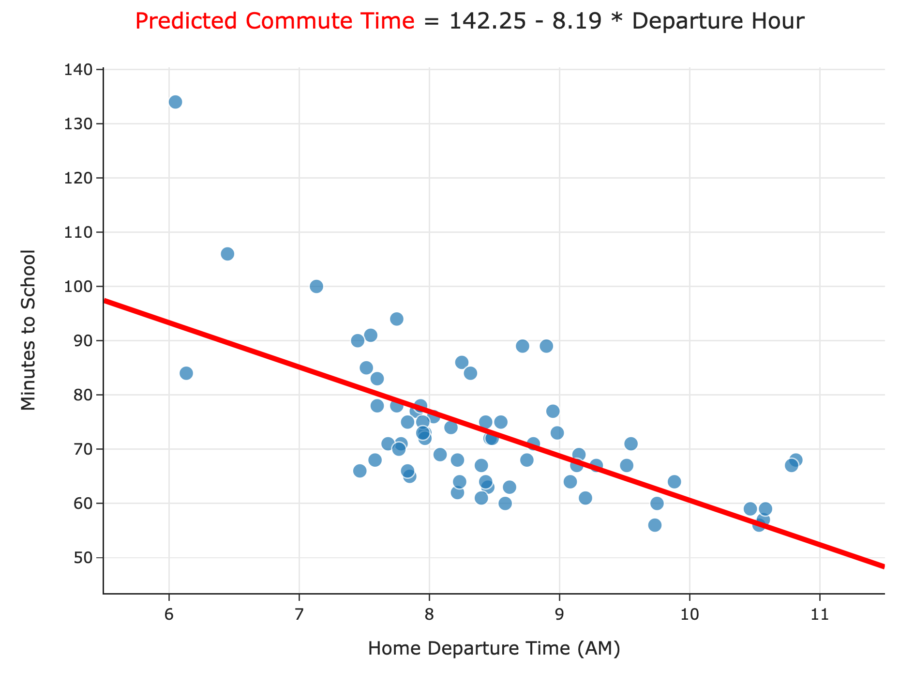

---

### Now what?

We've found the optimal slope and intercept for linear hypothesis functions using squared loss (i.e. for the regression line). Now, we'll:

- See how the formulas we just derived connect to the formulas for the slope and intercept of the regression line we saw in DSC 10.
  - They're the same, but we need to do a bit of work to prove that.
- Learn how to interpret the slope of the regression line.
- Understand connections to other related models.
- Learn how to build regression models with **multiple inputs**.
  - To do this, we'll need linear algebra!

---

### Question 🤔
**Answer in chat**

Consider a dataset with just two points, $(2, 5)$ and $(4, 15)$. Suppose we want to fit a linear hypothesis function to this dataset using squared loss. What are the values of $w_0^*$ and $w_1^*$ that minimize empirical risk?

- A. $w_0^* = 2$, $w_1^* = 5$
- B. $w_0^* = 3$, $w_1^* = 10$
- C. $w_0^* = -2$, $w_1^* = 5$
- D. $w_0^* = -5$, $w_1^* = 5$

---

     

## Correlation

---

### Quantifying patterns in scatter plots

   

    
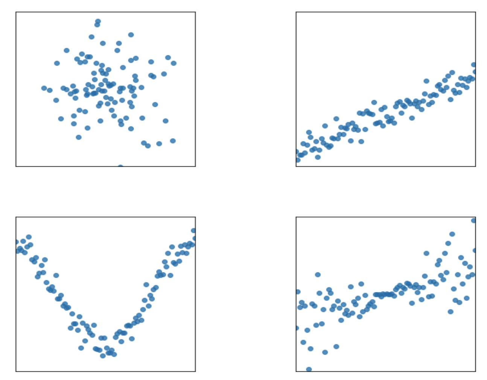
   

   

- In DSC 10, you were introduced to the idea of the **correlation coefficient**, $r$.
- It is a measure of the strength of the **linear association** of two variables, $x$ and $y$.
- Intuitively, it measures how tightly clustered a scatter plot is around a straight line.
- It ranges between -1 and 1. 

---

### The correlation coefficient

- The correlation coefficient, $r$, is defined as the **average of the product of $x$ and $y$, when both are in standard units**.
- Let $\sigma_x$ be the standard deviation of the $x_i$s, and $\bar{x}$ be the mean of the $x_i$s.
- $x_i$ in standard units is $\frac{x_i - \bar{x}}{\sigma_x}$.
- The correlation coefficient, then, is:

$$r = \frac{1}{n} \sum_{i = 1}^n \left( \frac{x_i - \bar{x}}{\sigma_x} \right) \left( \frac{y_i - \bar{y}}{\sigma_y} \right) $$

---

### The correlation coefficient, visualized

 

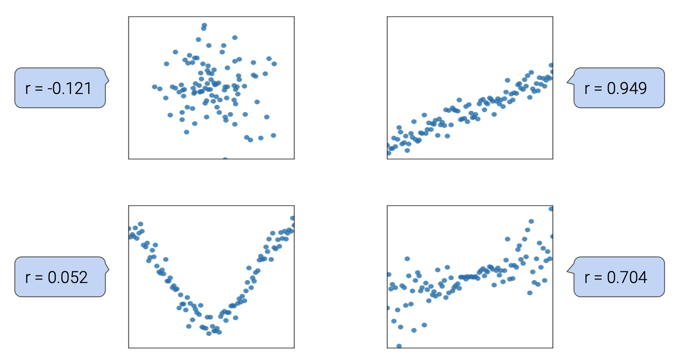

---

### Another way to express $w_1^*$

- It turns out that $w_1^*$, the optimal slope for the linear hypothesis function when using squared loss (i.e. the regression line), can be written in terms of $r$!

    $$w_1^* = \frac{
                        \displaystyle
                        \sum_{i=1}^n (x_i - \bar x)(y_i - \bar y)
                    }{
                        \displaystyle
                        \sum_{i=1}^n (x_i - \bar x)^2
                    } = r \frac{\sigma_y}{\sigma_x}$$

- It's not surprising that $r$ is related to $w_1^*$, since $r$ is a measure of linear association.

- Concise way of writing $w_0^*$ and $w_1^*$:

    $$w_1^* = r\frac{\sigma_y}{\sigma_x} \qquad w_0^* = \bar{y} - w_1^* \bar{x}$$

---

### Proof that $w_1^* = r\frac{\sigma_y}{\sigma_x}$

            

---

Let's test these new formulas out in code! Follow along [here](https://drive.google.com/file/d/1m1qsNYdDofKlPqH7MiagIQDRCLpDl-6f/view?usp=sharing).

 

---

     

## Interpreting the formulas

---

### Interpreting the slope

$$w_1^* = r \frac{\sigma_y}{\sigma_x}$$

- The units of the slope are **units of $y$ per units of $x$**.
- In our commute times example, in $H(x) = 142.25 - 8.19x$, our predicted commute time **decreases by 8.19 minutes per hour**.

       

---

### Interpreting the slope

$$w_1^* = r \frac{\sigma_y}{\sigma_x}$$

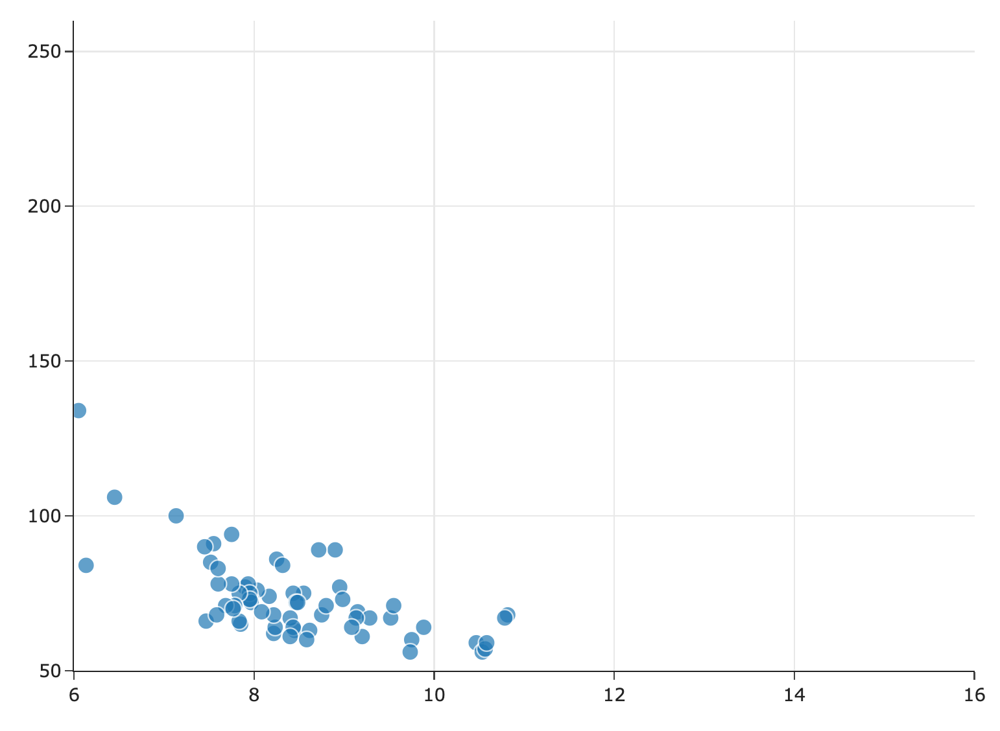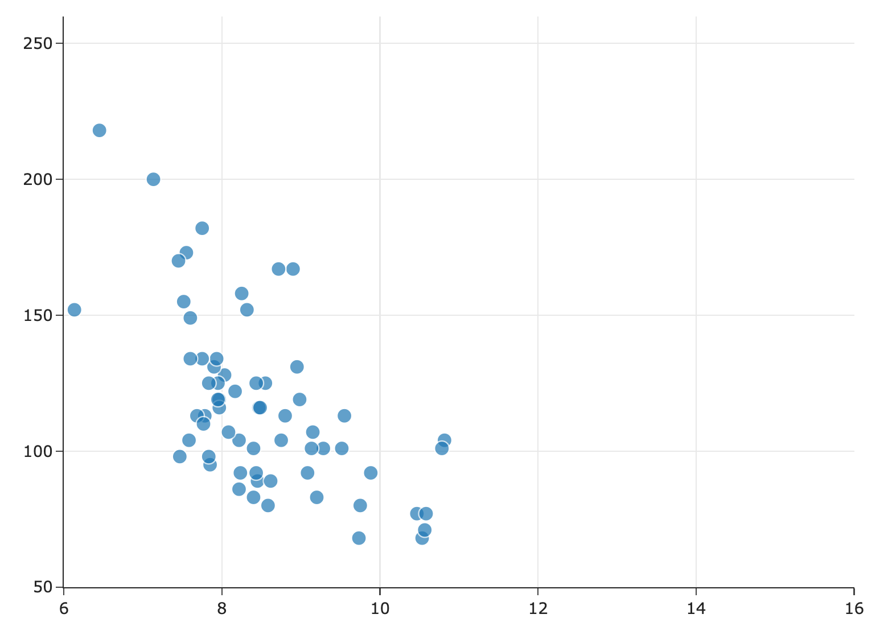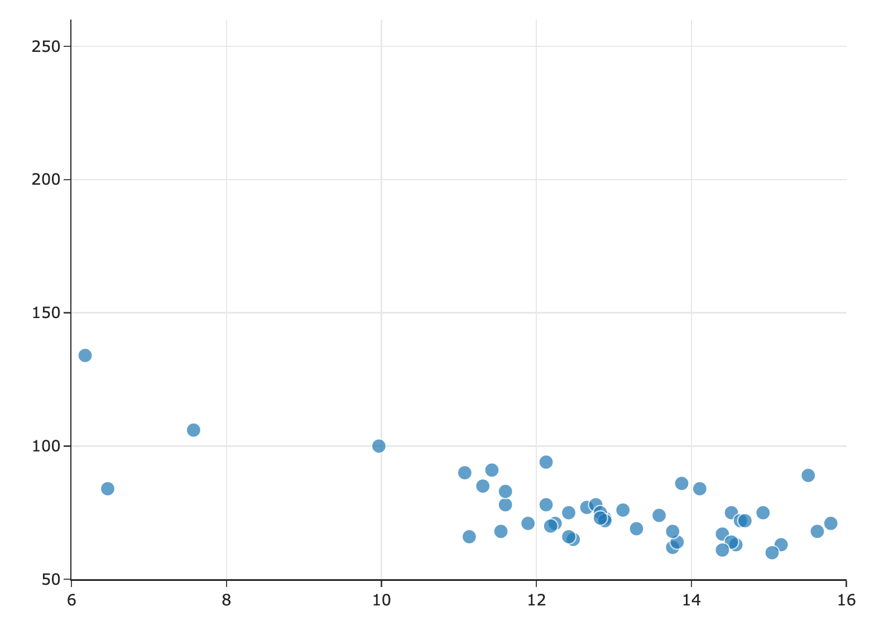

- Since $\sigma_x \geq 0$ and $\sigma_y \geq 0$, the slope's sign is $r$'s sign.

- As the $y$ values get more spread out, $\sigma_y$ increases, so the slope gets steeper.

- As the $x$ values get more spread out, $\sigma_x$ increases, so the slope gets shallower.

---

### Interpreting the intercept

 

 

$w_0^* = \bar{y} - w_1^* \bar{x}$

 

- What are the units of the intercept?   
- What is the value of $H^*(\bar{x})$?

---

### Question 🤔
**Answer in chat.**

We fit a regression line to predict commute times given departure hour. Then, we add 75 minutes to all commute times in our dataset. What happens to the resulting regression line?

- A. Slope increases, intercept increases.
- B. Slope decreases, intercept increases.
- C. Slope stays the same, intercept increases.
- D. Slope stays the same, intercept stays the same.

---

### Correlation and mean squared error (Proof in FAQs page)

- **Claim**: Suppose that $w_0^*$ and $w_1^*$ are the optimal intercept and slope for the regression line. Then,

$${\color{purple}R_\text{sq}(w_0^*, w_1^*)} = \sigma_y^2 (1 - {\color{blue}r}^2)$$

- That is, the mean squared error of the regression line's predictions and the correlation coefficient, ${\color{blue}r}$, always satisfy the relationship above.

- Even if it's true, why do we care?
    - In machine learning, we often use both the mean squared error and ${\color{blue}r}^2$ to compare the performances of different models.
    - If we can prove the above statement, we can show that **finding models that minimize mean squared error** is equivalent to **finding models that maximize ${\color{blue}r}^2$**.

<!-- ---

### Proof that $R_\text{sq}(w_0^*, w_1^*) = \sigma_y^2 (1 - r^2)$

            

---
 -->

---

     

## Connections to related models

---

### Question 🤔
**Answer in chat.**

Suppose we chose the model $H(x) = w_1 x$ and squared loss. What is the optimal model parameter, $w_1^*$?

- A. $\displaystyle \frac{\sum_{i = 1}^n (x_i - \bar{x})(y_i - \bar{y})}{\sum_{i = 1}^n (x_i - \bar{x})^2}$

- B. $\displaystyle \frac{\sum_{i = 1}^n x_iy_i}{\sum_{i = 1}^n x_i^2}$

 

- C. $\displaystyle \frac{\sum_{i = 1}^n x_iy_i}{\sum_{i = 1}^n x_i^2}$ &nbsp;&nbsp;&nbsp;&nbsp;&nbsp;&nbsp;&nbsp;&nbsp;&nbsp;&nbsp;&nbsp;&nbsp;&nbsp;&nbsp;&nbsp;&nbsp;&nbsp;&nbsp;&nbsp;&nbsp;&nbsp;&nbsp;&nbsp;&nbsp;&nbsp;&nbsp;&nbsp;&nbsp;&nbsp;&nbsp;&nbsp;&nbsp;&nbsp;&nbsp;&nbsp;&nbsp;&nbsp;&nbsp;&nbsp;&nbsp;&nbsp;&nbsp;&nbsp;&nbsp;&nbsp;

- D. $\displaystyle \frac{\sum_{i = 1}^n y_i}{\sum_{i = 1}^n x_i}$

---

### Exercise

Suppose we chose the model $H(x) = w_1 x$ and squared loss. What is the optimal model parameter, $w_1^*$?

  
  
  
  

---

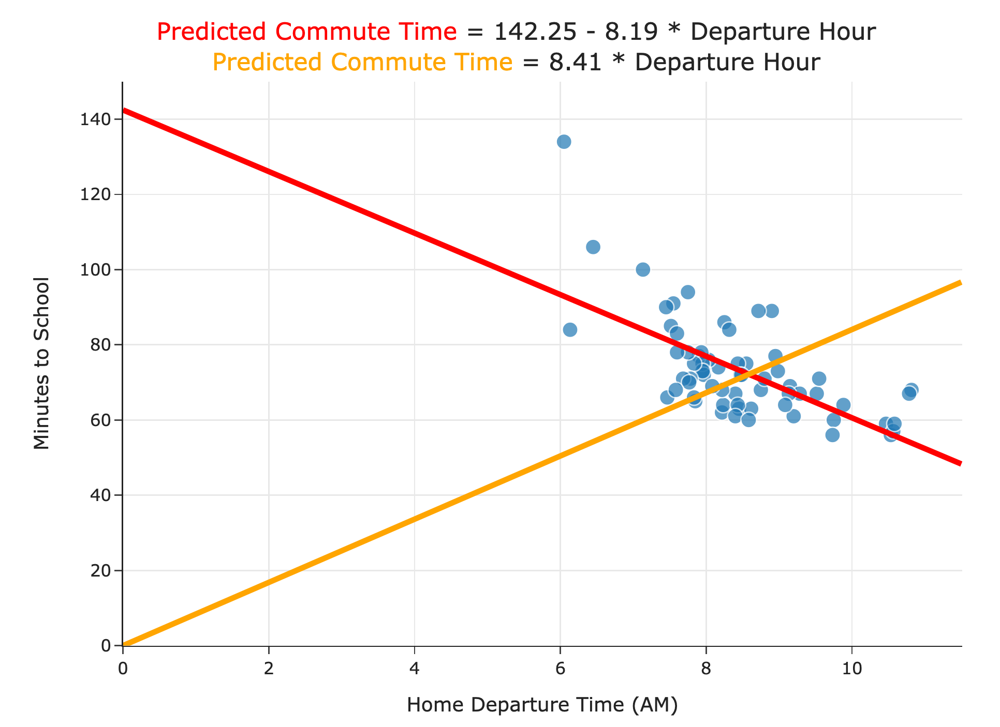

---

### Exercise

Suppose we choose the model $H(x) = w_0$ and squared loss. What is the optimal model parameter, $w_0^*$?

  
  
  
  

---

### Comparing mean squared errors

- With both:
    - the constant model, $H(x) = h$, and 
    - the simple linear regression model, $H(x) = w_0 + w_1x$, 
   
   when we chose squared loss, we minimized mean squared error to find optimal parameters:

$$R_\text{sq}(H) = \frac{1}{n} \sum_{i = 1}^n \left( y_i - H(x_i) \right)^2$$

- **Which model minimizes mean squared error more?**

---

### Comparing mean squared errors

 

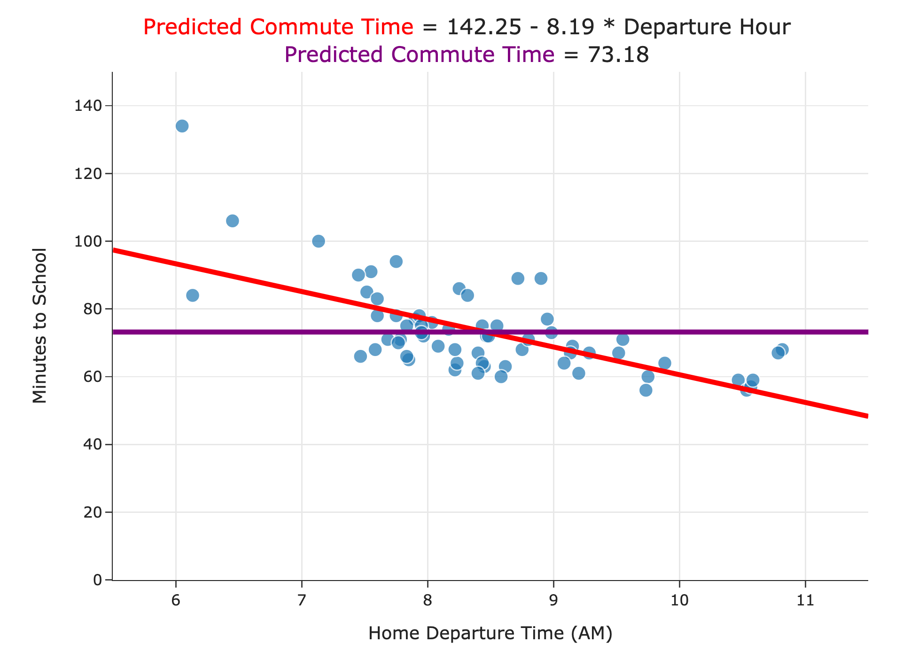

    
 

$\text{MSE} = \frac{1}{n} \sum_{i = 1}^n \left( y_i - H(x_i) \right)^2$

- The MSE of the best simple linear regression model is $\approx 97$.
- The MSE of the best constant model is $\approx 167$.
- The simple linear regression model is a more flexible version of the constant model.

---

     

## Linear algebra review

---

### Wait... why do we need linear algebra?

- Soon, we'll want to make predictions using more than one feature.
    - Example: Predicting commute times using departure hour and temperature.
- Thinking about linear regression in terms of **matrices and vectors** will allow us to find hypothesis functions that:
    - Use multiple features (input variables).
    - Are non-linear, e.g. $H(x) = w_0 + w_1 x + w_2 x^2$.
- Before we dive in, let's review.

  
  

---

### Spans of vectors

- One of the most important ideas you'll need to remember from linear algebra is the concept of the **span** of two or more vectors.
- To jump start our review of linear algebra, let's start by watching [🎥 **this video by 3blue1brown**](https://youtu.be/k7RM-ot2NWY?si=HRt1nlqIWJPLI0cp).

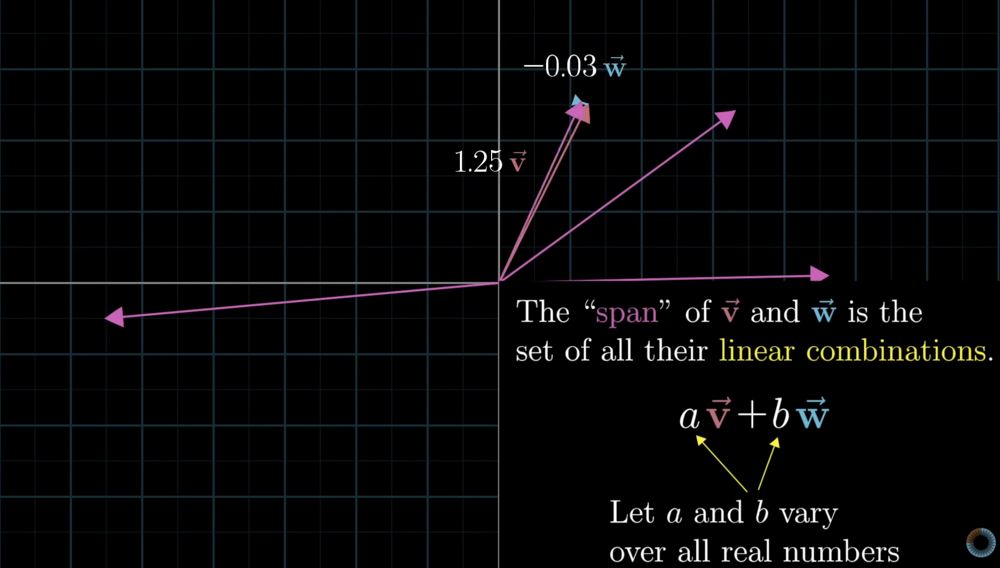

---

### Next time

- We'll review the necessary linear algebra prerequisites.
- We'll then start to formulate the problem of minimizing mean squared error for the simple linear regression model **using matrices and vectors**.

  
  
  

---

# Break

---

   

##### Lecture 3 Part 2

# Dot Products and Projections

#### DSC 40A, Summer 2026

---

### Agenda for Part 2

- Recap: Friends of simple linear regression.
- Dot products.
- Spans and projections.

---

### Question 🤔
**Answer in chat**

   

<big><b>Remember, you can always ask questions!</b></big>

  

---

     

## Recap: Friends of simple linear regression

---

---

### Simple linear regression

- Model: $H(x) = w_0 + w_1x$.
- Loss function: squared loss, i.e. $L_\text{sq}(y_i, H(x_i)) = (y_i - H(x_i))^2$.
- Average loss, i.e. empirical risk:

$$R_\text{sq}(w_0, w_1) = \frac{1}{n} \sum_{i = 1}^n \left( y_i - (w_0 + w_1 x_i) \right)^2$$

- Optimal model parameters, found by minimizing empirical risk:

$$w_1^* = \frac{
                        \displaystyle
                        \sum_{i=1}^n (x_i - \bar x)(y_i - \bar y)
                    }{
                        \displaystyle
                        \sum_{i=1}^n (x_i - \bar x)^2
                    } = r \frac{\sigma_y}{\sigma_x}
                    
\qquad\qquad       w_0^* = \bar{y} - w_1^* \bar{x}             
$$

 

$$$$

---

### Friends of simple linear regression

- Suppose we use squared loss throughout.
- If our model is $H(x) = w_1x$, it is a **line that is forced through the origin, $(0, 0)$**.
    
    $$w_1^* = \frac{\sum_{i = 1}^n x_iy_i}{\sum_{i = 1}^n x_i^2}$$

- If our model is $H(x) = w_0$, it is a **line that is forced to have a slope of $0$, i.e. a horizontal line**. This is the same as the constant model from before.

$$w_0^* = \text{Mean}(y_1, y_2, ..., y_n)$$

- **Key idea**: $w_0^*$ above is **not** necessarily equal to $w_0^*$ for the simple linear regression model!

---

### Comparing mean squared errors

 

<!-- 
 -->

    
 

$\text{MSE} = \frac{1}{n} \sum_{i = 1}^n \left( y_i - H(x_i) \right)^2$

- The MSE of the best simple linear regression model is $\approx 97$.
- The MSE of the best constant model is $\approx 167$.
- The simple linear regression model is a more flexible version of the constant model.

---

     

## Dot products

---

### Wait... why do we need linear algebra?

- Soon, we'll want to make predictions using more than one feature.
    - Example: Predicting commute times using departure hour and temperature.
- Thinking about linear regression in terms of **matrices and vectors** will allow us to find hypothesis functions that:
    - Use multiple features (input variables).
    - Are non-linear in the features, e.g. $H(x) = w_0 + w_1 x + w_2 x^2$.
- Before we dive in, let's review.

---

### Spans of vectors

- One of the most important ideas you'll need to remember from linear algebra is the concept of the **span** of one or more vectors.
- To jump start our review of linear algebra, let's start by watching [🎥 **this video by 3blue1brown**](https://youtu.be/k7RM-ot2NWY?si=HRt1nlqIWJPLI0cp).

---

### Warning ⚠️

- We're **not** going to cover every single detail from your linear algebra course.
- There will be facts that you're expected to remember that we won't explicitly say.
    - For example, if $A$ and $B$ are two matrices, then $AB \neq BA$.
    - This is the kind of fact that we will only mention explicitly if it's directly relevant to what we're studying.
    - But you still need to know it, and it may come up in homework questions.
- We **will** review the topics that you really need to know well.

---

### Vectors

- A **vector** in $\mathbb{R}^n$ is an **ordered collection of $n$ numbers**.

- We use lower-case letters with an arrow on top to represent vectors, and we usually write vectors as **columns**.

$$\vec{v} = \begin{bmatrix} 8 \\ 3 \\ -2 \\ 5 \end{bmatrix}$$

- Another way of writing the above vector is $\vec{v} = [8, 3, -2, 5]^\intercal$.

- Since $\vec{v}$ has four **components**, we say $\vec{v} \in \mathbb{R}^4$.

---

### The geometric interpretation of a vector

    
 

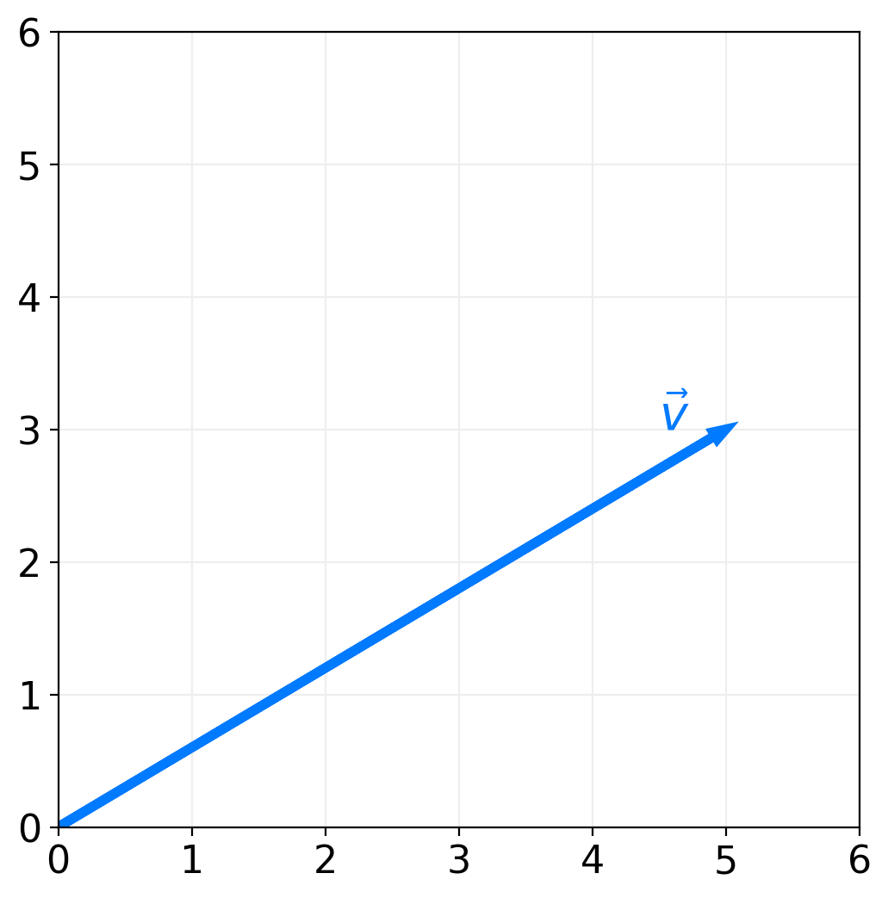

 

- A vector $\vec{v} = \begin{bmatrix} v_1 \\ v_2 \\ \vdots \\ v_n \end{bmatrix}$ is an arrow to the point $(v_1, v_2, ..., v_n)$ from the origin.

- The **length**, or **$L_2$ norm**, of $\vec{v}$ is: 

$\lVert \vec{v} \rVert = \sqrt{v_1^2 + v_2^2 + ... + v_n^2}$

- A vector is sometimes described as an object with a **magnitude/length** and **direction**.

---

### Dot product: coordinate definition

    
 

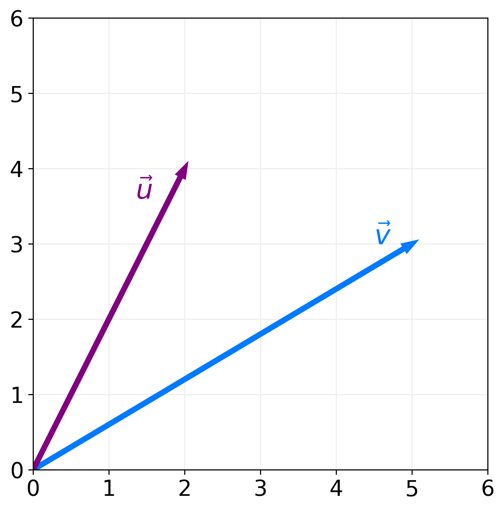

 

- The **dot product** of two vectors $\vec{u}$ and $\vec{v}$ in $\mathbb{R}^n$ is written as:

&nbsp;&nbsp;&nbsp;&nbsp;&nbsp;&nbsp;&nbsp;&nbsp;&nbsp;&nbsp;&nbsp;&nbsp;&nbsp;&nbsp;&nbsp;&nbsp;&nbsp;&nbsp;&nbsp;&nbsp;&nbsp;&nbsp;&nbsp;&nbsp;&nbsp;&nbsp;&nbsp;&nbsp;&nbsp;&nbsp;&nbsp;&nbsp;&nbsp;&nbsp;&nbsp;&nbsp;&nbsp;&nbsp; $\vec{u} \cdot \vec{v} = \vec{u}^\intercal \vec{v}$

- The computational definition of the dot product:

${\color{purple}\vec{u}} \cdot {\color{#007aff}\vec{v}} = \sum_{i = 1}^n {\color{purple}u_i} {\color{#007aff} v_i} = {\color{purple}u_1} {\color{#007aff} v_1} + {\color{purple}u_2} {\color{#007aff} v_2} + ... + {\color{purple}u_n} {\color{#007aff} v_n}$

- The result is a **scalar**, i.e. a single number.

---

### Question 🤔
**Answer in chat.**

Which of these is another expression for the length of $\vec v$?

- A. $\vec v \cdot \vec v$
- B. $\sqrt{\vec v^2}$
- C. $\sqrt{\vec v \cdot \vec v}$
- D. $\vec v^2$
- E. More than one of the above.

---

### Dot product: geometric definition

    
 

 

- The computational definition of the dot product:

${\color{purple}\vec{u}} \cdot {\color{#007aff}\vec{v}} = \sum_{i = 1}^n {\color{purple}u_i} {\color{#007aff} v_i} = {\color{purple}u_1} {\color{#007aff} v_1} + {\color{purple}u_2} {\color{#007aff} v_2} + ... + {\color{purple}u_n} {\color{#007aff} v_n}$

- The geometric definition of the dot product:

&nbsp;&nbsp;&nbsp;&nbsp;&nbsp;&nbsp;&nbsp;&nbsp;&nbsp;&nbsp;&nbsp;&nbsp;&nbsp;&nbsp;&nbsp;&nbsp;&nbsp;&nbsp;&nbsp;&nbsp;&nbsp;&nbsp;&nbsp;&nbsp;&nbsp;&nbsp;&nbsp;&nbsp;&nbsp;&nbsp;&nbsp;&nbsp;&nbsp;&nbsp;&nbsp; ${\color{purple}\vec{u}} \cdot {\color{#007aff}\vec{v}} = \lVert {\color{purple}\vec{u}} \rVert \lVert {\color{#007aff}\vec{v}} \rVert \cos \theta$

where $\theta$ is the angle between $\color{purple}\vec{u}$ and ${\color{#007aff}\vec{v}}$.

- The two definitions are equivalent! This equivalence allows us to find the angle $\theta$ between two vectors.

---

### Question 🤔
**Answer in chat.**

 

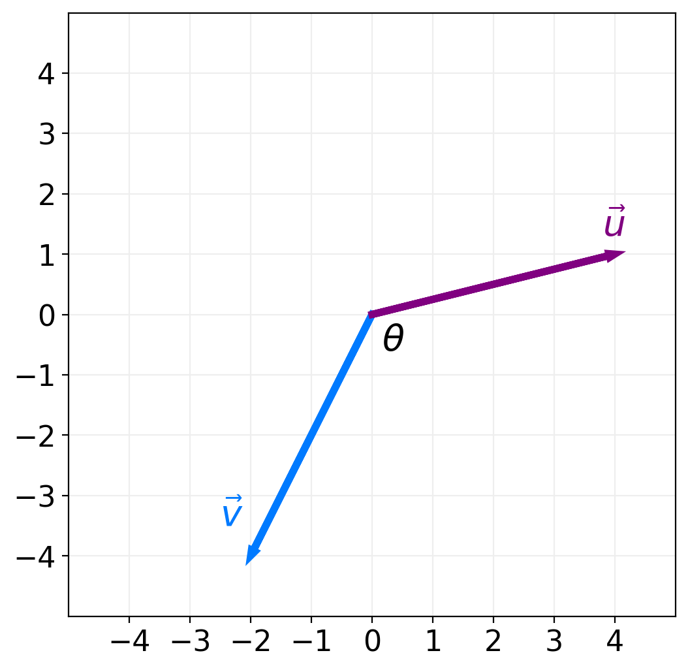

 

What is the value of $\theta$ in the plot to the right?

---

### Orthogonal vectors

- Recall: $\cos 90º = 0$.
- Since $\vec{u} \cdot \vec{v} = \lVert \vec u \rVert \lVert \vec v \rVert \cos \theta$, if the angle between two vectors is $90º$, their dot product is $\lVert \vec u \rVert \lVert \vec v \rVert \cos 90º = 0$.
- If the angle between two vectors is $90º$, we say they are perpendicular, or more generally, **orthogonal**.

- **Key idea**:

$$\boxed{\text{two vectors are \textbf{orthogonal}} \iff \vec{u} \cdot \vec{v} = 0}$$

---

### Exercise

Find a non-zero vector in $\mathbb{R}^3$ orthogonal to:

$$\vec v = \begin{bmatrix} 2 \\ 5 \\ -8 \end{bmatrix}$$

 
       

---

     

## Spans and projections

---

### Adding and scaling vectors

   
 

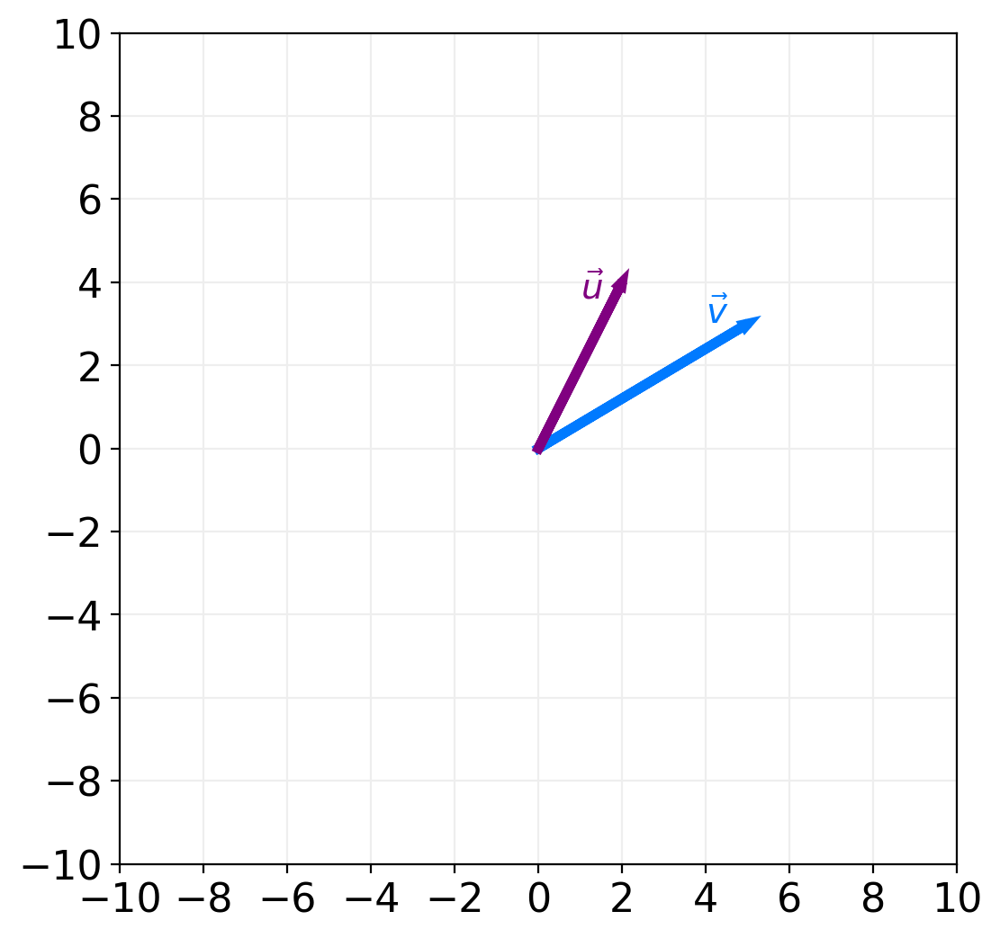

 

- The sum of two vectors $\color{purple} \vec u$ and $\color{#007aff}\vec v$ in $\mathbb{R}^n$ is the  **element-wise sum** of their components:

${\color{purple}\vec{u}} + {\color{#007aff}\vec{v}} = \begin{bmatrix} {\color{purple} u_1} + {\color{#007aff} v_1} \\ {\color{purple} u_2} + {\color{#007aff} v_2} \\ \vdots \\ {\color{purple} u_n} + {\color{#007aff} v_n} \end{bmatrix}$

- If $c$ is a scalar, then:

&nbsp;&nbsp;&nbsp;&nbsp;&nbsp;&nbsp; $c \vec{v} = \begin{bmatrix} cv_1 \\ cv_2 \\ \vdots \\ cv_n \end{bmatrix}$

 

---

### Linear combinations

 

- Let $\vec v_1$, $\vec v_2$, ..., $\vec v_d$ all be vectors in $\mathbb{R}^n$.
- A **linear combination** of $\vec v_1$, $\vec v_2$, ..., $\vec v_d$ is any vector of the form:

$$a_1 \vec v_1 + a_2 \vec v_2 + ... + a_d \vec v_d$$

where $a_1$, $a_2$, ..., $a_d$ are all scalars.

    
 

          

---

### Span

- Let $\vec v_1$, $\vec v_2$, ..., $\vec v_d$ all be vectors in $\mathbb{R}^n$.
- The **span** of $\vec v_1$, $\vec v_2$, ..., $\vec v_d$ is the set of all vectors that can be created using linear combinations of those vectors.
- Formal definition:

$$\text{span}(\vec v_1, \vec v_2, ..., \vec v_d) = \{ a_1 \vec v_1 + a_2 \vec v_2 + ... + a_d \vec v_d : a_1, a_2, ..., a_n \in \mathbb{R} \}$$

            

---

### Exercise

Let $\vec v_1 = \begin{bmatrix} 2 \\ -3 \end{bmatrix}$ and let $\vec v_2 =  \begin{bmatrix} -1 \\ 4 \end{bmatrix}$. Is $\vec y = \begin{bmatrix} 9 \\ 1 \end{bmatrix}$ in $\text{span}(\vec{v_1}, \vec{v_2})$? 
If so, write $\vec{y}$ as a linear combination of $\vec{v_1}$ and $\vec{v_2}$.

                 

<!-- ---

To whoever teaches this in the future: the slides afterwards were improved in Lecture 7, so you may want to bring some of that material to this lecture. -->

---

### Projecting onto a single vector

    
 

 

- Let $\color{#007aff} \vec x$ and $\color{orange} \vec y$ be two vectors in $\mathbb{R}^n$.
- The span of $\color{#007aff} \vec x$ is the set of all vectors of the form:

$w \color{#007aff} \vec x$

where $w \in \mathbb{R}$ is a scalar.

- **Question**: What vector in $\text{span}({\color{#007aff}\vec x})$ is closest to $\color{orange} \vec y$?

- The vector in $\text{span}({\color{#007aff}\vec x})$ that is closest to $\color{orange} \vec y$ is the **projection of $\color{orange} \vec y$ onto $\text{span}({\color{#007aff}\vec x})$**.

---

### Projection error

    
 

&nbsp;&nbsp;&nbsp;&nbsp;&nbsp;&nbsp;&nbsp;&nbsp;

 

- Let ${\color{red} \vec e} = {\color{orange} \vec y} - w{\color{#007aff} \vec x}$ be the **projection error**: that is, the vector that connects ${\color{orange} \vec y}$ to $\text{span}({\color{#007aff}\vec x})$.
- **Goal**: **Find the $w$ that makes $\color{red} \vec e$ as short as possible**.
    - That is, minimize:
    $\lVert {\color{red} \vec e} \rVert$
    - Equivalently, minimize:
    $\lVert {\color{orange} \vec y} - w {\color{#007aff} \vec{x}} \rVert$
- **Idea**: To make $\color{red} \vec{e}$ has short as possible, it should be **orthogonal to $w{\color{#007aff}\vec x}$**.

---

### Minimizing projection error

- **Goal**: **Find the $w$ that makes ${\color{red} \vec e} = {\color{orange} \vec y} - w {\color{#007aff} \vec{x}}$ as short as possible**.

- **Idea**: To make $\color{red} \vec{e}$ as short as possible, it should be **orthogonal to $w{\color{#007aff}\vec x}$**.

- Can we prove that making $\color{red} \vec{e}$ orthogonal to $w{\color{#007aff}\vec x}$ minimizes $\lVert {\color{red} \vec{e}} \rVert$?

         

---

### Minimizing projection error

- **Goal**: **Find the $w$ that makes ${\color{red} \vec e} = {\color{orange} \vec y} - w {\color{#007aff} \vec{x}}$ as short as possible**.
- Now we know that to minimize $\lVert {\color{red} \vec{e}} \rVert$,  $\color{red} \vec{e}$ must be orthogonal to $w{\color{#007aff}\vec x}$.
- Given this fact, how can we solve for $w$?

         

---

### Orthogonal projection

- **Question**: What vector in $\text{span}({\color{#007aff}\vec x})$ is closest to $\color{orange} \vec y$?

- **Answer**: It is the vector $w^* {\color{#007aff}\vec x}$, where:

$$w^* = \frac{{\color{#007aff}\vec x} \cdot {\color{orange}\vec y}}{{\color{#007aff}\vec x} \cdot {\color{#007aff}\vec x}}$$

- Note that $w^*$ is the solution to a minimization problem, specifically, this one:

$${\color{red} \text{error}}(w) = \lVert {\color{red} \vec{e}} \rVert = \lVert {\color{orange} \vec y} - w {\color{#007aff} \vec{x}} \rVert $$

- We call $w^* {\color{#007aff} \vec{x}}$ the **orthogonal projection of $\color{orange} \vec{y}$ onto $\text{span}({\color{#007aff} \vec{x}})$**.
    - Think of $w^* {\color{#007aff} \vec{x}}$ as the "shadow" of $\color{orange} \vec{y}$.

---

### Exercise

Let $\vec{a} = \begin{bmatrix} 5 \\ 2 \end{bmatrix}$ and $\vec{b} = \begin{bmatrix} -1 \\ 9 \end{bmatrix}$.

What is the orthogonal projection of $\vec{a}$ onto $\text{span}(\vec b)$?  Your answer should be of the form $w^* \vec b$, where $w^*$ is a scalar.

         

---

### Moving to multiple dimensions

- Let's now consider three vectors, $\color{orange}\vec{y}$, $\color{#007aff} \vec{x}^{(1)}$, and $\color{#007aff} \vec{x}^{(2)}$, all in $\mathbb{R}^n$.

- **Question**: What vector in $\text{span}({\color{#007aff} \vec{x}^{(1)}}, {\color{#007aff} \vec{x}^{(2)}})$ is closest to ${\color{orange} \vec{y}}$? 

    - Vectors in $\text{span}({\color{#007aff} \vec{x}^{(1)}}, {\color{#007aff} \vec{x}^{(2)}})$ are of the form $w_1 {\color{#007aff} \vec{x}^{(1)}} + w_2 {\color{#007aff} \vec{x}^{(2)}}$, where $w_1$, $w_2 \in \mathbb{R}$ are scalars.

- Before trying to answer, let's watch [**🎥 this animation that Jack, one of our tutors, made**](https://youtu.be/dJcbJKpYywk?si=giWFps-ixYDXBwzh).

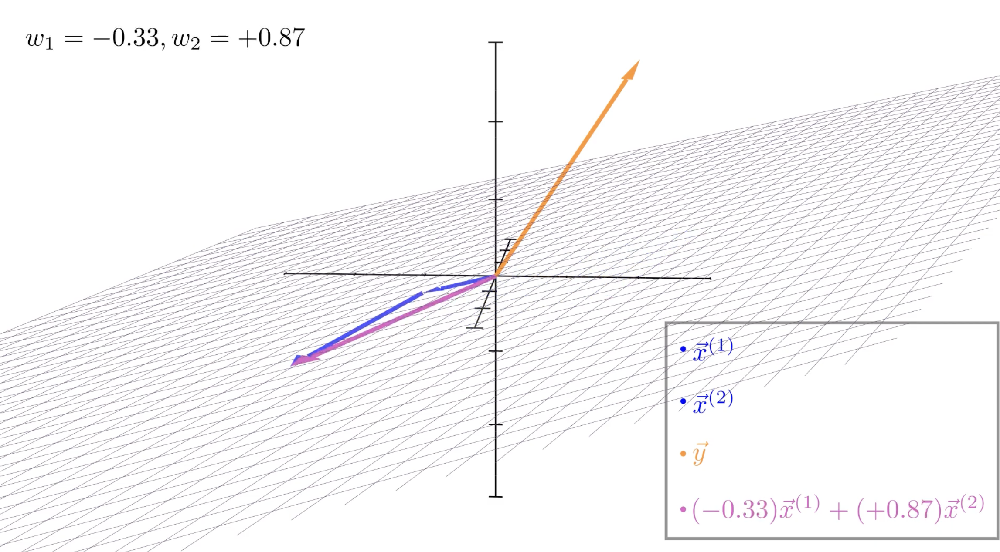

---

### Minimizing projection error in multiple dimensions

- **Question**: What vector in $\text{span}({\color{#007aff} \vec{x}^{(1)}}, {\color{#007aff} \vec{x}^{(2)}})$ is closest to ${\color{orange} \vec{y}}$? 
    - That is, what vector minimizes $\lVert {\color{red} \vec{e}} \rVert$, where:

    $${\color{red} \vec{e}} = {\color{orange} \vec{y}} - w_1 {\color{#007aff} \vec{x}^{(1)}} - w_2 {\color{#007aff} \vec{x}^{(2)}}$$

- **Answer**: It's the vector such that $w_1 {\color{#007aff} \vec{x}^{(1)}} + w_2 {\color{#007aff} \vec{x}^{(2)}}$ is **orthogonal** to $\color{red} \vec e$.

- **Issue**: Solving for $w_1$ and $w_2$ in the following equation is difficult:

$$\left( w_1 {\color{#007aff} \vec{x}^{(1)}} + w_2 {\color{#007aff} \vec{x}^{(2)}} \right) \cdot \underbrace{\left( {\color{orange} \vec y} -   w_1 {\color{#007aff} \vec{x}^{(1)}} - w_2 {\color{#007aff} \vec{x}^{(2)}}\right)}_{\color{red} \vec e} = 0$$

---

### What's next?

- It's hard for us to solve for $w_1$ and $w_2$ in:

$$\left( w_1 {\color{#007aff} \vec{x}^{(1)}} + w_2 {\color{#007aff} \vec{x}^{(2)}} \right) \cdot \underbrace{\left( {\color{orange} \vec y} -   w_1 {\color{#007aff} \vec{x}^{(1)}} - w_2 {\color{#007aff} \vec{x}^{(2)}}\right)}_{\color{red} \vec e} = 0$$

- **Solution**: Combine ${\color{#007aff} \vec{x}^{(1)}}$ and ${\color{#007aff} \vec{x}^{(2)}}$ into a single **matrix**, ${\color{#007aff} X}$, and express $w_1 {\color{#007aff} \vec{x}^{(1)}} + w_2 {\color{#007aff} \vec{x}^{(2)}}$ as a **matrix-vector multiplication**, ${\color{#007aff} X}\vec{w}$.

- **Next time**: Formulate linear regression in terms of matrices and vectors!