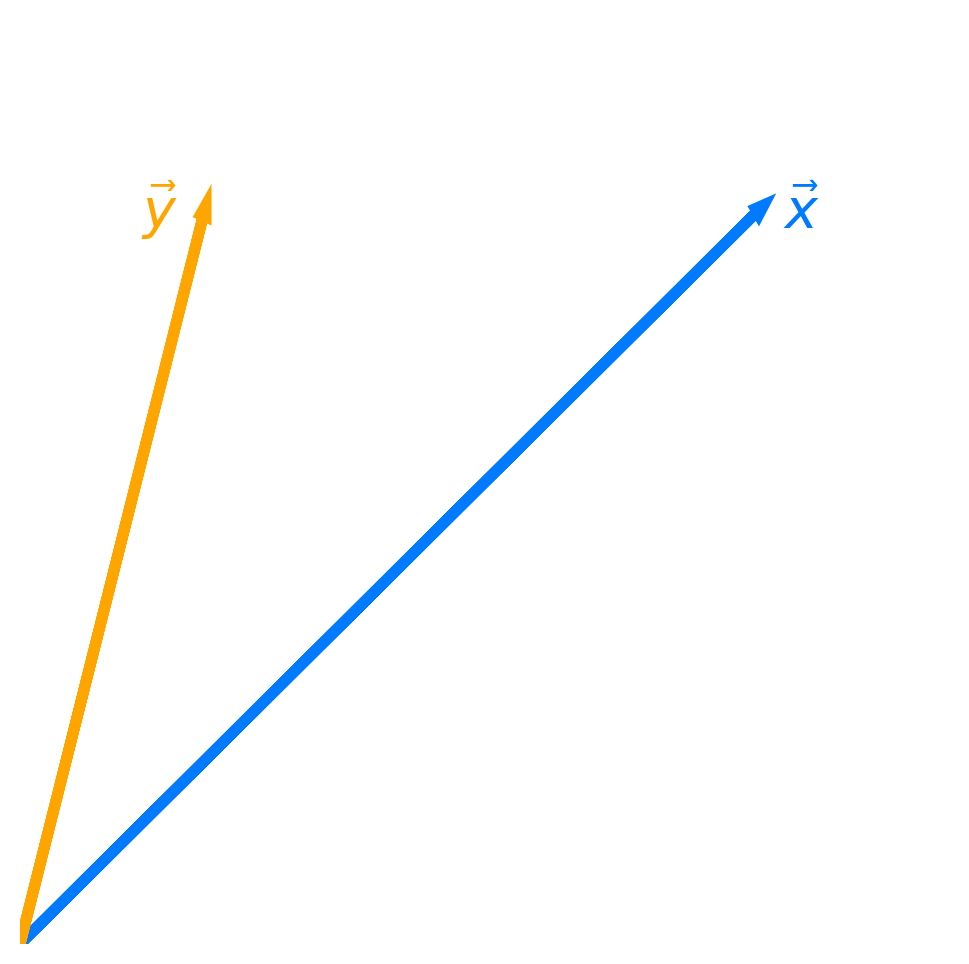
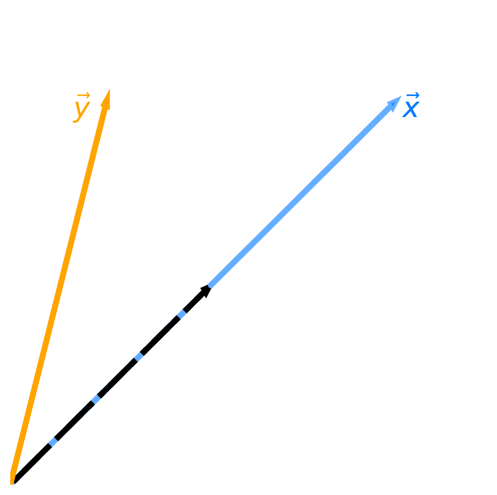
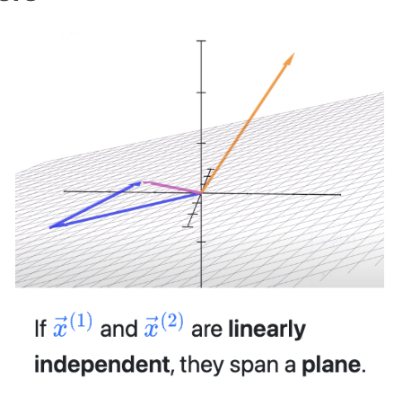
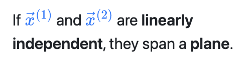
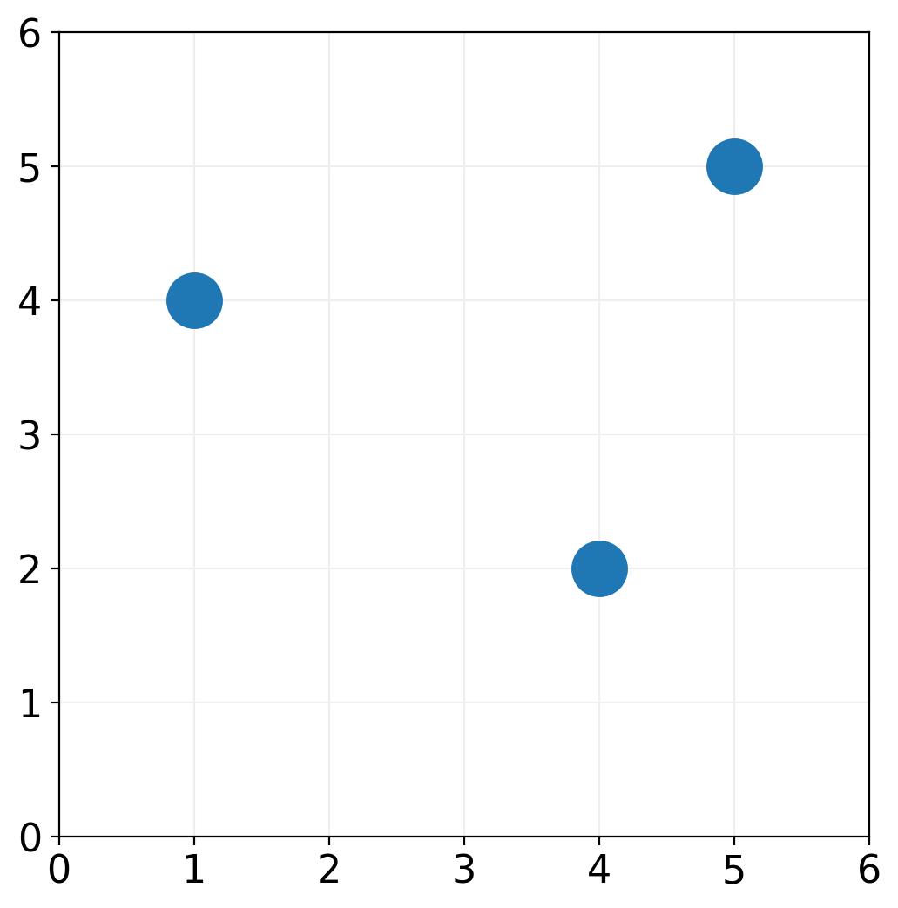
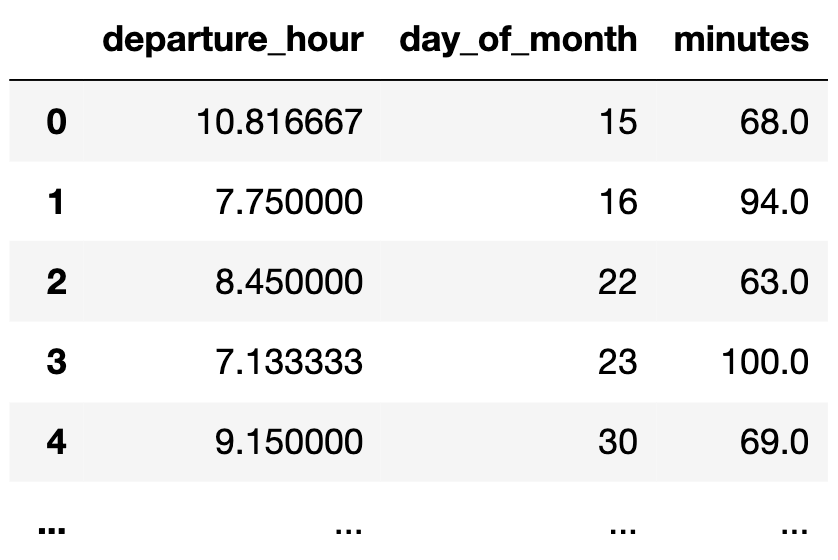
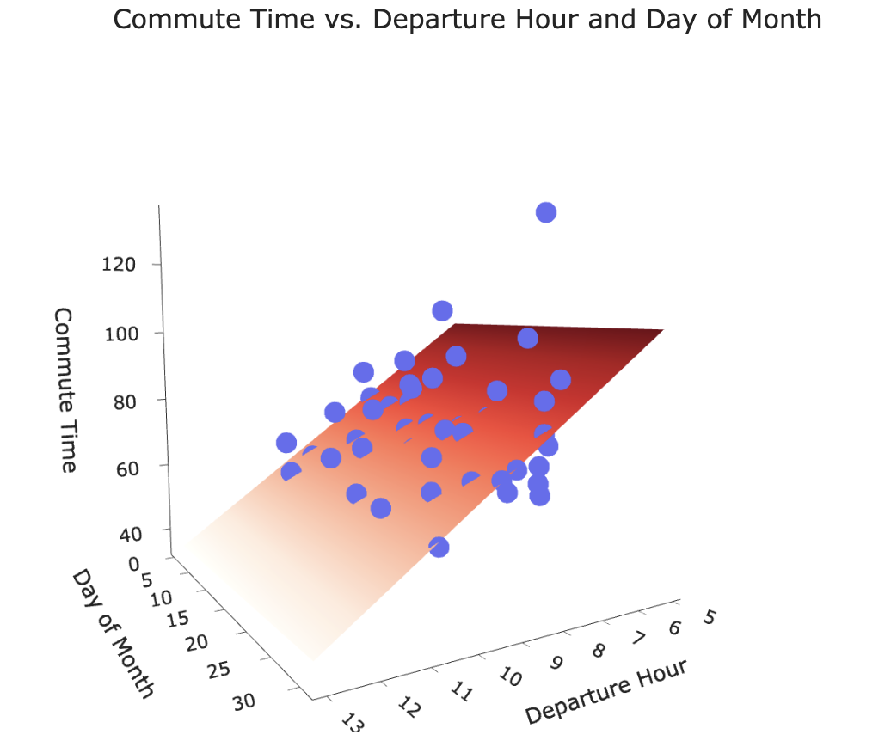
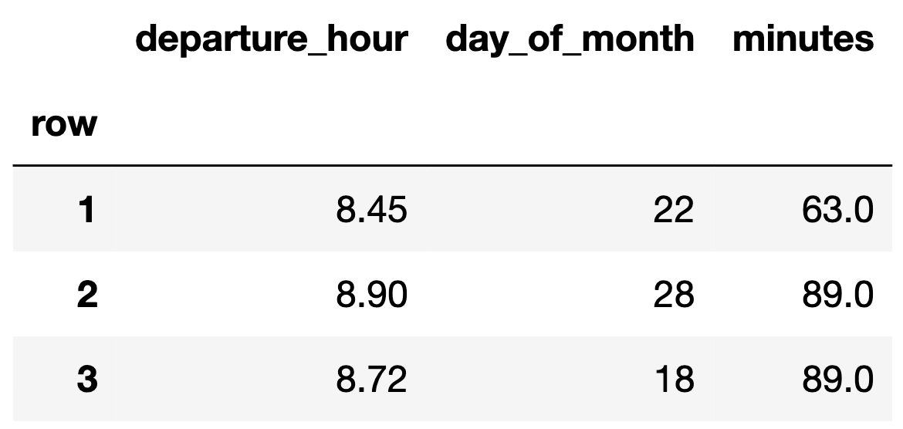

<!-- These set styles for the entire document. -->
<!-- These set styles for the entire document. -->

   

##### Lecture 4

# Orthogonal Projections; Regression and Linear Algebra

#### DSC 40A, Summer 2026

---

Announcements at break

---

##### Lecture 4 Part 1

# Orthogonal Projections

#### DSC 40A, Summer 2026

---

### Agenda for Part 1

- Spans and projections.
- Matrices.
- Spans and projections, revisited.
- Regression and linear algebra.

---

### Question 🤔
**Answer at [q.dsc40a.com](https://docs.google.com/forms/d/e/1FAIpQLSfEaSAGovXZCk_51_CVI587CcGW1GZH1w4Y50dKDzoLEX3D4w/viewform)**

   

<big><b>Remember, you can always ask questions at <a href="https://docs.google.com/forms/d/e/1FAIpQLSfEaSAGovXZCk_51_CVI587CcGW1GZH1w4Y50dKDzoLEX3D4w/viewform">q.dsc40a.com</a>!</b></big>

If the direct link doesn't work, click the "🤔 Lecture Questions"  link in the top right corner of [dsc40a.com](https://dsc40a.com).

---

     

## Spans and projections

---
### Projecting onto a single vector

    
 

 

- Let $\color{#007aff} \vec x$ and $\color{orange} \vec y$ be two vectors in $\mathbb{R}^n$.
- The span of $\color{#007aff} \vec x$ is the set of all vectors of the form:

$w \color{#007aff} \vec x$

where $w \in \mathbb{R}$ is a scalar.

- **Question**: What vector in $\text{span}({\color{#007aff}\vec x})$ is closest to $\color{orange} \vec y$?

- The vector in $\text{span}({\color{#007aff}\vec x})$ that is closest to $\color{orange} \vec y$ is the **projection of $\color{orange} \vec y$ onto $\text{span}({\color{#007aff}\vec x})$**.

---

### Projection error

    
 

&nbsp;&nbsp;&nbsp;&nbsp;&nbsp;&nbsp;&nbsp;&nbsp;

 

- Let ${\color{red} \vec e} = {\color{orange} \vec y} - w{\color{#007aff} \vec x}$ be the **projection error**: that is, the vector that connects ${\color{orange} \vec y}$ to $\text{span}({\color{#007aff}\vec x})$.
- **Goal**: **Find the $w$ that makes $\color{red} \vec e$ as short as possible**.
    - That is, minimize:
    $\lVert {\color{red} \vec e} \rVert$
    - Equivalently, minimize:
    $\lVert {\color{orange} \vec y} - w {\color{#007aff} \vec{x}} \rVert$
- **Idea**: To make $\color{red} \vec{e}$ has short as possible, it should be **orthogonal to $w{\color{#007aff}\vec x}$**.

---

### Minimizing projection error

- **Goal**: **Find the $w$ that makes ${\color{red} \vec e} = {\color{orange} \vec y} - w {\color{#007aff} \vec{x}}$ as short as possible**.

- **Idea**: To make $\color{red} \vec{e}$ as short as possible, it should be **orthogonal to $w{\color{#007aff}\vec x}$**.

- Can we prove that making $\color{red} \vec{e}$ orthogonal to $w{\color{#007aff}\vec x}$ minimizes $\lVert {\color{red} \vec{e}} \rVert$?

         

---

### Minimizing projection error

- **Goal**: **Find the $w$ that makes ${\color{red} \vec e} = {\color{orange} \vec y} - w {\color{#007aff} \vec{x}}$ as short as possible**.
- Now we know that to minimize $\lVert {\color{red} \vec{e}} \rVert$,  $\color{red} \vec{e}$ must be orthogonal to $w{\color{#007aff}\vec x}$.
- Given this fact, how can we solve for $w$?

         

---

### Orthogonal projection

- **Question**: What vector in $\text{span}({\color{#007aff}\vec x})$ is closest to $\color{orange} \vec y$?

- **Answer**: It is the vector $w^* {\color{#007aff}\vec x}$, where:

$$w^* = \frac{{\color{#007aff}\vec x} \cdot {\color{orange}\vec y}}{{\color{#007aff}\vec x} \cdot {\color{#007aff}\vec x}}$$

- Note that $w^*$ is the solution to a minimization problem, specifically, this one:

$${\color{red} \text{error}}(w) = \lVert {\color{red} \vec{e}} \rVert = \lVert {\color{orange} \vec y} - w {\color{#007aff} \vec{x}} \rVert $$

- We call $w^* {\color{#007aff} \vec{x}}$ the **orthogonal projection of $\color{orange} \vec{y}$ onto $\text{span}({\color{#007aff} \vec{x}})$**.
    - Think of $w^* {\color{#007aff} \vec{x}}$ as the "shadow" of $\color{orange} \vec{y}$.

---

### Exercise

Let $\vec{a} = \begin{bmatrix} 5 \\ 2 \end{bmatrix}$ and $\vec{b} = \begin{bmatrix} -1 \\ 9 \end{bmatrix}$.

What is the orthogonal projection of $\vec{a}$ onto $\text{span}(\vec b)$?  Your answer should be of the form $w^* \vec b$, where $w^*$ is a scalar.

        

---

### Moving to multiple dimensions

- Let's now consider three vectors, $\color{orange}\vec{y}$, $\color{#007aff} \vec{x}^{(1)}$, and $\color{#007aff} \vec{x}^{(2)}$, all in $\mathbb{R}^n$.

- **Question**: What vector in $\text{span}({\color{#007aff} \vec{x}^{(1)}}, {\color{#007aff} \vec{x}^{(2)}})$ is closest to ${\color{orange} \vec{y}}$? 

    - Vectors in $\text{span}({\color{#007aff} \vec{x}^{(1)}}, {\color{#007aff} \vec{x}^{(2)}})$ are of the form $w_1 {\color{#007aff} \vec{x}^{(1)}} + w_2 {\color{#007aff} \vec{x}^{(2)}}$, where $w_1$, $w_2 \in \mathbb{R}$ are scalars.

- Before trying to answer, let's watch [**🎥 this animation that Jack, one of our tutors, made**](https://youtu.be/dJcbJKpYywk?si=giWFps-ixYDXBwzh).

---

### Minimizing projection error in multiple dimensions

- **Question**: What vector in $\text{span}({\color{#007aff} \vec{x}^{(1)}}, {\color{#007aff} \vec{x}^{(2)}})$ is closest to ${\color{orange} \vec{y}}$? 
    - That is, what vector minimizes $\lVert {\color{red} \vec{e}} \rVert$, where:

    $${\color{red} \vec{e}} = {\color{orange} \vec{y}} - w_1 {\color{#007aff} \vec{x}^{(1)}} - w_2 {\color{#007aff} \vec{x}^{(2)}}$$

- **Answer**: It's the vector such that $w_1 {\color{#007aff} \vec{x}^{(1)}} + w_2 {\color{#007aff} \vec{x}^{(2)}}$ is **orthogonal** to $\color{red} \vec e$.

- **Issue**: Solving for $w_1$ and $w_2$ in the following equation is difficult:

$$\left( w_1 {\color{#007aff} \vec{x}^{(1)}} + w_2 {\color{#007aff} \vec{x}^{(2)}} \right) \cdot \underbrace{\left( {\color{orange} \vec y} -   w_1 {\color{#007aff} \vec{x}^{(1)}} - w_2 {\color{#007aff} \vec{x}^{(2)}}\right)}_{\color{red} \vec e} = 0$$

  

---

### Minimizing projection error in multiple dimensions

- It's hard for us to solve for $w_1$ and $w_2$ in:

$$\left( w_1 {\color{#007aff} \vec{x}^{(1)}} + w_2 {\color{#007aff} \vec{x}^{(2)}} \right) \cdot \underbrace{\left( {\color{orange} \vec y} -   w_1 {\color{#007aff} \vec{x}^{(1)}} - w_2 {\color{#007aff} \vec{x}^{(2)}}\right)}_{\color{red} \vec e} = 0$$

- **Observation**: All we really need is for ${\color{#007aff} \vec x^{(1)}}$ and ${\color{#007aff} \vec x^{(2)}}$ to individually be orthogonal to $\color{red} \vec{e}$.
    - That is, it's sufficient for $\color{red} \vec e$ to be orthogonal to the spanning vectors themselves.

- If ${\color{#007aff} \vec x^{(1)}} \cdot {\color{red} \vec{e}} = 0$ and ${\color{#007aff} \vec x^{(2)}} \cdot {\color{red} \vec{e}} = 0$, then:

<!-- $$\begin{align*} \left( w_1 {\color{#007aff} \vec{x}^{(1)}} + w_2 {\color{#007aff} \vec{x}^{(2)}} \right) \cdot {\color{red} \vec{e}} &= \underbrace{w_1  {\color{#007aff} \vec{x}^{(1)}} \cdot {\color{red} \vec{e}} + w_2 {\color{#007aff} \vec{x}^{(2)}} \cdot {\color{red} \vec{e}}}_{\text{by distributing} \:\: \cdot \:\color{red} \vec{e}} \\ &= w_1 \left(  {\color{#007aff} \vec{x}^{(1)}} \cdot {\color{red} \vec{e}} \right) + w_2 \left( {\color{#007aff} \vec{x}^{(2)}} \cdot {\color{red} \vec{e}} \right) \\ &= w_1 (0) + w_2 (0) \\ &= 0 \end{align*}$$ -->

   

---

### Minimizing projection error in multiple dimensions

- **Question**: What vector in $\text{span}({\color{#007aff} \vec{x}^{(1)}}, {\color{#007aff} \vec{x}^{(2)}})$ is closest to ${\color{orange} \vec{y}}$? 

- **Answer**: It's the vector such that $w_1 {\color{#007aff} \vec{x}^{(1)}} + w_2 {\color{#007aff} \vec{x}^{(2)}}$ is **orthogonal** to ${\color{red} \vec{e}} =  {\color{orange} \vec{y}} - w_1 {\color{#007aff} \vec{x}^{(1)}} - w_2 {\color{#007aff} \vec{x}^{(2)}}$.

- **Equivalently, it's the vector such that ${\color{#007aff} \vec{x}^{(1)}}$ and ${\color{#007aff} \vec{x}^{(2)}}$ are both orthogonal to $\color{red} \vec{e}$**:

$$\boxed{\begin{align*}{\color{#007aff} \vec{x}^{(1)}} \cdot \left({\color{orange} \vec y} -   w_1 {\color{#007aff} \vec{x}^{(1)}} - w_2 {\color{#007aff} \vec{x}^{(2)}}\right) &= 0 \\ 
{\color{#007aff} \vec{x}^{(2)}} \cdot \underbrace{\left({\color{orange} \vec y} -   w_1 {\color{#007aff} \vec{x}^{(1)}} - w_2 {\color{#007aff} \vec{x}^{(2)}}\right)}_{\color{red} \vec{e}} &= 0\end{align*}}
$$

- This is a system of two equations, two unknowns ($w_1$ and $w_2$), but it still looks difficult to solve.

---

### Now what?

- We're looking for the scalars $w_1$ and $w_2$ that satisfy the following equations:

$$\begin{align*}{\color{#007aff} \vec{x}^{(1)}} \cdot \left({\color{orange} \vec y} -   w_1 {\color{#007aff} \vec{x}^{(1)}} - w_2 {\color{#007aff} \vec{x}^{(2)}}\right) &= 0 \\ 
{\color{#007aff} \vec{x}^{(2)}} \cdot \underbrace{\left({\color{orange} \vec y} -   w_1 {\color{#007aff} \vec{x}^{(1)}} - w_2 {\color{#007aff} \vec{x}^{(2)}}\right)}_{\color{red} \vec{e}} &= 0\end{align*}
$$

- In this example, we just have two spanning vectors, ${\color{#007aff} \vec{x}^{(1)}}$ and ${\color{#007aff} \vec{x}^{(2)}}$.

- If we had any more, this system of equations would get extremely messy, extremely quickly.

- **Idea**: Rewrite the above system of equations **as a single equation, involving matrix-vector products**.

<!-- - **Issue**: Solving for $w_1$ and $w_2$ in the following equation is difficult:

$$\left( w_1 {\color{#007aff} \vec{x}^{(1)}} + w_2 {\color{#007aff} \vec{x}^{(2)}} \right) \cdot \underbrace{\left( {\color{orange} \vec y} -   w_1 {\color{#007aff} \vec{x}^{(1)}} - w_2 {\color{#007aff} \vec{x}^{(2)}}\right)}_{\color{red} \vec e} = 0$$ -->

</big>

<!-- - **Solution**: Combine ${\color{#007aff} \vec{x}^{(1)}}$ and ${\color{#007aff} \vec{x}^{(2)}}$ into a single **matrix**, ${\color{#007aff} X}$, and express $w_1 {\color{#007aff} \vec{x}^{(1)}} + w_2 {\color{#007aff} \vec{x}^{(2)}}$ as a **matrix-vector multiplication**, ${\color{#007aff} X} \vec{w}$. -->

---

     

## Matrices

---

### Matrices

- An $n \times d$ **matrix** is a table of numbers with $n$ rows and $d$ columns.

- We use upper-case letters to denote matrices.

$$A = \begin{bmatrix} 2 & 5 & 8 \\ -1 & 5 & -3 \end{bmatrix}$$

- Since $A$ has two rows and three columns, we say $A \in \mathbb{R}^{2 \times 3}$.

- **Key idea**: Think of a matrix as **several column vectors, stacked next to each other**.

    

---

### Matrix addition and scalar multiplication

- We can add two matrices only if they have the same dimensions.

- Addition occurs elementwise:

$$\begin{bmatrix} 2 & 5 & 8 \\ -1 & 5 & -3 \end{bmatrix} + \begin{bmatrix} 1 & 2 & 3 \\ 0 & 1 & 2 \end{bmatrix} = \begin{bmatrix} 3 & 7 & 11 \\ -1 & 6 & -1 \end{bmatrix}$$

- Scalar multiplication occurs elementwise, too:

$$2 \begin{bmatrix} 2 & 5 & 8 \\ -1 & 5 & -3 \end{bmatrix} = \begin{bmatrix} 4 & 10 & 16 \\ -2 & 10 & -6 \end{bmatrix}$$

    

---

### Matrix-matrix multiplication

- **Key idea**: We can multiply matrices $A$ and $B$ **if and only if**:

$$\boxed{\text{\# columns in $A$} = \text{\# rows in $B$}}$$

- If $A$ is ${\color{#007aff} n} \times {\color{red} d}$ and $B$ is ${\color{red} d} \times {\color{purple} p}$, then $AB$ is ${\color{#007aff} n} \times {\color{purple} p}$.

- Example: If $A$ is as defined below, what is $A^T A$?

$$A = \begin{bmatrix} 2 & 5 & 8 \\ -1 & 5 & -3 \end{bmatrix}$$

     

---

### Question 🤔
**Answer in chat**

Assume $A$, $B$, and $C$ are all matrices. Select the **incorrect** statement below.

- A. $A(B + C) = AB + AC$.
- B. $A(BC) = (AB)C$.
- C. $AB = BA$.
- D. $(A + B)^T  = A^T + B^T$.
- E. $(AB)^T = B^T A^T$.

   

---

### Matrix-vector multiplication

- A vector $\vec{v} \in \mathbb{R}^n$ is a matrix with $n$ rows and 1 column.

$$\vec{v} = \begin{bmatrix} v_1 \\ v_2 \\ \vdots \\ v_n \end{bmatrix}$$

- Suppose $A \in \mathbb{R}^{n \times d}$.
    - What must the dimensions of $\vec{v}$ be in order for the product $A\vec{v}$ to be valid?   
    - What must the dimensions of $\vec{v}$ be in order for the product $\vec{v}^TA$ to be valid?  

---

### One view of matrix-vector multiplication

- One way of thinking about the product $A \vec{v}$ is that it is **the dot product of $\vec{v}$ with every row of $A$**.
- Example: What is $A \vec{v}$?

$$A = \begin{bmatrix} 2 & 5 & 8 \\ -1 & 5 & -3 \end{bmatrix} \qquad \vec{v} = \begin{bmatrix} 2 \\ -1 \\ -5 \end{bmatrix}$$

       

---

### Another view of matrix-vector multiplication

- Another way of thinking about the product $A \vec{v}$ is that it is **a linear combination of the columns of $A$, using the weights in $\vec{v}$**.
- Example: What is $A \vec{v}$?

$$A = \begin{bmatrix} 2 & 5 & 8 \\ -1 & 5 & -3 \end{bmatrix} \qquad \vec{v} = \begin{bmatrix} 2 \\ -1 \\ -5 \end{bmatrix}$$

    

---

### Matrix-vector products create linear combinations of columns!

- **Key idea**: It'll be very useful to think of the matrix-vector product $A \vec{v}$ as a linear combination of the columns of $A$, using the weights in $\vec{v}$.

$$A = \begin{bmatrix} {\color{#007aff}a_{11}} & {\color{orange}a_{12}} & ... & {\color{purple}a_{1d}} \\ {\color{#007aff}a_{21}} & {\color{orange}a_{22}} & ... & {\color{purple}a_{2d}} \\ {\color{#007aff}\vdots} & \vdots & \vdots & \vdots \\ {\color{#007aff}a_{n1}} & {\color{orange}a_{n2}} & ... & {\color{purple}a_{nd}} \end{bmatrix} \qquad \vec{v} = \begin{bmatrix} {\color{#007aff}v_1} \\ {\color{orange}v_2} \\ \vdots \\ {\color{purple}v_d} \end{bmatrix}$$

$$\downarrow$$

$$\boxed{A \vec{v} = {\color{#007aff}v_1 \begin{bmatrix} a_{11} \\ a_{21} \\ \vdots \\ a_{n1} \end{bmatrix}} + {\color{orange} v_2 \begin{bmatrix} a_{12} \\ a_{22} \\ \vdots \\ a_{n2} \end{bmatrix}} \: + \: ... \: + \: {\color{purple}v_d \begin{bmatrix} a_{1d} \\ a_{2d} \\ \vdots \\ a_{nd} \end{bmatrix}}}$$

---

     

## Spans and projections, revisited

---

### Moving to multiple dimensions

- Let's now consider three vectors, $\color{orange}\vec{y}$, $\color{#007aff} \vec{x}^{(1)}$, and $\color{#007aff} \vec{x}^{(2)}$, all in $\mathbb{R}^n$.

- **Question**: What vector in $\text{span}({\color{#007aff} \vec{x}^{(1)}}, {\color{#007aff} \vec{x}^{(2)}})$ is closest to ${\color{orange} \vec{y}}$? 
    - That is, what values of $w_1$ and $w_2$ minimize $\lVert {\color{red} \vec{e}} \rVert$ = $\lVert {\color{orange} \vec{y}} - w_1 {\color{#007aff} \vec{x}^{(1)}} - w_2 {\color{#007aff} \vec{x}^{(2)}} \rVert$?

    <!-- - Vectors in $\text{span}({\color{#007aff} \vec{x}^{(1)}}, {\color{#007aff} \vec{x}^{(2)}})$ are of the form $w_1 {\color{#007aff} \vec{x}^{(1)}} + w_2 {\color{#007aff} \vec{x}^{(2)}}$, where $w_1$, $w_2 \in \mathbb{R}$ are scalars. -->

<!-- - **Answer**: It's the vector such that $w_1 {\color{#007aff} \vec{x}^{(1)}} + w_2 {\color{#007aff} \vec{x}^{(2)}}$ is **orthogonal** to $\color{red} \vec e$.

- **Issue**: Solving for $w_1$ and $w_2$ in the following equation is difficult:

$$\left( w_1 {\color{#007aff} \vec{x}^{(1)}} + w_2 {\color{#007aff} \vec{x}^{(2)}} \right) \cdot \underbrace{\left( {\color{orange} \vec y} -   w_1 {\color{#007aff} \vec{x}^{(1)}} - w_2 {\color{#007aff} \vec{x}^{(2)}}\right)}_{\color{red} \vec e} = 0$$

- **Solution**: Combine ${\color{#007aff} \vec{x}^{(1)}}$ and ${\color{#007aff} \vec{x}^{(2)}}$ into a single **matrix**, ${\color{#007aff} X}$, and express $w_1 {\color{#007aff} \vec{x}^{(1)}} + w_2 {\color{#007aff} \vec{x}^{(2)}}$ as a **matrix-vector multiplication**, ${\color{#007aff} X}\vec{w}$.
 -->

     

---

### Matrix-vector products create linear combinations of columns!

<!-- - Let's work with a concrete example. Let: -->

$${\color{#007aff} \vec{x}^{(1)} = \begin{bmatrix} 2 \\ 5 \\ 3 \end{bmatrix}} \qquad {\color{#007aff} \vec{x}^{(2)} = \begin{bmatrix} -1 \\ 0 \\ 4 \end{bmatrix}} \qquad {\color{orange} \vec{y} = \begin{bmatrix} 1 \\ 3 \\ 9 \end{bmatrix}}$$
  
<!-- - Note that $\color{#007aff} \vec{x}^{(1)}$ and $\color{#007aff} \vec{x}^{(2)}$ **do not** span $\mathbb{R}^3$. -->

- Combining $\color{#007aff} \vec{x}^{(1)}$ and $\color{#007aff} \vec{x}^{(2)}$ into a single matrix gives:

<!-- $${\color{#007aff} X} = \begin{bmatrix} \mid & \mid \\ {\color{#007aff} \vec x^{(1)}} & {\color{#007aff} \vec x^{(2)}} \\ \mid & \mid \end{bmatrix} = \begin{bmatrix} {\color{#007aff} 2} & {\color{#007aff} -1} \\ {\color{#007aff} 5} & {\color{#007aff} 0} \\ {\color{#007aff} 3} & {\color{#007aff} 4} \end{bmatrix}$$ -->

$${\color{#007aff} X} = \begin{bmatrix} \mid & \mid \\ {\color{#007aff} \vec x^{(1)}} & {\color{#007aff} \vec x^{(2)}} \\ \mid & \mid \end{bmatrix} = \begin{bmatrix} \_\_\_ & \_\_\_ \\  \_\_\_ & \_\_\_ \\  \_\_\_ & \_\_\_ \end{bmatrix}$$

<!-- $${\color{#007aff} X} = \begin{bmatrix} \mid & \mid \\ {\color{#007aff} \vec x^{(1)}} & {\color{#007aff} \vec x^{(2)}} \\ \mid & \mid \end{bmatrix} = \begin{bmatrix} {\color{#007aff} 2} & {\color{#007aff} -1} \\ {\color{#007aff} 5} & {\color{#007aff} 0} \\ {\color{#007aff} 3} & {\color{#007aff} 4} \end{bmatrix}$$ -->

- Then, if $\vec{w} = \begin{bmatrix} w_1 \\ w_2 \end{bmatrix}$, linear combinations of $\color{#007aff} \vec{x}^{(1)}$ and $\color{#007aff} \vec{x}^{(2)}$ can be written as ${\color{#007aff} X}\vec{w}$.
- The **span of the columns of ${\color{#007aff} X}$**, or $\text{span}({\color{#007aff} X})$, consists of all vectors that can be written in the form ${\color{#007aff} X}\vec{w}$.

---

### Minimizing projection error in multiple dimensions

$${\color{#007aff} X} = \begin{bmatrix} \mid & \mid \\ {\color{#007aff} \vec x^{(1)}} & {\color{#007aff} \vec x^{(2)}} \\ \mid & \mid \end{bmatrix} = \begin{bmatrix} {\color{#007aff} 2} & {\color{#007aff} -1} \\ {\color{#007aff} 5} & {\color{#007aff} 0} \\ {\color{#007aff} 3} & {\color{#007aff} 4} \end{bmatrix} \qquad {\color{orange} \vec{y} = \begin{bmatrix} 1 \\ 3 \\ 9 \end{bmatrix}}$$

- **Goal**: Find the vector $\vec{w} = \begin{bmatrix} w_1 & w_2 \end{bmatrix}^T$ such that $\lVert {\color{red} \vec{e}} \rVert = \lVert {\color{orange} \vec{y}} - {\color{#007aff} X}\vec{w} \rVert$ is minimized.
- As we've seen, $\vec{w}$ must be such that:

$$\begin{align*}{\color{#007aff} \vec{x}^{(1)}} \cdot \left({\color{orange} \vec y} -   w_1 {\color{#007aff} \vec{x}^{(1)}} - w_2 {\color{#007aff} \vec{x}^{(2)}}\right) &= 0 \\ 
{\color{#007aff} \vec{x}^{(2)}} \cdot \underbrace{\left({\color{orange} \vec y} -   w_1 {\color{#007aff} \vec{x}^{(1)}} - w_2 {\color{#007aff} \vec{x}^{(2)}}\right)}_{\color{red} \vec{e}} &= 0\end{align*}
$$

- **How can we use our knowledge of matrices to rewrite this system of equations as a single equation?**

---

### Simplifying the system of equations, using matrices

$${\color{#007aff} X} = \begin{bmatrix} \mid & \mid \\ {\color{#007aff} \vec x^{(1)}} & {\color{#007aff} \vec x^{(2)}} \\ \mid & \mid \end{bmatrix} = \begin{bmatrix} {\color{#007aff} 2} & {\color{#007aff} -1} \\ {\color{#007aff} 5} & {\color{#007aff} 0} \\ {\color{#007aff} 3} & {\color{#007aff} 4} \end{bmatrix} \qquad {\color{orange} \vec{y} = \begin{bmatrix} 1 \\ 3 \\ 9 \end{bmatrix}}$$

$$\begin{align*}{\color{#007aff} \vec{x}^{(1)}} \cdot \left({\color{orange} \vec y} -   w_1 {\color{#007aff} \vec{x}^{(1)}} - w_2 {\color{#007aff} \vec{x}^{(2)}}\right) &= 0 \\ 
{\color{#007aff} \vec{x}^{(2)}} \cdot \underbrace{\left({\color{orange} \vec y} -   w_1 {\color{#007aff} \vec{x}^{(1)}} - w_2 {\color{#007aff} \vec{x}^{(2)}}\right)}_{\color{red} \vec{e}} &= 0\end{align*}
$$

<!-- 1. $w_1 {\color{#007aff} \vec{x}^{(1)}} + w_2 {\color{#007aff} \vec{x}^{(2)}}$ can be written as ${\color{#007aff} X} \vec{w}$, so ${\color{red} \vec{e}} = {\color{orange} \vec y} - {\color{#007aff}X} \vec{w}$.
2. The two equations above seem to be computing the **dot product of $\color{red} \vec{e}$ and the columns of $\color{#007aff}X$, i.e. the rows of $\color{#007aff}X^T$**. -->

<!-- $${\color{#007aff} X}\vec{w}$$

is orthogonal to

$${\color{orange} \vec{y}} - {\color{#007aff} X}\vec{w}$$ -->

     

---

### Simplifying the system of equations, using matrices

$${\color{#007aff} X} = \begin{bmatrix} \mid & \mid \\ {\color{#007aff} \vec x^{(1)}} & {\color{#007aff} \vec x^{(2)}} \\ \mid & \mid \end{bmatrix} = \begin{bmatrix} {\color{#007aff} 2} & {\color{#007aff} -1} \\ {\color{#007aff} 5} & {\color{#007aff} 0} \\ {\color{#007aff} 3} & {\color{#007aff} 4} \end{bmatrix} \qquad {\color{orange} \vec{y} = \begin{bmatrix} 1 \\ 3 \\ 9 \end{bmatrix}}$$

1. $w_1 {\color{#007aff} \vec{x}^{(1)}} + w_2 {\color{#007aff} \vec{x}^{(2)}}$ can be written as ${\color{#007aff} X} \vec{w}$, so ${\color{red} \vec{e}} = {\color{orange} \vec y} - {\color{#007aff}X} \vec{w}$.
2. **The condition that $\color{red} \vec e$ must be orthogonal to each column of $\color{#007aff} X$ is equivalent to condition that ${\color{#007aff} X^T} {\color{red} \vec{e}} = 0$**.

     

---

---

---

### The normal equations

$${\color{#007aff} X} = \begin{bmatrix} \mid & \mid \\ {\color{#007aff} \vec x^{(1)}} & {\color{#007aff} \vec x^{(2)}} \\ \mid & \mid \end{bmatrix} = \begin{bmatrix} {\color{#007aff} 2} & {\color{#007aff} -1} \\ {\color{#007aff} 5} & {\color{#007aff} 0} \\ {\color{#007aff} 3} & {\color{#007aff} 4} \end{bmatrix} \qquad {\color{orange} \vec{y} = \begin{bmatrix} 1 \\ 3 \\ 9 \end{bmatrix}}$$

- **Goal**: Find the vector $\vec{w} = \begin{bmatrix} w_1 & w_2 \end{bmatrix}^T$ such that $\lVert {\color{red} \vec{e}} \rVert = \lVert {\color{orange} \vec{y}} - {\color{#007aff} X}\vec{w} \rVert$ is minimized.

- We now know that it is the vector $\vec{w}^*$ such that:

$$\begin{align*} {\color{#007aff} X^T}  {\color{red} \vec{e}} &= 0 \\ {\color{#007aff} X^T} ({\color{orange} \vec{y}} - {\color{#007aff} X} \vec{w}^*) &= 0 \\ {\color{#007aff} X^T} {\color{orange} \vec{y}} - {\color{#007aff} X^TX}\vec{w}^* &= 0 \\ \implies {\color{#007aff} X^TX} \vec{w}^* &= {\color{#007aff} X^T} {\color{orange} \vec y} \end{align*}$$

- The last statement is referred to as the **normal equations**.

---

### The general solution to the normal equations

$${\color{#007aff}X \in \mathbb{R}^{n \times d}} \qquad {\color{orange} \vec y \in \mathbb{R}^n}$$

- **Goal, in general**: Find the vector $\vec{w} \in \mathbb{R}^d$ such that $\lVert {\color{red} \vec{e}} \rVert = \lVert {\color{orange} \vec{y}} - {\color{#007aff} X}\vec{w} \rVert$ is minimized.

- We now know that it is the vector $\vec{w}^*$ such that:

$$\begin{align*} {\color{#007aff} X^T}  {\color{red} \vec{e}} &= 0 \\ \implies {\color{#007aff} X^TX} \vec{w}^* &= {\color{#007aff} X^T} {\color{orange} \vec y} \end{align*}$$

- Assuming $\color{#007aff} X^TX$ is invertible, this is the vector:

    $$\boxed{\vec{w}^* = ({\color{#007aff}{X^TX}})^{-1} {\color{#007aff}{X^T}}\color{orange}\vec{y}}$$
    - This is a big assumption, because it requires ${\color{#007aff}{X^TX}}$ to be **full rank**.
    - If ${\color{#007aff}{X^TX}}$ is not full rank, then there are infinitely many solutions to the normal equations, ${\color{#007aff} X^TX} \vec{w}^* = {\color{#007aff} X^T} {\color{orange} \vec y}$.

---

### What does it mean?

- **Original question**: What vector in $\text{span}({\color{#007aff} \vec{x}^{(1)}}, {\color{#007aff} \vec{x}^{(2)}})$ is closest to ${\color{orange} \vec{y}}$? 

- **Final answer**: It is the vector ${\color{#007aff} X} \vec{w}^*$, where:

$$\vec{w}^* = ({\color{#007aff}{X^TX}})^{-1} {\color{#007aff}{X^T}}\color{orange}\vec{y}$$

- Revisiting our example:

$${\color{#007aff} X} = \begin{bmatrix} \mid & \mid \\ {\color{#007aff} \vec x^{(1)}} & {\color{#007aff} \vec x^{(2)}} \\ \mid & \mid \end{bmatrix} = \begin{bmatrix} {\color{#007aff} 2} & {\color{#007aff} -1} \\ {\color{#007aff} 5} & {\color{#007aff} 0} \\ {\color{#007aff} 3} & {\color{#007aff} 4} \end{bmatrix} \qquad {\color{orange} \vec{y} = \begin{bmatrix} 1 \\ 3 \\ 9 \end{bmatrix}}$$

- Using a computer gives us $\vec{w}^* =  ({\color{#007aff}{X^TX}})^{-1} {\color{#007aff}{X^T}}{\color{orange}\vec{y}} \approx \begin{bmatrix} 0.7289 \\ 1.6300 \end{bmatrix}$.

- So, the vector in $\text{span}({\color{#007aff} \vec{x}^{(1)}}, {\color{#007aff} \vec{x}^{(2)}})$ closest to ${\color{orange} \vec{y}}$ is $0.7289 {\color{#007aff} \vec{x}^{(1)}} + 1.6300 {\color{#007aff} \vec{x}^{(2)}}$.

---

### An optimization problem, solved

- We just used linear algebra to solve an **optimization problem**.

- Specifically, the function we minimized is:

    $${\color{red}\text{error}}(\vec{w}) =  \lVert {\color{orange} \vec{y}} - {\color{#007aff} X}\vec{w} \rVert$$

    - This is a function whose input is a vector, $\vec{w}$, and whose output is a scalar!

- The input, $\vec{w}^*$, to ${\color{red}\text{error}}(\vec{w})$ that minimizes it is:

$$\vec{w}^* = ({\color{#007aff}{X^TX}})^{-1} {\color{#007aff}{X^T}}\color{orange}\vec{y}$$

- We're going to use this frequently!

---

# Announcements

---

### Announcements

- Homework 3 is due on **Friday, July 10th**, 11:59pm PT.
    - Try to finish it relatively early. Late submissions receive 0 credit, and we had a couple on HW1. Please don't make us give you a 0.
- Homework 1 scores will be available on Gradescope soon (hopefully), we will email you when this is the case.
    - Keep an eye out because the regrade request window is short.

---

### Exam Announcements

- Exam Proctoring Instructions have been sent out. Read them in full, carefully.
  - It is **your** responsibility to read them and ensure you have a proper proctoring set up. We will not be waiting to start the exam if you are late or are not set up; your exam score will just be canceled.
  - We are being very strict with proctoring for exam security, and any student caught without the correct proctoring set is eligible to having their exam score canceled.
- Many of you are in non-PT time zones. Please plan to take the exam during the expected exam time slot: Wednesday, July 15th, 11:00AM-1:50PM, PT. 
  - We will **not** be accommodating different exam times, unless you have OSD accommodations specifically for that.
  - We will be confirming the length of the exam today or tomorrow.

---

### Exam Announcements

- If you intend to use your exam accommodations on this upcoming midterm, please make sure OSD sends your AFA letter to us **by this Friday, July 10th**. 
  - It's hard to change/reschedule your exam last minute, so giving us at least the weekend to rearrange and make sure we can accommodate you is really helpful.
  - If you have done this, you should be hearing from us soon if you haven't already to confirm your exam accommodations.
- If you have any questions about the exam or proctoring, please post on Piazza.

---

# Break

--- 

   

##### Lecture 8

# Regression and Linear Algebra

#### DSC 40A, Summer 2024

---

### Announcements

- Homework 3 is due on **Saturday, April 27th**.
    - We moved some office hours around – we now have some on Saturday!
- Homework 1 scores are available on Gradescope.
    - Regrade requests are due on Sunday.
- Groupwork 4 is on Monday. Remember to submit groupworks as a group – you won't get any credit if you work alone!
- The Midterm Exam is on **Tuesday, May 7th in class**.
    - We will have a review session on **Friday, May 3rd from 2-5PM** where we'll go over old homework and exam problems.
    - We will be posting many past exams this weekend!

---

### Agenda

- Overview: Spans and projections.
- Regression and linear algebra.
- Multiple linear regression.

---

### Question 🤔
**Answer in chat**

   

<big><b>Remember, you can always ask questions in Q&A"</b></big>

---

     

## Overview: Spans and projections

---

### Projecting onto the span of a single vector

 

&nbsp;&nbsp;&nbsp;&nbsp;&nbsp;&nbsp;&nbsp;&nbsp;

 

- **Question**: What vector in $\text{span}({\color{#007aff} \vec x})$ is closest to $\color{orange} \vec{y}$?

- The answer is the vector $w {\color{#007aff} \vec x}$, where the $w$ is chosen to minimize the **length** of the error vector:

    $\lVert {\color{red} \vec e} \rVert = \lVert {\color{orange} \vec y} - w {\color{#007aff} \vec{x}} \rVert$

- **Key idea**: To minimize the length of the error vector, choose $w$ so that the error vector is **orthogonal** to ${\color{#007aff} \vec x}$.

---

### Projecting onto the span of a single vector

 

&nbsp;&nbsp;&nbsp;&nbsp;&nbsp;&nbsp;&nbsp;&nbsp;

 

- **Question**: What vector in $\text{span}({\color{#007aff}\vec x})$ is closest to $\color{orange} \vec y$?

- **Answer**: It is the vector $w^* {\color{#007aff}\vec x}$, where:

$w^* = \frac{{\color{#007aff}\vec x} \cdot {\color{orange}\vec y}}{{\color{#007aff}\vec x} \cdot {\color{#007aff}\vec x}}$

---

### Projecting onto the span of multiple vectors

&nbsp;&nbsp;&nbsp;&nbsp;&nbsp;&nbsp;&nbsp;&nbsp;

<!--       

 -->

 

- **Question**: What vector in $\text{span}({\color{#007aff} \vec{x}^{(1)}}, {\color{#007aff} \vec{x}^{(2)}})$ is closest to ${\color{orange} \vec{y}}$? 

- The answer is the vector $w_1 {\color{#007aff} \vec{x}^{(1)}} + w_2 {\color{#007aff} \vec{x}^{(2)}}$, where $w_1$ and $w_2$ are chosen to minimize the **length** of the error vector:

    $\lVert {\color{red} \vec e} \rVert = \lVert {\color{orange} \vec{y}} - w_1 {\color{#007aff} \vec{x}^{(1)}} - w_2 {\color{#007aff} \vec{x}^{(2)}}\rVert$

<!-- 
 -->

- **Key idea**: To minimize the length of the error vector, choose $w_1$ and $w_2$ so that the error vector is **orthogonal** to **both** $\color{#007aff} \vec{x}^{(1)}$ **and** $\color{#007aff} \vec{x}^{(2)}$.

<!-- 
 -->

<!-- 
  -->

<!-- If $\color{#007aff} \vec{x}^{(1)}$ and $\color{#007aff} \vec{x}^{(2)}$ are **linearly  independent**, they span a **plane**. -->

---

### Matrix-vector products create linear combinations of columns!

- **Question**: What vector in $\text{span}({\color{#007aff} \vec{x}^{(1)}}, {\color{#007aff} \vec{x}^{(2)}})$ is closest to ${\color{orange} \vec{y}}$? 

- To help, we can create a **matrix**, ${\color{#007aff} X}$, by stacking $\color{#007aff} \vec{x}^{(1)}$ and $\color{#007aff} \vec{x}^{(2)}$ next to each other:

$${\color{#007aff} X} = \begin{bmatrix} \mid & \mid \\ {\color{#007aff} \vec x^{(1)}} & {\color{#007aff} \vec x^{(2)}} \\ \mid & \mid \end{bmatrix} = \begin{bmatrix} {\color{#007aff} 2} & {\color{#007aff} -1} \\ {\color{#007aff} 5} & {\color{#007aff} 0} \\ {\color{#007aff} 3} & {\color{#007aff} 4} \end{bmatrix} \qquad {\color{orange} \vec{y} = \begin{bmatrix} 1 \\ 3 \\ 9 \end{bmatrix}}$$

- Then, instead of writing vectors in  $\text{span}({\color{#007aff} \vec{x}^{(1)}}, {\color{#007aff} \vec{x}^{(2)}})$ as $w_1 {\color{#007aff} \vec{x}^{(1)}} + w_2 {\color{#007aff} \vec{x}^{(2)}}$, we can say:

    $${\color{#007aff} X} \vec{w} \:\:\:\:\:\:\:\:\:\:\:\:\: \text{where } \vec{w} = \begin{bmatrix} w_1 \\ w_2 \end{bmatrix}$$

- **Key idea**: Find $\vec{w}$ such that the error vector, ${\color{red} \vec e} = {\color{orange} \vec{y}} - {\color{#007aff} X}\vec{w}$, is **orthogonal** to **every column of ${\color{#007aff} X}$**.

---

### Constructing an orthogonal error vector

<!-- $${\color{#007aff}X \in \mathbb{R}^{n \times d}} \qquad {\color{orange} \vec y \in \mathbb{R}^n}$$ -->

- **Key idea**: Find $\vec{w} \in \mathbb{R}^d$ such that the error vector, ${\color{red} \vec e} = {\color{orange} \vec{y}} - {\color{#007aff} X}\vec{w}$, is **orthogonal** to the **columns of ${\color{#007aff} X}$**.

    - Why? Because this will make the error vector as short as possible.

- The $\vec{w}^*$ that accomplishes this satisfies:

    $${\color{#007aff} X^T}  {\color{red} \vec{e}} = 0$$

    - Why? Because ${\color{#007aff} X^T}  {\color{red} \vec{e}}$ contains the **dot products** of each column in ${\color{#007aff} X}$ with $\vec{e}$. If these are all 0, then $\color{red} \vec{e}$ is **orthogonal** to **every column of ${\color{#007aff} X}$**!

    $${\color{#007aff} X^T}{\color{red} \vec{e}} = \begin{bmatrix} - \:{\color{#007aff} \vec{x}^{(1)^T}} - \\ - \:{\color{#007aff} \vec{x}^{(2)^T}} - \end{bmatrix}{\color{red} \vec{e}} = \begin{bmatrix} {\color{#007aff} \vec{x}^{(1)^T}}{\color{red} \vec{e}} \\ {\color{#007aff} \vec{x}^{(2)^T}}{\color{red} \vec{e}} \end{bmatrix}$$

---

### The normal equations

- **Key idea**: Find $\vec{w} \in \mathbb{R}^d$ such that the error vector, ${\color{red} \vec e} = {\color{orange} \vec{y}} - {\color{#007aff} X}\vec{w}$, is **orthogonal** to the **columns of ${\color{#007aff} X}$**.

- The $\vec{w}^*$ that accomplishes this satisfies:

$$\begin{align*} {\color{#007aff} X^T}  {\color{red} \vec{e}} &= 0 \\ {\color{#007aff} X^T} ({\color{orange} \vec{y}} - {\color{#007aff} X} \vec{w}^*) &= 0 \\ {\color{#007aff} X^T} {\color{orange} \vec{y}} - {\color{#007aff} X^TX}\vec{w}^* &= 0 \\ \implies {\color{#007aff} X^TX} \vec{w}^* &= {\color{#007aff} X^T} {\color{orange} \vec y} \end{align*}$$

- The last statement is referred to as the **normal equations**.

 

- Assuming $\color{#007aff} X^TX$ is invertible, this is the vector:

    $$\boxed{\vec{w}^* = ({\color{#007aff}{X^TX}})^{-1} {\color{#007aff}{X^T}}\color{orange}\vec{y}}$$
    - This is a big assumption, because it requires ${\color{#007aff}{X^TX}}$ to be **full rank**.
    - If ${\color{#007aff}{X^TX}}$ is not full rank, then there are infinitely many solutions to the normal equations, ${\color{#007aff} X^TX} \vec{w}^* = {\color{#007aff} X^T} {\color{orange} \vec y}$.

---

### What does it mean?

- **Original question**: What vector in $\text{span}({\color{#007aff} \vec{x}^{(1)}}, {\color{#007aff} \vec{x}^{(2)}})$ is closest to ${\color{orange} \vec{y}}$? 

- **Final answer**: Assuming ${\color{#007aff} X^TX}$ is invertible, it is the vector ${\color{#007aff} X} \vec{w}^*$, where:

$$\vec{w}^* = ({\color{#007aff}{X^TX}})^{-1} {\color{#007aff}{X^T}}\color{orange}\vec{y}$$

- Revisiting our example:

$${\color{#007aff} X} = \begin{bmatrix} \mid & \mid \\ {\color{#007aff} \vec x^{(1)}} & {\color{#007aff} \vec x^{(2)}} \\ \mid & \mid \end{bmatrix} = \begin{bmatrix} {\color{#007aff} 2} & {\color{#007aff} -1} \\ {\color{#007aff} 5} & {\color{#007aff} 0} \\ {\color{#007aff} 3} & {\color{#007aff} 4} \end{bmatrix} \qquad {\color{orange} \vec{y} = \begin{bmatrix} 1 \\ 3 \\ 9 \end{bmatrix}}$$

- Using a computer gives us $\vec{w}^* =  ({\color{#007aff}{X^TX}})^{-1} {\color{#007aff}{X^T}}{\color{orange}\vec{y}} \approx \begin{bmatrix} 0.7289 \\ 1.6300 \end{bmatrix}$.

- So, the vector in $\text{span}({\color{#007aff} \vec{x}^{(1)}}, {\color{#007aff} \vec{x}^{(2)}})$ closest to ${\color{orange} \vec{y}}$ is $0.7289 {\color{#007aff} \vec{x}^{(1)}} + 1.6300 {\color{#007aff} \vec{x}^{(2)}}$.

---

### An optimization problem, solved

- We just used linear algebra to solve an **optimization problem**.

- Specifically, the function we minimized is:

    $${\color{red}\text{error}}(\vec{w}) =  \lVert {\color{orange} \vec{y}} - {\color{#007aff} X}\vec{w} \rVert$$

    - This is a function whose input is a vector, $\vec{w}$, and whose output is a scalar!

- The input, $\vec{w}^*$, to ${\color{red}\text{error}}(\vec{w})$ that minimizes it is one that satisfies the **normal equations**:

    $${\color{#007aff} X^TX} \vec{w}^* = {\color{#007aff} X^T} {\color{orange} \vec y}$$

    If ${\color{#007aff} X^TX}$ is invertible, then the unique solution is:

    $$\vec{w}^* = ({\color{#007aff}{X^TX}})^{-1} {\color{#007aff}{X^T}}\color{orange}\vec{y}$$

- We're going to use this frequently!

---

     

## Regression and linear algebra

---

### Wait... why do we need linear algebra?

- Soon, we'll want to make predictions using more than one feature.
    - Example: Predicting commute times using departure hour and temperature.
- Thinking about linear regression in terms of **matrices and vectors** will allow us to find hypothesis functions that:
    - Use multiple features (input variables).
    - Are non-linear in the features, e.g. $H(x) = w_0 + w_1 x + w_2 x^2$.
- Let's see if we can put what we've just learned to use.

---

### Simple linear regression, revisited

    
 
     

    

    
 

- **Model**: $H(x) = w_0 + w_1x$.
- **Loss function**: $(y_i - H(x_i))^2$.
- To find $w_0^*$ and $w_1^*$, we minimized empirical risk, i.e. average loss:

$$R_\text{sq}(H) = \frac{1}{n} \sum_{i = 1}^n \left( y_i - H(x_i) \right)^2$$

- **Observation**: $R_\text{sq}(w_0, w_1)$ _kind of_ looks like the formula for the norm of a vector, $\lVert \vec v \rVert = \sqrt{v_1^2 + v_2^2 + \ldots + v_n^2}$.

---

### Regression and linear algebra

Let's define a few new terms:

- The **observation vector** is the vector $\color{orange} \vec{y} \in \mathbb{R}^n$. This is the vector of observed "actual values".
- The **hypothesis vector** is the vector $\color{purple} \vec{h} \in \mathbb{R}^n$ with components $\color{purple}H(x_i)$. This is the vector of predicted values.
- The **error vector** is the vector $\color{red} \vec{e} \in \mathbb{R}^n$ with components:

    $${\color{red} e_i} = {\color{orange} y_i} - {\color{purple}H(x_i)}$$

---

### Example

    
 

Consider $\color{purple}H(x) = 2 + \frac{1}{2}x$.

 

${\color{orange}\vec{y}} = \:\:\:\:\:\:\:\:\:\:\:\:\:\:\:\:\:\:\:\:\:\:\:\:\:\:\:\: {\color{purple}\vec{h}} =$

  

${\color{red}\vec{e}} = {\color{orange} \vec y} - {\color{purple} \vec h} =$

  

$\displaystyle \begin{align*}R_\text{sq}({\color{purple}H}) &= \frac{1}{n} \sum_{i = 1}^n \left( {\color{orange} y_i} - {\color{purple}H(x_i)} \right)^2 \\ &=\end{align*}$

---

### Regression and linear algebra

Let's define a few new terms:

- The **observation vector** is the vector $\color{orange} \vec{y} \in \mathbb{R}^n$. This is the vector of observed "actual values".
- The **hypothesis vector** is the vector $\color{purple} \vec{h} \in \mathbb{R}^n$ with components $\color{purple}H(x_i)$. This is the vector of predicted values.
- The **error vector** is the vector $\color{red} \vec{e} \in \mathbb{R}^n$ with components:

    $${\color{red} e_i} = {\color{orange} y_i} - {\color{purple}H(x_i)}$$

- **Key idea**: We can rewrite the mean squared error of $\color{purple}H$ as:

$$R_\text{sq}({\color{purple}H}) = \frac{1}{n} \sum_{i = 1}^n \left( {\color{orange} y_i} - {\color{purple}H(x_i)} \right)^2 = \frac{1}{n} \lVert {\color{red} \vec e} \rVert^2 = \frac{1}{n} \lVert {\color{orange} \vec y} - {\color{purple} \vec{h}} \rVert^2$$

---

### The hypothesis vector

- The **hypothesis vector** is the vector $\color{purple} \vec{h} \in \mathbb{R}^n$ with components $\color{purple}H(x_i)$. This is the vector of predicted values.

- For the linear hypothesis function $\color{purple} H(x) = w_0 + w_1x$, the hypothesis vector can be written:

$${\color{purple} \vec h} = \begin{bmatrix} {\color{purple} w_0 + w_1 x_1} \\ {\color{purple} w_0 + w_1 x_2} \\ \vdots \\ {\color{purple} w_0 + w_1 x_n} \end{bmatrix} = \:\:\:\:\:\:\:\:\:\:\:\:\:\:\:\:\:\:\:\:$$

---

### Rewriting the mean squared error

- Define the **design matrix** $\color{#007aff} X \in \mathbb{R}^{n \times 2}$ as:

$${\color{#007aff} X} = \begin{bmatrix} {\color{#007aff} 1} & {\color{#007aff} x_1} \\ {\color{#007aff} 1} & {\color{#007aff} x_2} \\ \vdots & \vdots \\ {\color{#007aff} 1} & {\color{#007aff} x_n} \end{bmatrix}$$

- Define the **parameter vector** $\vec{w} \in \mathbb{R}^2$ to be $\vec{w} = \begin{bmatrix} w_0 \\ w_1 \end{bmatrix}$.

- Then, ${\color{purple} \vec h} = {\color{#007aff} X} \vec{w}$, so the mean squared error becomes:

$$R_\text{sq}({\color{purple}H}) =  \frac{1}{n} \lVert {\color{orange} \vec y} - {\color{purple} \vec{h}} \rVert^2 \implies \boxed{R_\text{sq}(\vec{w}) = \frac{1}{n}  \lVert {\color{orange} \vec{y}} - {\color{#007aff} X}\vec{w} \rVert^2}$$

---

### Minimizing mean squared error, again

- To find the optimal model parameters for simple linear regression, $w_0^*$ and $w_1^*$, we previously minimized:

$$R_\text{sq}(w_0, w_1) = \frac{1}{n} \sum_{i = 1}^n ({\color{orange} y_i} - (w_0 + w_1 {\color{#007aff} x_i}))^2$$

- Now that we've reframed the simple linear regression problem in terms of linear algebra, we can find $w_0^*$ and $w_1^*$ by finding the $\vec{w}^* = \begin{bmatrix} w_0^* & w_1^* \end{bmatrix}^T$ that minimizes:

$$\boxed{R_\text{sq}(\vec{w}) = \frac{1}{n}  \lVert {\color{orange} \vec{y}} - {\color{#007aff} X}\vec{w} \rVert^2}$$

- Do we already know the $\vec{w^*}$ that minimizes $R_\text{sq}(\vec{w})$?

---

### An optimization problem we've seen before

- The optimal parameter vector, $\vec{w}^* = \begin{bmatrix} w_0^* & w_1^* \end{bmatrix}^T$, is the one that minimizes:

$$R_\text{sq}(\vec{w}) = \frac{1}{n}  \lVert {\color{orange} \vec{y}} - {\color{#007aff} X}\vec{w} \rVert^2$$

- Previously, we found that $\vec{w}^* = ({\color{#007aff}{X^TX}})^{-1} {\color{#007aff}{X^T}}\color{orange}\vec{y}$ minimizes the length of the error vector, $\lVert {\color{red} \vec{e}} \rVert = \lVert {\color{orange} \vec{y}} - {\color{#007aff} X}\vec{w} \rVert$

- $R_\text{sq}(\vec{w})$ is closely related to $\lVert {\color{red} \vec{e}} \rVert$:

  

- The minimizer of $\lVert {\color{red} \vec{e}} \rVert$ is the same as the minimizer of $R_\text{sq}(\vec{w})$!

 <!-- = \frac{1}{n} \lVert {\color{red} \vec{e}} \rVert^2 = \frac{1}{n} \lVert {\color{orange} \vec{y}} - {\color{#007aff} X}\vec{w} \rVert^2$. -->

- **Key idea**: $\vec{w}^* = ({\color{#007aff}{X^TX}})^{-1} {\color{#007aff}{X^T}}\color{orange}\vec{y}$ also **minimizes** $R_\text{sq}(\vec{w})$!

---

### The optimal parameter vector, $\vec{w}^*$

- To find the optimal model parameters for simple linear regression, $w_0^*$ and $w_1^*$, we previously minimized $R_\text{sq}(w_0, w_1) = \frac{1}{n} \sum_{i = 1}^n ({\color{orange} y_i} - (w_0 + w_1 {\color{#007aff} x_i}))^2$.

    - We found, using calculus, that:
        - $\boxed{w_1^* = \frac{\sum_{i = 1}^n (x_i - \bar{x})(y_i - \bar{y})}{\sum_{i = 1}^n (x_i - \bar{x})^2} = r \frac{\sigma_y}{\sigma_x}}$.
        - $\boxed{w_0^* = \bar{y} - w_1^* \bar{x}}$.

- Another way of finding optimal model parameters for simple linear regression is to find the $\vec{w}^*$ that minimizes $R_\text{sq}(\vec{w}) = \frac{1}{n}  \lVert {\color{orange} \vec{y}} - {\color{#007aff} X}\vec{w} \rVert^2$.

    - The minimizer, if ${\color{#007aff}{X^TX}}$ is invertible, is the vector $\boxed{\vec{w}^* = ({\color{#007aff}{X^TX}})^{-1} {\color{#007aff}{X^T}}\color{orange}\vec{y}}$.
- These formulas are equivalent!

---

### Roadmap

- To give us a break from math, we'll switch to a notebook, [linked here](http://datahub.ucsd.edu/user-redirect/git-sync?repo=https://github.com/dsc-courses/dsc40a-2024-sp&subPath=lectures/lec08/lec08-code.ipynb), showing that both formulas – that is, (1) the formulas for $w_1^*$ and $w_0^*$ we found using calculus, and (2) the formula for $\vec{w}^*$ we found using linear algebra – give the same results.
- Then, we'll use our new linear algebraic formulation of regression to incorporate **multiple features** in our prediction process.

---

### Summary: Regression and linear algebra

- Define the **design matrix** $\color{#007aff} X \in \mathbb{R}^{n \times 2}$, **observation vector** $\color{orange} \vec{y} \in \mathbb{R}^n$, and parameter vector $\vec{w} \in \mathbb{R}^2$ as:

$${\color{#007aff} X} = \begin{bmatrix} {\color{#007aff} 1} & {\color{#007aff} x_1} \\ {\color{#007aff} 1} & {\color{#007aff} x_2} \\ \vdots & \vdots \\ {\color{#007aff} 1} & {\color{#007aff} x_n} \end{bmatrix} \qquad {\color{orange} \vec{y} = \begin{bmatrix} y_1 \\ y_2 \\ \vdots \\ y_n \end{bmatrix}} \qquad \vec{w} = \begin{bmatrix} w_0 \\ w_1 \end{bmatrix}$$

- How do we make the hypothesis vector, ${\color{purple} \vec h} = {\color{#007aff} X} \vec{w}$,  as close to ${\color{orange} \vec{y}}$ as possible? Use the parameter vector $\vec{w}^*$:

$${\vec{w}^* = ({\color{#007aff}{X^TX}})^{-1} {\color{#007aff}{X^T}}\color{orange}\vec{y}}$$

- We chose $\vec{w}^*$ so that ${\color{purple} \vec h^*} = {\color{#007aff} X} \vec{w}^*$ is **the projection of $\color{orange} \vec{y}$ onto the span of the columns of the design matrix, $\color{#007aff}X$**.

---

     

## Multiple linear regression

---

So far, we've fit **simple** linear regression models, which use only **one** feature (`'departure_hour'`) for making predictions.

---

### Incorporating multiple features

- In the context of the commute times dataset, the simple linear regression model we fit was of the form:

$$\begin{align*}\text{pred. commute} &= H(\text{departure hour}) \\ &= w_0 + w_1 \cdot \text{departure hour} \end{align*}$$

- Now, we'll try and fit a multiple linear regression model of the form:

$$\begin{align*}\text{pred. commute} &= H(\text{departure hour}) \\ &= w_0 + w_1 \cdot \text{departure hour} + w_2 \cdot \text{day of month} \end{align*}$$

- Linear regression with **multiple** features is called **multiple linear regression**.

- How do we find $w_0^*$, $w_1^*$, and $w_2^*$?

---

### Geometric interpretation

- The hypothesis function:

    $$H(\text{departure hour}) = w_0 + w_1 \cdot \text{departure hour}$$

    looks like a **line** in 2D.

- **Questions**: 
    - How many dimensions do we need to graph the hypothesis function:

    $$H(\text{departure hour}) = w_0 + w_1 \cdot \text{departure hour} + w_2 \cdot \text{day of month}$$

    - What is the shape of the hypothesis function?

---

Our new hypothesis function is a **plane** in 3D!

---

### The setup

- Suppose we have the following dataset.

- We can represent each day with a **feature vector**, $\vec{x}$:

---

### The hypothesis vector

- When our hypothesis function is of the form:

    $$H(\text{departure hour}) = w_0 + w_1 \cdot \text{departure hour} + w_2 \cdot \text{day of month}$$

    the hypothesis vector $\color{purple} \vec{h} \in \mathbb{R}^n$ can be written as:

$${\color{purple} \vec{h}} = \begin{bmatrix}
    H(\text{departure hour}_1, \text{day}_1) \\
    H(\text{departure hour}_2, \text{day}_2) \\
		... \\
     H(\text{departure hour}_n, \text{day}_n) \\
	\end{bmatrix}
	= \begin{bmatrix}
		1      & \text{departure hour}_1 & \text{day}_1   \\
		1      & \text{departure hour}_2 & \text{day}_2    \\
		... & ... & ... \\
		1      & \text{departure hour}_n & \text{day}_n
	\end{bmatrix} \begin{bmatrix}
		w_0 \\
		w_1 \\
		w_2
	\end{bmatrix}  $$

---

### Finding the optimal parameters

- To find the optimal parameter vector, $\vec{w}^*$, we can use the **design matrix** $\color{#007aff} X \in \mathbb{R}^{n \times 3}$ and **observation vector** $\color{orange} \vec y \in \mathbb{R}^n$:

$${\color{#007aff} X = \begin{bmatrix}
		1      & \text{departure hour}_1 & \text{day}_1   \\
		1      & \text{departure hour}_2 & \text{day}_2    \\
		... & ... & ... \\
		1      & \text{departure hour}_n & \text{day}_n
	\end{bmatrix}} \qquad {\color{orange} \vec{y} = \begin{bmatrix} \text{commute time}_1 \\ \text{commute time}_2 \\ \vdots \\ \text{commute time}_n \end{bmatrix}}$$

- Then, all we need to do is solve the **normal equations**:

    $${\color{#007aff} X^TX} \vec{w}^* = {\color{#007aff} X^T} {\color{orange} \vec y}$$

    If ${\color{#007aff} X^TX}$ is invertible, we know the solution is:

$$\vec{w}^* = ({\color{#007aff}{X^TX}})^{-1} {\color{#007aff}{X^T}}\color{orange}\vec{y}$$

---

### Roadmap

- To wrap up today's lecture, we'll find the optimal parameter vector $\vec{w}^*$ for our new two-feature model in code. We'll switch back to our notebook, [linked here](https://drive.google.com/file/d/1li6xsRw8Ilc-vTcwY1eDHnOmmPnPGq--/view?usp=sharing).

- Next class, we'll present a more general framing of the multiple linear regression model, that uses $d$ features instead of just two.

- We'll also look at how we can **engineer** new features using existing features.

    - e.g. How can we fit a hypothesis function of the form $H(x) = w_0 + w_1 x + w_2 x^2$?

<!-- - **We've already solved this problem! Assuming ${\color{#007aff}{X^TX}}$ is invertible, the best $\vec{w}$ is**:

$$\boxed{\vec{w}^* = ({\color{#007aff}{X^TX}})^{-1} {\color{#007aff}{X^T}}\color{orange}\vec{y}}$$ -->
